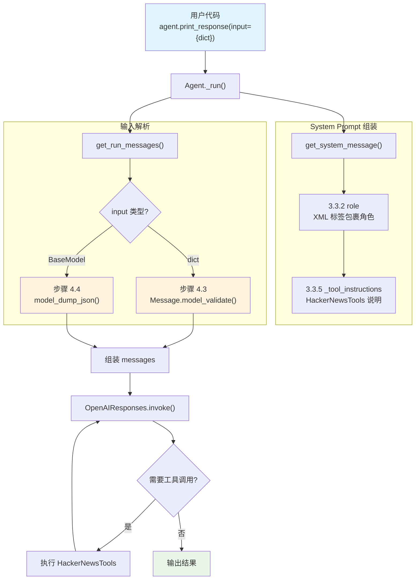

# input_schema.py — 实现原理分析

> 源文件：`cookbook/02_agents/02_input_output/input_schema.py`

## 概述

本示例展示 Agno 的 **`input_schema`** 机制：通过设置 `input_schema` 为 Pydantic `BaseModel`，Agent 可以接受结构化输入（`dict` 或 `BaseModel` 实例）。输入会在 `get_run_messages()` 中被序列化为 JSON 字符串作为用户消息内容。本例还组合使用了 **`tools`**（HackerNewsTools）和 **`role`** 参数。

**核心配置一览：**

| 配置项 | 值 | 说明 |
|--------|------|------|
| `name` | `"Hackernews Agent"` | Agent 名称 |
| `model` | `OpenAIResponses(id="gpt-5-mini")` | Responses API |
| `tools` | `[HackerNewsTools()]` | HackerNews 工具集 |
| `role` | `"Extract key insights and content from Hackernews posts"` | Agent 角色描述 |
| `input_schema` | `ResearchTopic`（Pydantic BaseModel） | 结构化输入验证 |
| `description` | `None` | 未设置 |
| `instructions` | `None` | 未设置 |
| `markdown` | `False`（默认） | 未设置 |
| `expected_output` | `None` | 未设置 |

## 架构分层

```
用户代码层                       agno.agent 层
┌────────────────────────┐    ┌──────────────────────────────────────┐
│ input_schema.py        │    │ Agent._run()                         │
│                        │    │  ├ _messages.py                      │
│ input_schema=          │    │  │  get_system_message()              │
│   ResearchTopic        │───>│  │    → 3.3.2 role 注入              │
│ role="Extract..."      │    │  │    → 3.3.5 _tool_instructions     │
│ tools=[HackerNews]     │    │  │                                    │
│                        │    │  │  get_run_messages()                │
│ print_response(        │    │  │    步骤 4.3: dict → JSON string    │
│   input={dict}         │    │  │    步骤 4.4: BaseModel → JSON      │
│ )                      │    │  │                                    │
│                        │    │  ├ _tools.py                         │
│                        │    │  │  get_tools() → HackerNewsTools    │
└────────────────────────┘    └──────────────────────────────────────┘
                                        │
                                        ▼
                              ┌──────────────────┐
                              │ OpenAIResponses   │
                              │ gpt-5-mini        │
                              │ Responses API     │
                              └──────────────────┘
```

## 核心组件解析

### input_schema 与 dict 输入

当 `input` 为 `dict` 且设置了 `input_schema` 时，`get_run_messages()`（`_messages.py:1297-1307`）步骤 4.3 处理：

```python
elif isinstance(input, dict):
    try:
        if agent.input_schema and is_typed_dict(agent.input_schema):
            # TypedDict 类型：直接 JSON 序列化
            content = json.dumps(input, indent=2, ensure_ascii=False)
            user_message = Message(role=agent.user_message_role, content=content)
        else:
            # Pydantic BaseModel：尝试验证为 Message
            user_message = Message.model_validate(input)
    except Exception as e:
        log_warning(f"Failed to validate message: {e}")
```

由于 `ResearchTopic` 是 Pydantic `BaseModel`（非 TypedDict），dict 输入会走 `Message.model_validate(input)` 分支。但 dict 格式不含 `role` 字段，验证会失败并打印警告。

### input_schema 与 BaseModel 输入

当 `input` 为 `BaseModel` 实例时，走步骤 4.4（`_messages.py:1310-1316`）：

```python
# 4.4 BaseModel 输入 → 序列化为 JSON 字符串
elif isinstance(input, BaseModel):
    try:
        content = input.model_dump_json(indent=2, exclude_none=True)
        user_message = Message(role=agent.user_message_role, content=content)
    except Exception as e:
        log_warning(f"Failed to convert BaseModel to message: {e}")
```

`BaseModel` 实例通过 `model_dump_json()` 序列化为格式化的 JSON 字符串，作为用户消息发送给模型。

### role

`role` 在 `get_system_message()`（`_messages.py:233-234`）中以 XML 标签注入：

```python
# 3.3.2 追加角色描述
if agent.role is not None:
    system_message_content += f"\n<your_role>\n{agent.role}\n</your_role>\n\n"
```

## System Prompt 组装

| 序号 | 组成部分 | 本文件中的值/来源 | 是否生效 |
|------|---------|-----------------|---------|
| 1 | `system_message`（自定义） | `None` | 否 |
| 2 | `build_context=False` | `True`（默认） | 否（不跳过） |
| 3.1 | `instructions` | `None` | 否 |
| 3.1.1 | 模型指令 | OpenAIResponses 默认 | 视模型而定 |
| 3.2.1 | `markdown` | `False` | 否 |
| 3.2.2 | `add_datetime_to_context` | `False` | 否 |
| 3.2.3 | `add_location_to_context` | `False` | 否 |
| 3.2.4 | `add_name_to_context` | `False` | 否 |
| 3.3.1 | `description` | `None` | 否 |
| 3.3.2 | `role` | `"Extract key insights..."` | 是 |
| 3.3.3 | instructions 拼接 | 无 | 否 |
| 3.3.4 | additional_information | 无 | 否 |
| 3.3.5 | `_tool_instructions` | HackerNewsTools 使用说明 | 是 |
| 3.3.7 | `expected_output` | `None` | 否 |
| 3.3.8 | `additional_context` | `None` | 否 |
| 3.3.9 | `add_memories_to_context` | `None` | 否 |

### 最终 System Prompt

```text
<your_role>
Extract key insights and content from Hackernews posts
</your_role>

<tool_instructions>
...HackerNewsTools 使用说明...
</tool_instructions>
```

## 完整 API 请求

**第一次调用（dict 输入）：**

```python
client.responses.create(
    model="gpt-5-mini",
    input=[
        # 1. System Message
        {"role": "developer", "content": "\n<your_role>\nExtract key insights and content from Hackernews posts\n</your_role>\n\n...tool_instructions..."},
        # 2. 用户输入（结构化 JSON）
        {"role": "user", "content": "{\n  \"topic\": \"AI\",\n  \"focus_areas\": [\"AI\", \"Machine Learning\"],\n  \"target_audience\": \"Developers\",\n  \"sources_required\": \"5\"\n}"}
    ],
    tools=[
        # HackerNewsTools 提供的工具函数
        {"type": "function", "function": {"name": "get_top_stories", ...}},
        {"type": "function", "function": {"name": "get_story", ...}}
    ]
)
```

**第二次调用（BaseModel 输入）：**

```python
client.responses.create(
    model="gpt-5-mini",
    input=[
        {"role": "developer", "content": "...同上..."},
        # BaseModel.model_dump_json() 输出
        {"role": "user", "content": "{\n  \"topic\": \"AI\",\n  \"focus_areas\": [\n    \"AI\",\n    \"Machine Learning\"\n  ],\n  \"target_audience\": \"Developers\",\n  \"sources_required\": 5\n}"}
    ],
    tools=[...]
)
```

## Mermaid 流程图



## 关键源码文件索引

| 文件 | 关键函数/类 | 作用 |
|------|------------|------|
| `agno/agent/agent.py` | `input_schema` L278 | 输入模式定义 |
| `agno/agent/agent.py` | `role` L312 | 角色属性 |
| `agno/agent/agent.py` | `tools` L159 | 工具列表 |
| `agno/agent/_messages.py` | `get_run_messages()` L1146 | 组装消息列表 |
| `agno/agent/_messages.py` | 步骤 4.3 L1297-1307 | dict 输入解析 |
| `agno/agent/_messages.py` | 步骤 4.4 L1310-1316 | BaseModel 输入序列化 |
| `agno/agent/_messages.py` | `get_system_message()` L106 | 构建 system prompt |
| `agno/agent/_messages.py` | 步骤 3.3.2 L233-234 | role 注入 |
| `agno/tools/hackernews.py` | `HackerNewsTools` | HackerNews 工具集 |
