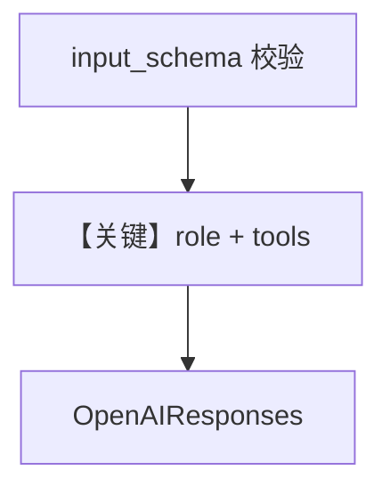

# input_schema.py — 实现原理分析

> 源文件：`cookbook/02_agents/02_input_output/input_schema.py`

## 概述

**`input_schema=ResearchTopic`** + **`HackerNewsTools`** + **`role`**：校验结构化输入（dict/Pydantic），并赋予 Agent **角色描述**（进入 **#3.3.2 `<your_role>`** 若配置方式匹配，此处为 `role` 字段）。

**核心配置一览：**

| 配置项 | 值 |
|--------|-----|
| `name` | `"Hackernews Agent"` |
| `model` | `OpenAIResponses(id="gpt-5-mini")` |
| `tools` | `[HackerNewsTools()]` |
| `role` | 提取 HN 洞察 |
| `input_schema` | `ResearchTopic` |

## 架构分层

```
结构化 input → 校验 → user/语义展开 → 工具 + Responses
```

## 核心组件解析

`role` 在 **#3.3.2** 注入（`_messages.py` L238-L239）。

### 运行机制与因果链

两次 `print_response` 演示 dict 与 Pydantic 输入。

## System Prompt 组装

### 还原后的完整 System 文本（结构）

```text
<your_role>
Extract key insights and content from Hackernews posts
</your_role>

```

另含模型默认与工具说明；**无长 instructions 字符串**。

## 完整 API 请求

**OpenAIResponses** + tools。

## Mermaid 流程图


```mermaid
flowchart TD
    A["input_schema 校验"] --> B["【关键】role + tools"]
    B --> C["OpenAIResponses"]
```

## 关键源码文件索引

| 文件 | 关键函数/类 | 作用 |
|------|------------|------|
| `agno/agent/_messages.py` | `#3.3.2` L238-239 | role 标签 |
