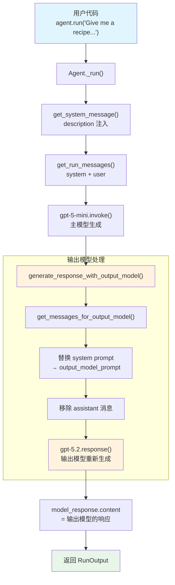

# output_model.py — 实现原理分析

> 源文件：`cookbook/02_agents/02_input_output/output_model.py`

## 概述

本示例展示 Agno 的 **`output_model`** 机制：主模型生成初步响应后，将对话上下文（替换 system prompt 为 `output_model_prompt`，移除最后的 assistant 消息）传递给第二个模型重新生成响应。适用于「廉价模型做推理/工具调用，高级模型做最终润色」的场景。与 `parser_model`（结构化 JSON 输出）不同，`output_model` 生成的是自由文本。

**核心配置一览：**

| 配置项 | 值 | 说明 |
|--------|------|------|
| `model` | `OpenAIResponses(id="gpt-5-mini")` | 主模型（Responses API） |
| `description` | `"You are a helpful chef that provides detailed recipe information."` | Agent 描述 |
| `output_model` | `OpenAIResponses(id="gpt-5.2")` | 输出模型（更强大的模型） |
| `output_model_prompt` | `"You are a world-class culinary writer. Rewrite the recipe with vivid descriptions, pro tips, and elegant formatting."` | 输出模型 system prompt |
| `name` | `None` | 未设置 |
| `instructions` | `None` | 未设置 |
| `tools` | `None` | 未设置 |
| `markdown` | `False`（默认） | 未设置 |
| `expected_output` | `None` | 未设置 |
| `output_schema` | `None` | 未设置 |

## 架构分层

```
用户代码层                       agno.agent 层
┌────────────────────────┐    ┌──────────────────────────────────────┐
│ output_model.py        │    │ Agent._run()                         │
│                        │    │  ├ _messages.py                      │
│ model=gpt-5-mini       │    │  │  get_system_message()              │
│ output_model=gpt-5.2   │───>│  │    → description 注入              │
│ output_model_prompt=   │    │  │                                    │
│   "culinary writer..." │    │  │  get_run_messages()                │
│                        │    │  │    → system + user message          │
│ agent.run(             │    │  │                                    │
│   "Give me a recipe")  │    │  ├ _response.py                      │
│                        │    │  │  generate_response_with_output_model│
│                        │    │  │    → 替换 system prompt             │
│                        │    │  │    → 移除 assistant 消息            │
│                        │    │  │    → 用 output_model 重新生成       │
└────────────────────────┘    └──────────────────────────────────────┘
                                   │              │
                                   ▼              ▼
                          ┌──────────────┐ ┌──────────────┐
                          │ 主模型        │ │ 输出模型      │
                          │ gpt-5-mini   │ │ gpt-5.2      │
                          │ 推理/生成    │ │ 润色/重写    │
                          └──────────────┘ └──────────────┘
```

## 核心组件解析

### output_model 调用流程

`generate_response_with_output_model()`（`_response.py:597-620`）在主模型响应后调用：

```python
def generate_response_with_output_model(agent, model_response, run_messages, run_response=None):
    if agent.output_model is None:
        return

    # 获取输出模型的消息：替换 system prompt，移除最后 assistant 消息
    messages_for_output_model = get_messages_for_output_model(agent, run_messages.messages)
    # 用 output_model 重新生成响应
    output_model_response = agent.output_model.response(messages=messages_for_output_model)
    # 用输出模型的内容替换主模型的响应
    model_response.content = output_model_response.content
```

### get_messages_for_output_model

`get_messages_for_output_model()`（`_messages.py:1641-1657`）构造输出模型的消息：

```python
def get_messages_for_output_model(agent, messages):
    # 如果设置了 output_model_prompt，替换 system message
    if agent.output_model_prompt is not None:
        system_message_exists = False
        for message in messages:
            if message.role == "system":
                system_message_exists = True
                message.content = agent.output_model_prompt  # 替换内容
                break
        if not system_message_exists:
            messages.insert(0, Message(role="system", content=agent.output_model_prompt))

    # 移除最后一条 assistant 消息（主模型的响应）
    messages.pop(-1)
    return messages
```

关键逻辑：
1. 将 system prompt 替换为 `output_model_prompt`
2. 移除主模型的 assistant 响应
3. 保留用户消息，让输出模型在相同上下文下重新生成

### agent.run() vs agent.print_response()

本例使用 `agent.run()` 而非 `agent.print_response()`，返回 `RunOutput` 对象供程序化处理。

## System Prompt 组装

| 序号 | 组成部分 | 本文件中的值/来源 | 是否生效 |
|------|---------|-----------------|---------|
| 1 | `system_message`（自定义） | `None` | 否 |
| 2 | `build_context=False` | `True`（默认） | 否（不跳过） |
| 3.1 | `instructions` | `None` | 否 |
| 3.1.1 | 模型指令 | OpenAIResponses 默认 | 视模型而定 |
| 3.2.1 | `markdown` | `False` | 否 |
| 3.2.2 | `add_datetime_to_context` | `False` | 否 |
| 3.2.3 | `add_location_to_context` | `False` | 否 |
| 3.2.4 | `add_name_to_context` | `False` | 否 |
| 3.3.1 | `description` | `"You are a helpful chef..."` | 是 |
| 3.3.2 | `role` | `None` | 否 |
| 3.3.3 | instructions 拼接 | 无 | 否 |
| 3.3.4 | additional_information | 无 | 否 |
| 3.3.5 | `_tool_instructions` | `None` | 否 |
| 3.3.7 | `expected_output` | `None` | 否 |
| 3.3.8 | `additional_context` | `None` | 否 |
| 3.3.9 | `add_memories_to_context` | `None` | 否 |

### 最终 System Prompt（主模型）

```text
You are a helpful chef that provides detailed recipe information.
```

### 输出模型 System Prompt

```text
You are a world-class culinary writer. Rewrite the recipe with vivid descriptions, pro tips, and elegant formatting.
```

## 完整 API 请求

**第 1 轮：主模型生成（gpt-5-mini）**

```python
client.responses.create(
    model="gpt-5-mini",
    input=[
        {"role": "developer", "content": "You are a helpful chef that provides detailed recipe information.\n"},
        {"role": "user", "content": "Give me a recipe for pad thai."}
    ]
)
```

**第 2 轮：输出模型润色（gpt-5.2）**

```python
client.responses.create(
    model="gpt-5.2",
    input=[
        # system prompt 被替换为 output_model_prompt
        {"role": "developer", "content": "You are a world-class culinary writer. Rewrite the recipe with vivid descriptions, pro tips, and elegant formatting."},
        # 用户消息保留
        {"role": "user", "content": "Give me a recipe for pad thai."}
        # 注意：主模型的 assistant 响应已被移除
    ]
)
```

> 输出模型的响应替换主模型的响应，最终 `run.content` 是 gpt-5.2 的输出。

## Mermaid 流程图



## 关键源码文件索引

| 文件 | 关键函数/类 | 作用 |
|------|------------|------|
| `agno/agent/agent.py` | `output_model` L287 | 输出模型定义 |
| `agno/agent/agent.py` | `output_model_prompt` L289 | 输出模型 prompt |
| `agno/agent/agent.py` | `description` L227 | Agent 描述 |
| `agno/agent/_response.py` | `generate_response_with_output_model()` L597 | 输出模型调用入口 |
| `agno/agent/_messages.py` | `get_messages_for_output_model()` L1641 | 构造输出模型消息 |
| `agno/agent/_messages.py` | `get_system_message()` L106 | 构建主模型 system prompt |
| `agno/agent/_messages.py` | 步骤 3.3.1 L230-231 | description 注入 |
| `agno/agent/_run.py` | `_run()` L316 | 主运行流程 |
| `agno/agent/_run.py` | L516 | 调用 generate_response_with_output_model |
