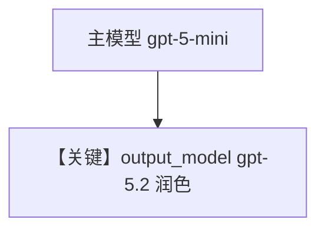

# output_model.py — 实现原理分析

<!-- cookbook-py-source:start -->
## 完整源码

```python
"""
Output Model
=============================

Use a separate output model to refine the main model's response.

The output_model receives the same conversation but generates its own
response, replacing the main model's output. This is useful when you
want a cheaper model to handle reasoning/tool-use and a more capable
model to produce the final polished answer.

For structured JSON output, use ``parser_model`` instead (see parser_model.py).
"""

from agno.agent import Agent, RunOutput
from agno.models.openai import OpenAIResponses
from rich.pretty import pprint

# ---------------------------------------------------------------------------
# Create Agent
# ---------------------------------------------------------------------------
agent = Agent(
    model=OpenAIResponses(id="gpt-5-mini"),
    description="You are a helpful chef that provides detailed recipe information.",
    output_model=OpenAIResponses(id="gpt-5.2"),
    output_model_prompt="You are a world-class culinary writer. Rewrite the recipe with vivid descriptions, pro tips, and elegant formatting.",
)

# ---------------------------------------------------------------------------
# Run Agent
# ---------------------------------------------------------------------------
if __name__ == "__main__":
    run: RunOutput = agent.run("Give me a recipe for pad thai.")
    pprint(run.content)
```

<!-- cookbook-py-source:end -->

> 源文件：`cookbook/02_agents/02_input_output/output_model.py`

## 概述

**`output_model`**：主模型 **`gpt-5-mini`** 负责推理（及可选工具），**第二模型 `gpt-5.2`** 在管线末 **重写/润色最终用户可见输出**；**`output_model_prompt`** 定义润色者角色。**`description`** 描述主 Agent 身份（厨师）。

**核心配置一览：**

| 配置项 | 值 |
|--------|-----|
| `model` | `OpenAIResponses(gpt-5-mini)` |
| `description` | chef 详细菜谱 |
| `output_model` | `OpenAIResponses(gpt-5.2)` |
| `output_model_prompt` | 世界级美食写作指令 |

## 架构分层

```
主模型 Run → 内部再调 output_model → 用户看到润色后文本
```

## 核心组件解析

**#3.3.1** 含 `description`（`_messages.py` L235-L236）；**output_model** 路径见 `agent.py` 中后处理（具体函数名可查 `grep output_model`）。

### 运行机制与因果链

**二次 LLM 调用**增加延迟与费用，换更好文风或合规。

## System Prompt 组装

主 Agent system 含 **description**；**润色模型**使用 **output_model_prompt**（可能作为独立 system 或合并消息，以框架为准）。

### 还原后的完整 System 文本（主 Agent 片段）

```text
You are a helpful chef that provides detailed recipe information.
```

**润色模型**提示：

```text
You are a world-class culinary writer. Rewrite the recipe with vivid descriptions, pro tips, and elegant formatting.
```

## 完整 API 请求

两次 **OpenAIResponses** 调用链。

## Mermaid 流程图


```mermaid
flowchart TD
    A["主模型 gpt-5-mini"] --> B["【关键】output_model gpt-5.2 润色"]
```

## 关键源码文件索引

| 文件 | 关键函数/类 | 作用 |
|------|------------|------|
| `agno/agent/agent.py` | `output_model` 属性 | 二次生成 |
