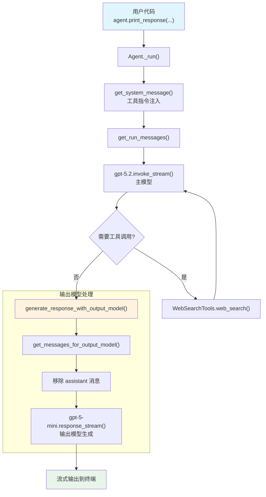

# output_schema.py — 实现原理分析

> 源文件：`cookbook/02_agents/02_input_output/output_schema.py`

## 概述

本示例展示 Agno 的 **`output_model`** 与 **`tools`** 组合使用：主模型（gpt-5.2）负责搜索和推理，输出模型（gpt-5-mini）负责生成最终响应。虽然文件名为 `output_schema.py`，但实际使用的是 `output_model`（自由文本输出模型），而非 `output_schema`（结构化 JSON 输出）。

**核心配置一览：**

| 配置项 | 值 | 说明 |
|--------|------|------|
| `model` | `OpenAIResponses(id="gpt-5.2")` | 主模型（Responses API） |
| `output_model` | `OpenAIResponses(id="gpt-5-mini")` | 输出模型 |
| `tools` | `[WebSearchTools()]` | 网络搜索工具 |
| `name` | `None` | 未设置 |
| `description` | `None` | 未设置 |
| `instructions` | `None` | 未设置 |
| `markdown` | `False`（默认） | 未设置 |
| `expected_output` | `None` | 未设置 |
| `output_model_prompt` | `None` | 未设置（使用默认行为） |

## 架构分层

```
用户代码层                       agno.agent 层
┌────────────────────────┐    ┌──────────────────────────────────────┐
│ output_schema.py       │    │ Agent._run()                         │
│                        │    │  ├ _messages.py                      │
│ model=gpt-5.2          │    │  │  get_system_message()              │
│ output_model=gpt-5-mini│───>│  │    → 工具指令注入                  │
│ tools=[WebSearchTools] │    │  │                                    │
│                        │    │  │  get_run_messages()                │
│ print_response(        │    │  │    → system + user                 │
│   "Latest news...",    │    │  │                                    │
│   stream=True)         │    │  ├ _response.py                      │
│                        │    │  │  generate_response_with_output_model│
│                        │    │  │    → gpt-5-mini 重新生成            │
└────────────────────────┘    └──────────────────────────────────────┘
                                   │              │
                                   ▼              ▼
                          ┌──────────────┐ ┌──────────────┐
                          │ 主模型        │ │ 输出模型      │
                          │ gpt-5.2      │ │ gpt-5-mini   │
                          │ 搜索+推理    │ │ 最终输出     │
                          └──────────────┘ └──────────────┘
                                   │
                                   ▼
                          ┌──────────────┐
                          │ WebSearchTools│
                          │ web_search() │
                          └──────────────┘
```

## 核心组件解析

### output_model（无自定义 prompt）

本例未设置 `output_model_prompt`，因此 `get_messages_for_output_model()`（`_messages.py:1641-1657`）不会替换 system prompt：

```python
def get_messages_for_output_model(agent, messages):
    if agent.output_model_prompt is not None:  # None，跳过
        ...
    # 仍然移除最后的 assistant 消息
    messages.pop(-1)
    return messages
```

输出模型收到的消息：原始 system prompt + 用户消息（无主模型的 assistant 响应）。

### WebSearchTools 工具调用

主模型（gpt-5.2）可能调用 `WebSearchTools` 搜索最新新闻，产生多轮工具调用循环（agentic loop）。所有工具调用结果都在主模型阶段处理完成后，才传给输出模型。

## System Prompt 组装

| 序号 | 组成部分 | 本文件中的值/来源 | 是否生效 |
|------|---------|-----------------|---------|
| 1 | `system_message`（自定义） | `None` | 否 |
| 2 | `build_context=False` | `True`（默认） | 否（不跳过） |
| 3.1 | `instructions` | `None` | 否 |
| 3.1.1 | 模型指令 | OpenAIResponses 默认 | 视模型而定 |
| 3.2.1 | `markdown` | `False` | 否 |
| 3.2.2 | `add_datetime_to_context` | `False` | 否 |
| 3.2.3 | `add_location_to_context` | `False` | 否 |
| 3.2.4 | `add_name_to_context` | `False` | 否 |
| 3.3.1 | `description` | `None` | 否 |
| 3.3.2 | `role` | `None` | 否 |
| 3.3.3 | instructions 拼接 | 无 | 否 |
| 3.3.4 | additional_information | 无 | 否 |
| 3.3.5 | `_tool_instructions` | WebSearchTools 使用说明 | 是 |
| 3.3.7 | `expected_output` | `None` | 否 |
| 3.3.8 | `additional_context` | `None` | 否 |
| 3.3.9 | `add_memories_to_context` | `None` | 否 |

### 最终 System Prompt

```text
...WebSearchTools 工具使用说明...
```

## 完整 API 请求

**第 1 轮：主模型搜索（gpt-5.2）**

```python
client.responses.create(
    model="gpt-5.2",
    input=[
        {"role": "developer", "content": "...tool_instructions..."},
        {"role": "user", "content": "Latest news from France?"}
    ],
    tools=[
        {"type": "function", "function": {"name": "web_search", ...}}
    ],
    stream=True,
    stream_options={"include_usage": True}
)
```

**工具调用后：主模型继续（gpt-5.2）**

```python
client.responses.create(
    model="gpt-5.2",
    input=[
        {"role": "developer", "content": "..."},
        {"role": "user", "content": "Latest news from France?"},
        {"role": "assistant", "tool_calls": [...]},
        {"role": "tool", "content": "...搜索结果..."}
    ],
    tools=[...],
    stream=True
)
```

**第 2 轮：输出模型生成（gpt-5-mini）**

```python
client.responses.create(
    model="gpt-5-mini",
    input=[
        {"role": "developer", "content": "...tool_instructions..."},
        {"role": "user", "content": "Latest news from France?"}
        # assistant 消息已被移除
    ],
    stream=True
)
```

## Mermaid 流程图



## 关键源码文件索引

| 文件 | 关键函数/类 | 作用 |
|------|------------|------|
| `agno/agent/agent.py` | `output_model` L287 | 输出模型定义 |
| `agno/agent/agent.py` | `output_model_prompt` L289 | 输出模型 prompt（本例未设置） |
| `agno/agent/_response.py` | `generate_response_with_output_model()` L597 | 输出模型调用 |
| `agno/agent/_response.py` | `generate_response_with_output_model_stream()` L623 | 流式输出模型 |
| `agno/agent/_messages.py` | `get_messages_for_output_model()` L1641 | 构造输出模型消息 |
| `agno/agent/_run.py` | `_run()` L316 | 主运行流程 |
| `agno/tools/websearch.py` | `WebSearchTools` L16 | 网络搜索工具 |
| `agno/tools/websearch.py` | `web_search()` L74 | 搜索函数 |
