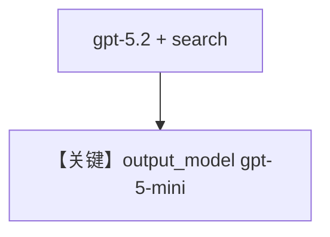

# output_schema.py — 实现原理分析

<!-- cookbook-py-source:start -->
## 完整源码

```python
"""
Output Schema
=============================

This example shows how to use the output_model parameter to specify the model that will be used to generate the final response.
"""

from agno.agent import Agent
from agno.models.openai import OpenAIResponses
from agno.tools.websearch import WebSearchTools

# ---------------------------------------------------------------------------
# Create Agent
# ---------------------------------------------------------------------------
agent = Agent(
    model=OpenAIResponses(id="gpt-5.2"),
    output_model=OpenAIResponses(id="gpt-5-mini"),
    tools=[WebSearchTools()],
)

# ---------------------------------------------------------------------------
# Run Agent
# ---------------------------------------------------------------------------
if __name__ == "__main__":
    agent.print_response("Latest news from France?", stream=True)
```

<!-- cookbook-py-source:end -->

> 源文件：`cookbook/02_agents/02_input_output/output_schema.py`

> 注意：文件头注释误写为 output_model；源码实际使用 **`output_model=OpenAIResponses(gpt-5-mini)`** 作为**另一模型**，与 `output_schema` 参数不同，请以代码为准。

## 概述

**主模型 `gpt-5.2`** + **`WebSearchTools`** + **`output_model=gpt-5-mini`**：由强模型检索/推理，**弱模型**产出**最终面向用户的回复**（成本优化模式）。**非** Pydantic `output_schema` 字段。

**核心配置一览：**

| 配置项 | 值 |
|--------|-----|
| `model` | `OpenAIResponses(gpt-5.2)` |
| `output_model` | `OpenAIResponses(gpt-5-mini)` |
| `tools` | `[WebSearchTools()]` |

## 架构分层

```
gpt-5.2 工具循环 → gpt-5-mini 最终撰文
```

## 核心组件解析

与 `output_model.py`（厨师双模型）同属 **output_model 管线**，场景为 **新闻检索**。

### 运行机制与因果链

至少两轮模型：主轮可含 tool results；末轮 output_model 汇总。

## System Prompt 组装

无用户 `instructions`；依赖模型默认 + 工具说明。

## 完整 API 请求

**OpenAIResponses** + WebSearch 工具定义。

## Mermaid 流程图


```mermaid
flowchart TD
    A["gpt-5.2 + search"] --> B["【关键】output_model gpt-5-mini"]
```

## 关键源码文件索引

| 文件 | 关键函数/类 | 作用 |
|------|------------|------|
| `agno/agent/agent.py` | `output_model` | 终端模型 |
