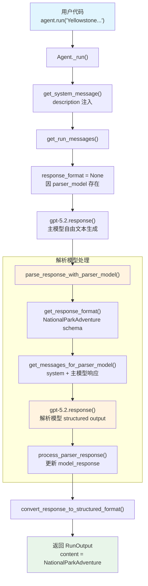

# parser_model.py — 实现原理分析

> 源文件：`cookbook/02_agents/02_input_output/parser_model.py`

## 概述

本示例展示 Agno 的 **`parser_model`** + **`output_schema`** 组合机制：主模型生成自由文本响应后，由 `parser_model` 将响应解析为 Pydantic `BaseModel` 定义的结构化 JSON。与直接在主模型上使用 `output_schema`（通过 API 强制 structured outputs）不同，`parser_model` 模式下主模型不受格式约束，结构化解析交给第二个模型完成。

**核心配置一览：**

| 配置项 | 值 | 说明 |
|--------|------|------|
| `model` | `OpenAIResponses(id="gpt-5.2")` | 主模型（Responses API） |
| `description` | `"You help people plan amazing national park adventures and provide detailed park guides."` | Agent 描述 |
| `output_schema` | `NationalParkAdventure`（Pydantic BaseModel） | 结构化输出模式 |
| `parser_model` | `OpenAIResponses(id="gpt-5.2")` | 解析模型 |
| `name` | `None` | 未设置 |
| `instructions` | `None` | 未设置 |
| `tools` | `None` | 未设置 |
| `markdown` | `False`（默认） | 未设置 |
| `parser_model_prompt` | `None` | 使用默认 prompt |

## 架构分层

```
用户代码层                       agno.agent 层
┌────────────────────────┐    ┌──────────────────────────────────────┐
│ parser_model.py        │    │ Agent._run()                         │
│                        │    │  ├ _messages.py                      │
│ model=gpt-5.2          │    │  │  get_system_message()              │
│ output_schema=         │───>│  │    → description 注入              │
│   NationalParkAdventure│    │  │    → 注意：有 parser_model 时      │
│ parser_model=gpt-5.2   │    │  │      主模型不接收 response_format  │
│                        │    │  │                                    │
│ agent.run(             │    │  ├ _response.py                      │
│   "Yellowstone...")     │    │  │  parse_response_with_parser_model  │
│                        │    │  │    → 构造解析消息                   │
│                        │    │  │    → parser_model 生成结构化输出    │
└────────────────────────┘    └──────────────────────────────────────┘
                                   │              │
                                   ▼              ▼
                          ┌──────────────┐ ┌──────────────────┐
                          │ 主模型        │ │ 解析模型          │
                          │ gpt-5.2      │ │ gpt-5.2          │
                          │ 自由文本生成  │ │ 结构化 JSON 输出 │
                          └──────────────┘ └──────────────────┘
```

## 核心组件解析

### parser_model 跳过主模型 response_format

在 `_run.py:1321` 中，当存在 `parser_model` 时，主模型不设置 `response_format`：

```python
# 有 parser_model 时，主模型不强制结构化输出
response_format = get_response_format(agent, run_context=run_context) if agent.parser_model is None else None
```

这意味着主模型以自由文本方式生成响应，不受 JSON schema 约束。

### parse_response_with_parser_model

`parse_response_with_parser_model()`（`_response.py:364-409`）在主模型响应后调用：

```python
def parse_response_with_parser_model(agent, model_response, run_messages, run_context=None, run_response=None):
    if agent.parser_model is None:
        return

    output_schema = run_context.output_schema if run_context else None

    if output_schema is not None:
        # 获取解析模型的 response_format（结构化输出 schema）
        parser_response_format = get_response_format(agent, agent.parser_model, run_context=run_context)
        # 构造解析模型的消息
        messages_for_parser_model = get_messages_for_parser_model(
            agent, model_response, parser_response_format, run_context=run_context
        )
        # 调用解析模型
        parser_model_response = agent.parser_model.response(
            messages=messages_for_parser_model,
            response_format=parser_response_format,  # 强制结构化输出
        )
        # 处理解析结果
        process_parser_response(agent, model_response, run_messages, parser_model_response, messages_for_parser_model)
```

### get_messages_for_parser_model

`get_messages_for_parser_model()`（`_messages.py:1591-1613`）构造解析模型的消息：

```python
def get_messages_for_parser_model(agent, model_response, response_format, run_context=None):
    output_schema = run_context.output_schema if run_context else None

    # 默认 prompt 或自定义 parser_model_prompt
    system_content = (
        agent.parser_model_prompt
        if agent.parser_model_prompt is not None
        else "You are tasked with creating a structured output from the provided user message."
    )

    # 如果是 JSON mode（非 native structured outputs），追加 JSON schema 说明
    if response_format == {"type": "json_object"} and output_schema is not None:
        system_content += f"{get_json_output_prompt(output_schema)}"

    return [
        Message(role="system", content=system_content),
        Message(role="user", content=model_response.content),  # 主模型的响应作为输入
    ]
```

### NationalParkAdventure 输出模式

定义了 12 个字段的 Pydantic 模型，包含：
- 字符串字段：`park_name`、`best_season`
- 列表字段：`signature_attractions`、`recommended_trails` 等
- 整数字段：`difficulty_rating`（1-5）、`estimated_days`（1-14）

## System Prompt 组装

| 序号 | 组成部分 | 本文件中的值/来源 | 是否生效 |
|------|---------|-----------------|---------|
| 1 | `system_message`（自定义） | `None` | 否 |
| 2 | `build_context=False` | `True`（默认） | 否（不跳过） |
| 3.1 | `instructions` | `None` | 否 |
| 3.1.1 | 模型指令 | OpenAIResponses 默认 | 视模型而定 |
| 3.2.1 | `markdown` | `False` | 否（有 output_schema 时也会跳过） |
| 3.2.2 | `add_datetime_to_context` | `False` | 否 |
| 3.2.3 | `add_location_to_context` | `False` | 否 |
| 3.2.4 | `add_name_to_context` | `False` | 否 |
| 3.3.1 | `description` | `"You help people plan..."` | 是 |
| 3.3.2 | `role` | `None` | 否 |
| 3.3.3 | instructions 拼接 | 无 | 否 |
| 3.3.4 | additional_information | 无 | 否 |
| 3.3.5 | `_tool_instructions` | `None` | 否 |
| 3.3.7 | `expected_output` | `None` | 否 |
| 3.3.8 | `additional_context` | `None` | 否 |
| 3.3.9 | `add_memories_to_context` | `None` | 否 |

### 最终 System Prompt（主模型）

```text
You help people plan amazing national park adventures and provide detailed park guides.
```

### 解析模型 System Prompt

```text
You are tasked with creating a structured output from the provided user message.
```

## 完整 API 请求

**第 1 轮：主模型自由生成（gpt-5.2）**

```python
client.responses.create(
    model="gpt-5.2",
    input=[
        {"role": "developer", "content": "You help people plan amazing national park adventures and provide detailed park guides.\n"},
        {"role": "user", "content": "Yellowstone National Park"}
    ]
    # 注意：无 response_format，主模型自由生成
)
```

**第 2 轮：解析模型结构化输出（gpt-5.2）**

```python
client.responses.create(
    model="gpt-5.2",
    input=[
        {"role": "developer", "content": "You are tasked with creating a structured output from the provided user message."},
        {"role": "user", "content": "...主模型生成的自由文本响应..."}
    ],
    text={"format": {
        "type": "json_schema",
        "name": "NationalParkAdventure",
        "schema": {
            "type": "object",
            "properties": {
                "park_name": {"type": "string"},
                "best_season": {"type": "string"},
                "signature_attractions": {"type": "array", "items": {"type": "string"}},
                "recommended_trails": {"type": "array", "items": {"type": "string"}},
                "wildlife_encounters": {"type": "array", "items": {"type": "string"}},
                "photography_spots": {"type": "array", "items": {"type": "string"}},
                "camping_options": {"type": "array", "items": {"type": "string"}},
                "safety_warnings": {"type": "array", "items": {"type": "string"}},
                "hidden_gems": {"type": "array", "items": {"type": "string"}},
                "difficulty_rating": {"type": "integer"},
                "estimated_days": {"type": "integer"},
                "special_permits_needed": {"type": "array", "items": {"type": "string"}}
            },
            "required": ["park_name", "best_season", ...]
        }
    }}
)
```

> 解析模型通过 `response_format`（structured outputs）强制输出符合 `NationalParkAdventure` schema 的 JSON。

## Mermaid 流程图



## 关键源码文件索引

| 文件 | 关键函数/类 | 作用 |
|------|------------|------|
| `agno/agent/agent.py` | `output_schema` L281 | 结构化输出模式 |
| `agno/agent/agent.py` | `parser_model` L283 | 解析模型 |
| `agno/agent/agent.py` | `parser_model_prompt` L285 | 解析模型 prompt |
| `agno/agent/_response.py` | `parse_response_with_parser_model()` L364 | 解析模型调用入口 |
| `agno/agent/_response.py` | `get_response_format()` L872 | 获取结构化输出格式 |
| `agno/agent/_messages.py` | `get_messages_for_parser_model()` L1591 | 构造解析模型消息 |
| `agno/agent/_run.py` | L1321 | parser_model 存在时跳过主模型 response_format |
| `agno/agent/_run.py` | L519-521 | 调用 parse_response_with_parser_model |
