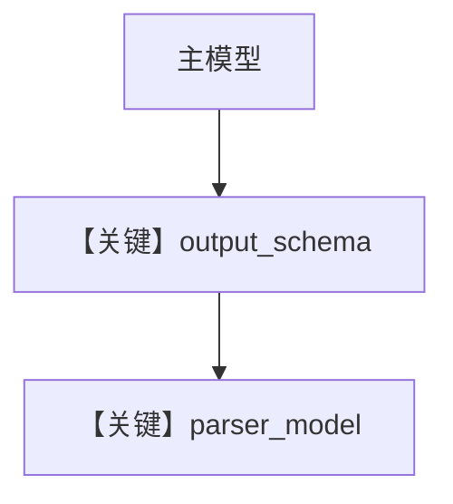

# parser_model.py — 实现原理分析

> 源文件：`cookbook/02_agents/02_input_output/parser_model.py`

## 概述

**`output_schema=NationalParkAdventure`** 强制结构化输出；**`parser_model=OpenAIResponses(gpt-5.2)`** 用于将主模型生成内容 **解析/对齐** 到 Pydantic（具体阶段见框架：可能在后处理填充字段）。**`description`** 提供公园规划师人设。

**核心配置一览：**

| 配置项 | 值 |
|--------|-----|
| `model` | `OpenAIResponses(gpt-5.2)` |
| `description` | 国家公园向导 |
| `output_schema` | `NationalParkAdventure` |
| `parser_model` | `OpenAIResponses(gpt-5.2)` |

## 架构分层

```
主生成 → schema 约束 → parser_model 解析校验 → run.content: BaseModel
```

## 核心组件解析

大型 schema 多字段，演示 **复杂结构化旅行规划**。

### 运行机制与因果链

`run.content` 为 **Pydantic 实例**（`parser_model.py` L95-98）。

## System Prompt 组装

- **description** 进入 #3.3.1 前序或 role/instructions 逻辑；
- **output_schema** 影响 **markdown 附加**条件及 **response_format**。

### 还原后的完整 System 文本

**description** 字面量：

```text
You help people plan amazing national park adventures and provide detailed park guides.
```

其余为 `_messages` 默认与 schema 约束，完整请调试打印。

## 完整 API 请求

**OpenAIResponses** + structured output / parser 调用链。

## Mermaid 流程图


```mermaid
flowchart TD
    A["主模型"] --> B["【关键】output_schema"]
    B --> C["【关键】parser_model"]
```

## 关键源码文件索引

| 文件 | 关键函数/类 | 作用 |
|------|------------|------|
| `agno/agent/agent.py` | `parser_model` / `output_schema` | 结构化 |
