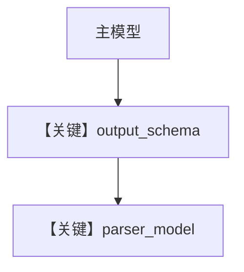

# parser_model.py — 实现原理分析

<!-- cookbook-py-source:start -->
## 完整源码

```python
"""
Parser Model
=============================

Parser Model.
"""

import random
from typing import List

from agno.agent import Agent, RunOutput  # noqa
from agno.models.openai import OpenAIResponses
from pydantic import BaseModel, Field
from rich.pretty import pprint  # noqa


class NationalParkAdventure(BaseModel):
    park_name: str = Field(..., description="Name of the national park")
    best_season: str = Field(
        ...,
        description="Optimal time of year to visit this park (e.g., 'Late spring to early fall')",
    )
    signature_attractions: List[str] = Field(
        ...,
        description="Must-see landmarks, viewpoints, or natural features in the park",
    )
    recommended_trails: List[str] = Field(
        ...,
        description="Top hiking trails with difficulty levels (e.g., 'Angel's Landing - Strenuous')",
    )
    wildlife_encounters: List[str] = Field(
        ..., description="Animals visitors are likely to spot, with viewing tips"
    )
    photography_spots: List[str] = Field(
        ...,
        description="Best locations for capturing stunning photos, including sunrise/sunset spots",
    )
    camping_options: List[str] = Field(
        ..., description="Available camping areas, from primitive to RV-friendly sites"
    )
    safety_warnings: List[str] = Field(
        ..., description="Important safety considerations specific to this park"
    )
    hidden_gems: List[str] = Field(
        ..., description="Lesser-known spots or experiences that most visitors miss"
    )
    difficulty_rating: int = Field(
        ...,
        ge=1,
        le=5,
        description="Overall park difficulty for average visitor (1=easy, 5=very challenging)",
    )
    estimated_days: int = Field(
        ...,
        ge=1,
        le=14,
        description="Recommended number of days to properly explore the park",
    )
    special_permits_needed: List[str] = Field(
        default=[],
        description="Any special permits or reservations required for certain activities",
    )


# ---------------------------------------------------------------------------
# Create Agent
# ---------------------------------------------------------------------------
agent = Agent(
    model=OpenAIResponses(id="gpt-5.2"),
    description="You help people plan amazing national park adventures and provide detailed park guides.",
    output_schema=NationalParkAdventure,
    parser_model=OpenAIResponses(id="gpt-5.2"),
)


# Get the response in a variable
national_parks = [
    "Yellowstone National Park",
    "Yosemite National Park",
    "Grand Canyon National Park",
    "Zion National Park",
    "Grand Teton National Park",
    "Rocky Mountain National Park",
    "Acadia National Park",
    "Mount Rainier National Park",
    "Great Smoky Mountains National Park",
    "Rocky National Park",
]

# ---------------------------------------------------------------------------
# Run Agent
# ---------------------------------------------------------------------------
if __name__ == "__main__":
    # Get the response in a variable
    run: RunOutput = agent.run(
        national_parks[random.randint(0, len(national_parks) - 1)]
    )
    pprint(run.content)
```

<!-- cookbook-py-source:end -->

> 源文件：`cookbook/02_agents/02_input_output/parser_model.py`

## 概述

**`output_schema=NationalParkAdventure`** 强制结构化输出；**`parser_model=OpenAIResponses(gpt-5.2)`** 用于将主模型生成内容 **解析/对齐** 到 Pydantic（具体阶段见框架：可能在后处理填充字段）。**`description`** 提供公园规划师人设。

**核心配置一览：**

| 配置项 | 值 |
|--------|-----|
| `model` | `OpenAIResponses(gpt-5.2)` |
| `description` | 国家公园向导 |
| `output_schema` | `NationalParkAdventure` |
| `parser_model` | `OpenAIResponses(gpt-5.2)` |

## 架构分层

```
主生成 → schema 约束 → parser_model 解析校验 → run.content: BaseModel
```

## 核心组件解析

大型 schema 多字段，演示 **复杂结构化旅行规划**。

### 运行机制与因果链

`run.content` 为 **Pydantic 实例**（`parser_model.py` L95-98）。

## System Prompt 组装

- **description** 进入 #3.3.1 前序或 role/instructions 逻辑；
- **output_schema** 影响 **markdown 附加**条件及 **response_format**。

### 还原后的完整 System 文本

**description** 字面量：

```text
You help people plan amazing national park adventures and provide detailed park guides.
```

其余为 `_messages` 默认与 schema 约束，完整请调试打印。

## 完整 API 请求

**OpenAIResponses** + structured output / parser 调用链。

## Mermaid 流程图


```mermaid
flowchart TD
    A["主模型"] --> B["【关键】output_schema"]
    B --> C["【关键】parser_model"]
```

## 关键源码文件索引

| 文件 | 关键函数/类 | 作用 |
|------|------------|------|
| `agno/agent/agent.py` | `parser_model` / `output_schema` | 结构化 |
