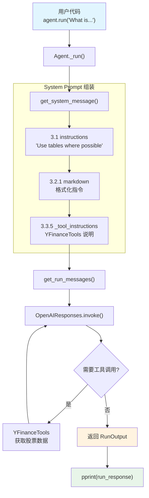

# response_as_variable.py — 实现原理分析

> 源文件：`cookbook/02_agents/02_input_output/response_as_variable.py`

## 概述

本示例展示 Agno 的 **`agent.run()` 程序化调用** 机制：与 `print_response()`（直接打印到终端）不同，`agent.run()` 返回 `RunOutput` 对象，包含完整的响应内容、指标、工具调用记录等，供后续程序逻辑处理。本例还组合使用了 **`tools`**（YFinanceTools）和 **`instructions`**。

**核心配置一览：**

| 配置项 | 值 | 说明 |
|--------|------|------|
| `model` | `OpenAIResponses(id="gpt-5.2")` | Responses API |
| `tools` | `[YFinanceTools()]` | YFinance 金融数据工具 |
| `instructions` | `["Use tables where possible"]` | 指令列表 |
| `markdown` | `True` | 启用 markdown 格式化 |
| `name` | `None` | 未设置 |
| `description` | `None` | 未设置 |
| `expected_output` | `None` | 未设置 |
| `output_schema` | `None` | 未设置 |

## 架构分层

```
用户代码层                       agno.agent 层
┌────────────────────────┐    ┌──────────────────────────────────────┐
│ response_as_variable.py│    │ Agent.run()                          │
│                        │    │  └─ Agent._run()                     │
│ tools=[YFinanceTools]  │    │     ├ _messages.py                   │
│ instructions=          │───>│     │  get_system_message()           │
│   ["Use tables..."]   │    │     │    → instructions 拼接          │
│ markdown=True          │    │     │    → markdown 指令              │
│                        │    │     │    → 工具指令                   │
│ run_response =         │    │     │                                 │
│   agent.run(           │    │     │  get_run_messages()             │
│     "What is..."       │    │     │    → system + user              │
│   )                    │    │     │                                 │
│ pprint(run_response)   │    │     ├ _tools.py                      │
│                        │    │     │  get_tools() → YFinanceTools   │
└────────────────────────┘    └──────────────────────────────────────┘
                                        │
                                        ▼
                              ┌──────────────────┐
                              │ OpenAIResponses   │
                              │ gpt-5.2           │
                              └──────────────────┘
                                        │
                                        ▼
                              ┌──────────────────┐
                              │ YFinanceTools     │
                              │ 股票数据查询      │
                              └──────────────────┘
```

## 核心组件解析

### agent.run() 返回 RunOutput

`agent.run()` 内部调用 `_run()`，返回 `RunOutput` 对象。与 `print_response()` 的区别：

| 方法 | 返回值 | 输出方式 | 适用场景 |
|------|--------|---------|---------|
| `agent.run()` | `RunOutput` | 无终端输出 | 程序化处理 |
| `agent.print_response()` | `None` | 打印到终端 | 交互式展示 |

`RunOutput` 包含：
- `content`：模型响应内容（str 或结构化对象）
- `messages`：完整消息列表
- `metrics`：运行指标（token 用量、耗时等）
- `tools`：工具调用记录

### instructions

`instructions` 在 `get_system_message()`（`_messages.py:163-174`）中解析为列表：

```python
# 3.1 解析 instructions
instructions: List[str] = []
if agent.instructions is not None:
    _instructions = agent.instructions
    if callable(agent.instructions):
        _instructions = execute_instructions(...)
    if isinstance(_instructions, str):
        instructions.append(_instructions)
    elif isinstance(_instructions, list):
        instructions.extend(_instructions)  # 本例走这个分支
```

然后在步骤 3.3.3（`_messages.py:236-250`）中拼接到 system message：

```python
# 单条指令直接拼接，多条用 "- " 前缀列表
if len(instructions) > 1:
    for _upi in instructions:
        system_message_content += f"- {_upi}\n"
else:
    system_message_content += instructions[0] + "\n\n"
```

## System Prompt 组装

| 序号 | 组成部分 | 本文件中的值/来源 | 是否生效 |
|------|---------|-----------------|---------|
| 1 | `system_message`（自定义） | `None` | 否 |
| 2 | `build_context=False` | `True`（默认） | 否（不跳过） |
| 3.1 | `instructions` | `["Use tables where possible"]` | 是 |
| 3.1.1 | 模型指令 | OpenAIResponses 默认 | 视模型而定 |
| 3.2.1 | `markdown` | `True` | 是 |
| 3.2.2 | `add_datetime_to_context` | `False` | 否 |
| 3.2.3 | `add_location_to_context` | `False` | 否 |
| 3.2.4 | `add_name_to_context` | `False` | 否 |
| 3.3.1 | `description` | `None` | 否 |
| 3.3.2 | `role` | `None` | 否 |
| 3.3.3 | instructions 拼接 | `"Use tables where possible"` | 是 |
| 3.3.4 | additional_information | markdown 指令 | 是 |
| 3.3.5 | `_tool_instructions` | YFinanceTools 使用说明 | 是 |
| 3.3.7 | `expected_output` | `None` | 否 |
| 3.3.8 | `additional_context` | `None` | 否 |
| 3.3.9 | `add_memories_to_context` | `None` | 否 |

### 最终 System Prompt

```text
Use tables where possible

<additional_information>
- Use markdown to format your answers.
</additional_information>

...YFinanceTools 工具使用说明...
```

## 完整 API 请求

```python
client.responses.create(
    model="gpt-5.2",
    input=[
        {"role": "developer", "content": "Use tables where possible\n\n<additional_information>\n- Use markdown to format your answers.\n</additional_information>\n\n...tool_instructions..."},
        {"role": "user", "content": "What is the stock price of NVDA"}
    ],
    tools=[
        {"type": "function", "function": {"name": "get_stock_price", ...}},
        # ...YFinanceTools 提供的其他工具函数
    ]
)
```

> 模型可能调用 `YFinanceTools` 获取实时股票数据，产生 agentic loop。

## Mermaid 流程图



## 关键源码文件索引

| 文件 | 关键函数/类 | 作用 |
|------|------------|------|
| `agno/agent/agent.py` | `instructions` L229 | 指令参数 |
| `agno/agent/agent.py` | `markdown` L237 | markdown 开关 |
| `agno/agent/agent.py` | `tools` L159 | 工具列表 |
| `agno/agent/_messages.py` | `get_system_message()` L106 | 构建 system prompt |
| `agno/agent/_messages.py` | 步骤 3.1 L163-174 | instructions 解析 |
| `agno/agent/_messages.py` | 步骤 3.3.3 L236-250 | instructions 拼接 |
| `agno/agent/_messages.py` | `get_run_messages()` L1146 | 组装消息列表 |
| `agno/agent/_run.py` | `_run()` L316 | 主运行流程 |
| `agno/tools/yfinance.py` | `YFinanceTools` | 金融数据工具集 |
