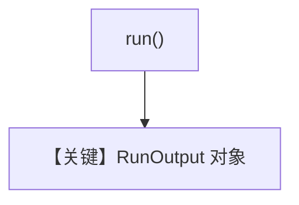

# response_as_variable.py — 实现原理分析

<!-- cookbook-py-source:start -->
## 完整源码

```python
"""
Response As Variable
=============================

Response As Variable.
"""

from typing import Iterator  # noqa
from rich.pretty import pprint
from agno.agent import Agent, RunOutput
from agno.models.openai import OpenAIResponses
from agno.tools.yfinance import YFinanceTools

# ---------------------------------------------------------------------------
# Create Agent
# ---------------------------------------------------------------------------
agent = Agent(
    model=OpenAIResponses(id="gpt-5.2"),
    tools=[YFinanceTools()],
    instructions=["Use tables where possible"],
    markdown=True,
)

# ---------------------------------------------------------------------------
# Run Agent
# ---------------------------------------------------------------------------
if __name__ == "__main__":
    run_response: RunOutput = agent.run("What is the stock price of NVDA")
    pprint(run_response)

    # run_response_strem: Iterator[RunOutputEvent] = agent.run("What is the stock price of NVDA", stream=True)
    # for response in run_response_strem:
    #     pprint(response)
```

<!-- cookbook-py-source:end -->

> 源文件：`cookbook/02_agents/02_input_output/response_as_variable.py`

## 概述

演示 **`agent.run(...)`** 返回 **`RunOutput`**，赋值给变量并 **`pprint`**；**`instructions` 为 list**（多条字符串合并）。**`YFinanceTools`** + **`markdown=True`**。

**核心配置一览：**

| 配置项 | 值 |
|--------|-----|
| `model` | `OpenAIResponses(id="gpt-5.2")` |
| `tools` | `[YFinanceTools()]` |
| `instructions` | `["Use tables where possible"]` |
| `markdown` | `True` |

## 架构分层

```
run → RunOutput（content, metrics, ...）→ 程序消费
```

## 核心组件解析

注释展示 **stream=True** 时返回 **迭代器** 的替代用法。

### 运行机制与因果链

非流式一次性拿全 **`RunOutput`**，适合脚本后处理。

## System Prompt 组装

### 还原后的完整 System 文本

```text
Use tables where possible

Use markdown to format your answers.
```

（及时间等若默认开启。）

## 完整 API 请求

**OpenAIResponses** + YFinance。

## Mermaid 流程图


```mermaid
flowchart TD
    A["run()"] --> B["【关键】RunOutput 对象"]
```

## 关键源码文件索引

| 文件 | 关键函数/类 | 作用 |
|------|------------|------|
| `agno/run/agent.py` | `RunOutput` | 返回类型 |
