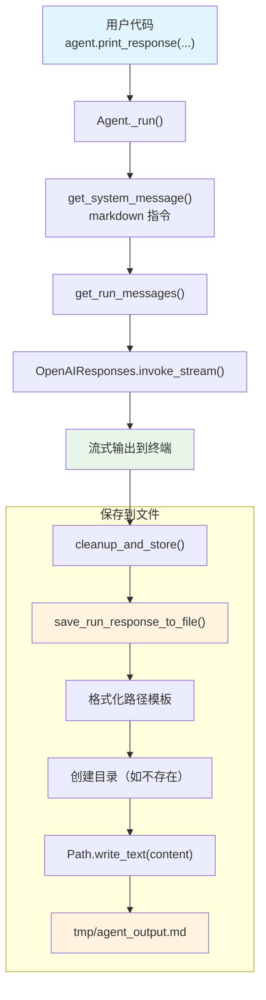

# save_to_file.py — 实现原理分析

> 源文件：`cookbook/02_agents/02_input_output/save_to_file.py`

## 概述

本示例展示 Agno 的 **`save_response_to_file`** 机制：Agent 在运行结束后自动将响应内容保存到指定文件路径。该功能在 `_run.py` 的 `cleanup_and_store` 阶段执行，支持路径模板变量（`{name}`、`{session_id}` 等）。

**核心配置一览：**

| 配置项 | 值 | 说明 |
|--------|------|------|
| `model` | `OpenAIResponses(id="gpt-5.2")` | Responses API |
| `save_response_to_file` | `"tmp/agent_output.md"` | 响应保存路径 |
| `markdown` | `True` | 启用 markdown 格式化 |
| `name` | `None` | 未设置 |
| `instructions` | `None` | 未设置 |
| `description` | `None` | 未设置 |
| `tools` | `None` | 未设置 |
| `expected_output` | `None` | 未设置 |

## 架构分层

```
用户代码层                       agno.agent 层
┌────────────────────────┐    ┌──────────────────────────────────────┐
│ save_to_file.py        │    │ Agent._run()                         │
│                        │    │  ├ _messages.py                      │
│ save_response_to_file= │    │  │  get_system_message()              │
│   "tmp/agent_output.md"│───>│  │    → markdown 指令                 │
│ markdown=True          │    │  │                                    │
│                        │    │  │  get_run_messages()                │
│ os.makedirs("tmp")     │    │  │    → system + user                 │
│                        │    │  │                                    │
│ print_response(        │    │  ├ _run.py                           │
│   "Write a brief...",  │    │  │  cleanup_and_store()               │
│   stream=True)         │    │  │    → save_run_response_to_file()   │
│                        │    │  │    → Path.write_text(content)      │
└────────────────────────┘    └──────────────────────────────────────┘
                                        │
                                        ▼
                              ┌──────────────────┐
                              │ OpenAIResponses   │
                              │ gpt-5.2           │
                              └──────────────────┘
                                        │
                                        ▼
                              ┌──────────────────┐
                              │ tmp/agent_output.md│
                              │ 文件系统保存       │
                              └──────────────────┘
```

## 核心组件解析

### save_response_to_file

属性定义在 `agent.py:298`：

```python
# 将响应保存到文件
save_response_to_file: Optional[str] = None
```

### save_run_response_to_file

保存逻辑在 `_run.py:4301-4333`（`save_run_response_to_file()` 函数）中实现：

```python
def save_run_response_to_file(agent, run_response, input=None, session_id=None, user_id=None):
    if agent.save_response_to_file is not None and run_response is not None:
        try:
            def _sanitize(value):
                """去除路径遍历字符"""
                s = str(value) if value is not None else ""
                return s.replace("/", "_").replace("\\", "_").replace("..", "_")

            # 支持模板变量：{name}, {session_id}, {user_id}, {message}, {run_id}
            fn = agent.save_response_to_file.format(
                name=_sanitize(agent.name),
                session_id=_sanitize(session_id),
                user_id=_sanitize(user_id),
                message=_sanitize(message_str),
                run_id=_sanitize(run_response.run_id),
            )
            fn_path = Path(fn)
            if not fn_path.parent.exists():
                fn_path.parent.mkdir(parents=True, exist_ok=True)
            # 字符串内容直接写入，非字符串 JSON 序列化
            if isinstance(run_response.content, str):
                fn_path.write_text(run_response.content)
            else:
                fn_path.write_text(json.dumps(run_response.content, indent=2))
        except Exception as e:
            log_warning(f"Failed to save output to file: {e}")
```

### 调用时机

`save_run_response_to_file()` 在 `cleanup_and_store()`（`_run.py:4369-4374`）中调用：

```python
# cleanup_and_store() 在 _run() 结束时执行
# 可选：如果设置了 save_response_to_file，保存输出到文件
save_run_response_to_file(
    agent,
    run_response=run_response,
    input=run_response.input.input_content_string() if run_response.input else "",
    session_id=session.session_id,
)
```

### 路径模板变量

| 变量 | 说明 | 示例 |
|------|------|------|
| `{name}` | Agent 名称 | `my_agent` |
| `{session_id}` | 会话 ID | `abc123` |
| `{user_id}` | 用户 ID | `user_001` |
| `{message}` | 用户输入（sanitized） | `Write_a_brief_guide` |
| `{run_id}` | 运行 ID | `run_xyz` |

本例使用固定路径 `"tmp/agent_output.md"`，不含模板变量。

## System Prompt 组装

| 序号 | 组成部分 | 本文件中的值/来源 | 是否生效 |
|------|---------|-----------------|---------|
| 1 | `system_message`（自定义） | `None` | 否 |
| 2 | `build_context=False` | `True`（默认） | 否（不跳过） |
| 3.1 | `instructions` | `None` | 否 |
| 3.1.1 | 模型指令 | OpenAIResponses 默认 | 视模型而定 |
| 3.2.1 | `markdown` | `True` | 是 |
| 3.2.2 | `add_datetime_to_context` | `False` | 否 |
| 3.2.3 | `add_location_to_context` | `False` | 否 |
| 3.2.4 | `add_name_to_context` | `False` | 否 |
| 3.3.1 | `description` | `None` | 否 |
| 3.3.2 | `role` | `None` | 否 |
| 3.3.3 | instructions 拼接 | 无 | 否 |
| 3.3.4 | additional_information | markdown 指令 | 是 |
| 3.3.5 | `_tool_instructions` | `None` | 否 |
| 3.3.7 | `expected_output` | `None` | 否 |
| 3.3.8 | `additional_context` | `None` | 否 |
| 3.3.9 | `add_memories_to_context` | `None` | 否 |

### 最终 System Prompt

```text
<additional_information>
- Use markdown to format your answers.
</additional_information>
```

## 完整 API 请求

```python
client.responses.create(
    model="gpt-5.2",
    input=[
        {"role": "developer", "content": "<additional_information>\n- Use markdown to format your answers.\n</additional_information>\n\n"},
        {"role": "user", "content": "Write a brief guide on Python virtual environments."}
    ],
    stream=True,
    stream_options={"include_usage": True}
)
```

> 响应生成后，内容自动写入 `tmp/agent_output.md`。

## Mermaid 流程图



## 关键源码文件索引

| 文件 | 关键函数/类 | 作用 |
|------|------------|------|
| `agno/agent/agent.py` | `save_response_to_file` L298 | 保存路径属性 |
| `agno/agent/_run.py` | `save_run_response_to_file()` L4295-4333 | 保存逻辑实现 |
| `agno/agent/_run.py` | `cleanup_and_store()` L4348 | 清理与存储入口 |
| `agno/agent/_run.py` | L4369-4374 | 调用 save_run_response_to_file |
| `agno/agent/_messages.py` | `get_system_message()` L106 | 构建 system prompt |
| `agno/agent/_messages.py` | 步骤 3.2.1 L184-185 | markdown 指令 |
