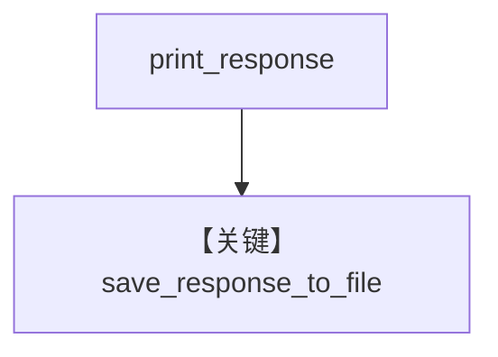

# save_to_file.py — 实现原理分析

> 源文件：`cookbook/02_agents/02_input_output/save_to_file.py`

## 概述

**`save_response_to_file="tmp/agent_output.md"`**：run 结束后将**最终响应**写入指定路径（具体写入点在 `agent.py`/`_run.py` 的 save 钩子）。**`markdown=True`**。

**核心配置一览：**

| 配置项 | 值 |
|--------|-----|
| `model` | `OpenAIResponses(id="gpt-5.2")` |
| `save_response_to_file` | `tmp/agent_output.md` |
| `markdown` | `True` |

## 架构分层

```
流式/非流式完成 → 聚合内容 → 写磁盘
```

## 核心组件解析

`main` 中 **`os.makedirs("tmp")`** 确保目录存在。

### 运行机制与因果链

**副作用**：覆盖/追加行为以框架实现为准；适合 CI 生成报告。

## System Prompt 组装

无自定义 instructions；默认 system。

## 完整 API 请求

**OpenAIResponses**；与文件 IO 无关。

## Mermaid 流程图


```mermaid
flowchart TD
    A["print_response"] --> B["【关键】save_response_to_file"]
```

## 关键源码文件索引

| 文件 | 关键函数/类 | 作用 |
|------|------------|------|
| `agno/agent/agent.py` | `save_response_to_file` | 配置项 |
