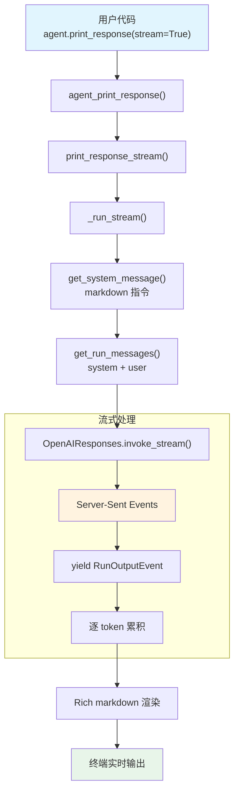

# streaming.py — 实现原理分析

> 源文件：`cookbook/02_agents/02_input_output/streaming.py`

## 概述

本示例展示 Agno 的 **流式响应（Streaming）** 机制：通过 `print_response(stream=True)` 启用流式输出，Agent 逐 token 从模型获取响应并实时打印到终端。这是最基础的 Agent 使用模式——仅设置模型和 markdown 格式化。

**核心配置一览：**

| 配置项 | 值 | 说明 |
|--------|------|------|
| `model` | `OpenAIResponses(id="gpt-5.2")` | Responses API |
| `markdown` | `True` | 启用 markdown 格式化 |
| `name` | `None` | 未设置 |
| `instructions` | `None` | 未设置 |
| `description` | `None` | 未设置 |
| `tools` | `None` | 未设置 |
| `expected_output` | `None` | 未设置 |
| `output_schema` | `None` | 未设置 |

## 架构分层

```
用户代码层                       agno.agent 层
┌────────────────────────┐    ┌──────────────────────────────────────┐
│ streaming.py           │    │ Agent.print_response(stream=True)    │
│                        │    │  └─ _cli.agent_print_response()      │
│ model=gpt-5.2          │    │      └─ print_response_stream()      │
│ markdown=True          │───>│          └─ _run_stream()             │
│                        │    │              ├ get_system_message()   │
│ print_response(        │    │              │   → markdown 指令      │
│   "Explain...",        │    │              ├ get_run_messages()     │
│   stream=True)         │    │              └ Model.invoke_stream() │
│                        │    │                → 逐 token yield      │
└────────────────────────┘    └──────────────────────────────────────┘
                                        │
                                        ▼
                              ┌──────────────────┐
                              │ OpenAIResponses   │
                              │ gpt-5.2           │
                              │ Responses API     │
                              │ stream=True       │
                              └──────────────────┘
```

## 核心组件解析

### 流式调用链

`print_response(stream=True)` 的调用链：

```
Agent.print_response()              agent.py:L1053
  └─ _cli.agent_print_response()    _cli.py:L32
      └─ print_response_stream()    流式打印
          └─ _run_stream()          _run.py（流式版 _run）
              ├ get_run_messages()  组装消息
              └ Model.invoke_stream()  流式调用模型
                  → yield RunOutputEvent  逐事件产出
```

### stream=True 的效果

| 模式 | 调用方式 | 模型 API | 用户体验 |
|------|---------|---------|---------|
| `stream=False` | `Model.invoke()` | 一次返回完整响应 | 等待后显示全部 |
| `stream=True` | `Model.invoke_stream()` | Server-Sent Events | 逐 token 实时显示 |

OpenAIResponses 的流式调用在底层使用：

```python
# responses.py invoke_stream 内部
client.responses.create(
    model=self.id,
    input=self._format_messages(messages),
    stream=True,  # 启用流式
    ...
)
```

### markdown 格式化

`markdown=True` 在 Agent 层面添加格式化指令，同时在 `_cli` 层面影响终端输出渲染——使用 Rich 库渲染 markdown 格式。

## System Prompt 组装

| 序号 | 组成部分 | 本文件中的值/来源 | 是否生效 |
|------|---------|-----------------|---------|
| 1 | `system_message`（自定义） | `None` | 否 |
| 2 | `build_context=False` | `True`（默认） | 否（不跳过） |
| 3.1 | `instructions` | `None` | 否 |
| 3.1.1 | 模型指令 | OpenAIResponses 默认 | 视模型而定 |
| 3.2.1 | `markdown` | `True` | 是 |
| 3.2.2 | `add_datetime_to_context` | `False` | 否 |
| 3.2.3 | `add_location_to_context` | `False` | 否 |
| 3.2.4 | `add_name_to_context` | `False` | 否 |
| 3.3.1 | `description` | `None` | 否 |
| 3.3.2 | `role` | `None` | 否 |
| 3.3.3 | instructions 拼接 | 无 | 否 |
| 3.3.4 | additional_information | markdown 指令 | 是 |
| 3.3.5 | `_tool_instructions` | `None` | 否 |
| 3.3.7 | `expected_output` | `None` | 否 |
| 3.3.8 | `additional_context` | `None` | 否 |
| 3.3.9 | `add_memories_to_context` | `None` | 否 |

### 最终 System Prompt

```text
<additional_information>
- Use markdown to format your answers.
</additional_information>
```

## 完整 API 请求

```python
client.responses.create(
    model="gpt-5.2",
    input=[
        {"role": "developer", "content": "<additional_information>\n- Use markdown to format your answers.\n</additional_information>\n\n"},
        {"role": "user", "content": "Explain the difference between concurrency and parallelism."}
    ],
    stream=True,
    stream_options={"include_usage": True}
)
```

> 响应以 Server-Sent Events 流式返回，Agent 逐 token 通过 Rich 渲染到终端。

## Mermaid 流程图



## 关键源码文件索引

| 文件 | 关键函数/类 | 作用 |
|------|------------|------|
| `agno/agent/agent.py` | `print_response()` L1053 | 用户调用入口 |
| `agno/agent/agent.py` | `markdown` L237 | markdown 格式化开关 |
| `agno/agent/_cli.py` | `agent_print_response()` L32 | CLI 打印入口 |
| `agno/agent/_messages.py` | `get_system_message()` L106 | 构建 system prompt |
| `agno/agent/_messages.py` | 步骤 3.2.1 L184-185 | markdown 指令注入 |
| `agno/agent/_messages.py` | `get_run_messages()` L1146 | 组装消息列表 |
| `agno/models/openai/responses.py` | `invoke_stream()` | 流式 API 调用 |
| `agno/models/openai/responses.py` | `role_map` L84 | system → developer 映射 |
