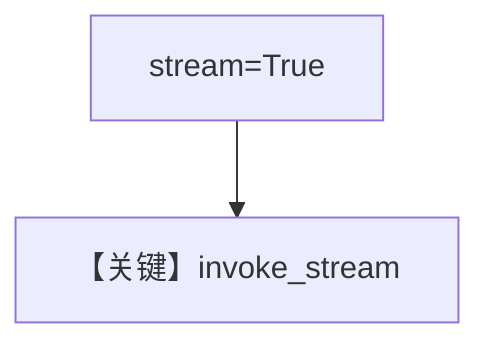

# streaming.py — 实现原理分析

<!-- cookbook-py-source:start -->
## 完整源码

```python
"""
Streaming
=============================

Demonstrates streaming agent responses token by token.
"""

from agno.agent import Agent
from agno.models.openai import OpenAIResponses

# ---------------------------------------------------------------------------
# Create Agent
# ---------------------------------------------------------------------------
agent = Agent(
    model=OpenAIResponses(id="gpt-5.2"),
    markdown=True,
)

# ---------------------------------------------------------------------------
# Run Agent
# ---------------------------------------------------------------------------
if __name__ == "__main__":
    # Stream the response token by token
    agent.print_response(
        "Explain the difference between concurrency and parallelism.",
        stream=True,
    )
```

<!-- cookbook-py-source:end -->

> 源文件：`cookbook/02_agents/02_input_output/streaming.py`

## 概述

最简 **流式**：**`print_response(..., stream=True)`**，**`markdown=True`**，无 tools。用于理解 **token 级输出** 与 **OpenAIResponses 流式 API**。

**核心配置一览：**

| 配置项 | 值 |
|--------|-----|
| `model` | `OpenAIResponses(id="gpt-5.2")` |
| `markdown` | `True` |

## 架构分层

```
invoke_stream → 增量 ModelResponse → 控制台打印
```

## 核心组件解析

见 **`OpenAIResponses.invoke_stream`**（`responses.py` L811+）。

### 运行机制与因果链

无工具则无 agentic loop；单 pass 流式生成。

## System Prompt 组装

无 instructions；默认拼装。

## 完整 API 请求

**流式 Responses**；delta 聚合为可见文本。

## Mermaid 流程图


```mermaid
flowchart TD
    A["stream=True"] --> B["【关键】invoke_stream"]
```

## 关键源码文件索引

| 文件 | 关键函数/类 | 作用 |
|------|------------|------|
| `agno/models/openai/responses.py` | `invoke_stream` L811+ | 流式 |
