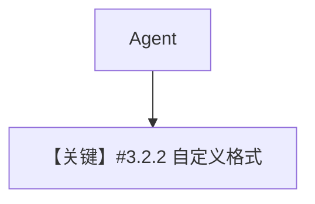

# datetime_format.py — 实现原理分析

<!-- cookbook-py-source:start -->
## 完整源码

```python
"""
Custom Datetime Format
======================

Customize the datetime format injected into the agent's system context.
"""

from agno.agent import Agent
from agno.models.openai import OpenAIResponses

# ---------------------------------------------------------------------------
# Create Agent
# ---------------------------------------------------------------------------
agent = Agent(
    model=OpenAIResponses(id="gpt-5-mini"),
    add_datetime_to_context=True,
    datetime_format="%Y-%m-%dT%H:%M:%SZ",  # ISO 8601 format in UTC (e.g., 2026-03-09T14:30:00Z)
    timezone_identifier="US/Eastern",
)

# ---------------------------------------------------------------------------
# Run Agent
# ---------------------------------------------------------------------------
if __name__ == "__main__":
    agent.print_response("What is the current time and timezone?", stream=True)
```

<!-- cookbook-py-source:end -->

> 源文件：`cookbook/02_agents/03_context_management/datetime_format.py`

## 概述

**`datetime_format` + `timezone_identifier`** 自定义注入到 system **#3.2.2** 的时间字符串格式与时区（`_messages.py` L187-L207 使用 `strftime` 与 `ZoneInfo`）。

**核心配置一览：**

| 配置项 | 值 |
|--------|-----|
| `model` | `OpenAIResponses(id="gpt-5-mini")` |
| `add_datetime_to_context` | `True` |
| `datetime_format` | `"%Y-%m-%dT%H:%M:%SZ"` |
| `timezone_identifier` | `"US/Eastern"` |

## 架构分层

```
datetime.now(ZoneInfo) → strftime → <additional_information> 一行
```

## 核心组件解析

与默认 `str(time)` 不同，本例强制 **ISO 风格** 标签。

### 运行机制与因果链

仅影响 system 中时间句子，不改变用户消息。

## System Prompt 组装

### 还原后的完整 System 文本（时间句）

运行时一行类似：

```text
The current time is 2026-03-20T14:30:00Z.
```

（具体秒数随运行变化；时区为 US/Eastern 时格式化结果依 `strftime` 与 zoneinfo。）

## 完整 API 请求

**OpenAIResponses**。

## Mermaid 流程图



## 关键源码文件索引

| 文件 | 关键函数/类 | 作用 |
|------|------------|------|
| `agno/agent/_messages.py` | L187-207 | 时间注入 |
