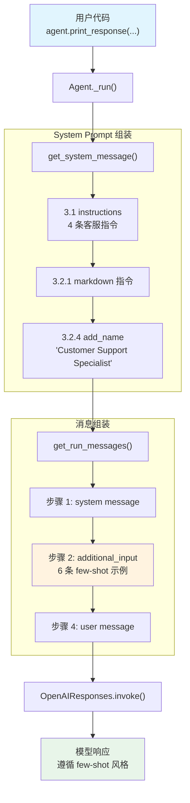

# few_shot_learning.py — 实现原理分析

> 源文件：`cookbook/02_agents/03_context_management/few_shot_learning.py`

## 概述

本示例展示 Agno 的 **`additional_input`（Few-Shot Learning）** 机制：通过 `additional_input` 参数传入预定义的 user/assistant 对话示例，在 system message 之后、用户消息之前插入，引导模型学习期望的回答风格和格式。本例还组合使用了 **`instructions`**、**`add_name_to_context`** 和 **`markdown`**。

**核心配置一览：**

| 配置项 | 值 | 说明 |
|--------|------|------|
| `name` | `"Customer Support Specialist"` | Agent 名称 |
| `model` | `OpenAIResponses(id="gpt-5-mini")` | Responses API |
| `add_name_to_context` | `True` | 在 system prompt 中添加名称 |
| `additional_input` | 6 条 `Message`（3 组 user/assistant 对话） | Few-shot 示例 |
| `instructions` | 4 条指令列表 | 客服行为规范 |
| `markdown` | `True` | 启用 markdown 格式化 |
| `description` | `None` | 未设置 |
| `tools` | `None` | 未设置 |
| `expected_output` | `None` | 未设置 |

## 架构分层

```
用户代码层                       agno.agent 层
┌────────────────────────┐    ┌──────────────────────────────────────┐
│ few_shot_learning.py   │    │ Agent._run()                         │
│                        │    │  ├ _messages.py                      │
│ additional_input=      │    │  │  get_system_message()              │
│   [Message x 6]        │───>│  │    → 3.3.3 instructions 拼接      │
│ instructions=[...]     │    │  │    → 3.2.1 markdown 指令           │
│ add_name_to_context=   │    │  │    → 3.2.4 add_name 注入          │
│   True                 │    │  │                                    │
│                        │    │  │  get_run_messages()                │
│ print_response(        │    │  │    步骤 1: system message          │
│   "I want to enable    │    │  │    步骤 2: additional_input        │
│    two-factor...")      │    │  │           (6 条 few-shot 示例)     │
│                        │    │  │    步骤 4: user message             │
└────────────────────────┘    └──────────────────────────────────────┘
                                        │
                                        ▼
                              ┌──────────────────┐
                              │ OpenAIResponses   │
                              │ gpt-5-mini        │
                              └──────────────────┘
```

## 核心组件解析

### additional_input

`additional_input` 在 `get_run_messages()`（`_messages.py:1204-1228`）步骤 2 中处理：

```python
# 2. 在 system message 之后、history/user message 之前插入额外消息
if agent.additional_input is not None:
    messages_to_add_to_run_response: List[Message] = []
    if run_messages.extra_messages is None:
        run_messages.extra_messages = []

    for _m in agent.additional_input:
        if isinstance(_m, Message):
            # Message 对象直接追加到消息列表
            messages_to_add_to_run_response.append(_m)
            run_messages.messages.append(_m)
            run_messages.extra_messages.append(_m)
        elif isinstance(_m, dict):
            # dict 验证为 Message 后追加
            _m_parsed = Message.model_validate(_m)
            ...
```

**消息顺序：** system → additional_input（few-shot 示例）→ history → user message

### add_name_to_context

`add_name_to_context` 在 `get_system_message()`（`_messages.py:224-225`）中处理：

```python
# 3.2.4 添加 Agent 名称到上下文
if agent.name is not None and agent.add_name_to_context:
    additional_information.append(f"Your name is: {agent.name}.")
```

### instructions 列表

本例传入 4 条 instructions，在步骤 3.3.3 中以 `"- "` 前缀列表方式拼接（因 `len(instructions) > 1`）。

## System Prompt 组装

| 序号 | 组成部分 | 本文件中的值/来源 | 是否生效 |
|------|---------|-----------------|---------|
| 1 | `system_message`（自定义） | `None` | 否 |
| 2 | `build_context=False` | `True`（默认） | 否（不跳过） |
| 3.1 | `instructions` | 4 条指令列表 | 是 |
| 3.1.1 | 模型指令 | OpenAIResponses 默认 | 视模型而定 |
| 3.2.1 | `markdown` | `True` | 是 |
| 3.2.2 | `add_datetime_to_context` | `False` | 否 |
| 3.2.3 | `add_location_to_context` | `False` | 否 |
| 3.2.4 | `add_name_to_context` | `True`，name=`"Customer Support Specialist"` | 是 |
| 3.3.1 | `description` | `None` | 否 |
| 3.3.2 | `role` | `None` | 否 |
| 3.3.3 | instructions 拼接 | 4 条以 `"- "` 前缀拼接 | 是 |
| 3.3.4 | additional_information | markdown + name | 是 |
| 3.3.5 | `_tool_instructions` | `None` | 否 |
| 3.3.7 | `expected_output` | `None` | 否 |
| 3.3.8 | `additional_context` | `None` | 否 |
| 3.3.9 | `add_memories_to_context` | `None` | 否 |

### 最终 System Prompt

```text
- You are an expert customer support specialist.
- Always be empathetic, professional, and solution-oriented.
- Provide clear, actionable steps to resolve customer issues.
- Follow the established patterns for consistent, high-quality support.

<additional_information>
- Use markdown to format your answers.
- Your name is: Customer Support Specialist.
</additional_information>
```

## 完整 API 请求

```python
client.responses.create(
    model="gpt-5-mini",
    input=[
        # 1. System Message
        {"role": "developer", "content": "- You are an expert customer support specialist.\n- Always be empathetic, professional, and solution-oriented.\n- Provide clear, actionable steps to resolve customer issues.\n- Follow the established patterns for consistent, high-quality support.\n\n<additional_information>\n- Use markdown to format your answers.\n- Your name is: Customer Support Specialist.\n</additional_information>\n\n"},

        # 2. Few-shot 示例（additional_input）
        {"role": "user", "content": "I forgot my password and can't log in"},
        {"role": "assistant", "content": "I'll help you reset your password right away.\n\n**Steps to Reset Your Password:**\n..."},
        {"role": "user", "content": "I've been charged twice for the same order and I'm frustrated!"},
        {"role": "assistant", "content": "I sincerely apologize for the billing error...\n\n**Immediate Action Plan:**\n..."},
        {"role": "user", "content": "Your app keeps crashing when I try to upload photos"},
        {"role": "assistant", "content": "I'm sorry you're experiencing crashes...\n\n**Troubleshooting Steps:**\n..."},

        # 3. 当前用户输入
        {"role": "user", "content": "I want to enable two-factor authentication for my account."}
    ]
)
```

> 6 条 few-shot 消息让模型学习到：使用 **加粗标题**、**编号步骤**、**后续建议** 的客服回答模式。

## Mermaid 流程图



## 关键源码文件索引

| 文件 | 关键函数/类 | 作用 |
|------|------------|------|
| `agno/agent/agent.py` | `additional_input` L261 | Few-shot 消息列表 |
| `agno/agent/agent.py` | `add_name_to_context` L239 | 名称注入开关 |
| `agno/agent/agent.py` | `instructions` L229 | 指令参数 |
| `agno/agent/_messages.py` | `get_run_messages()` L1146 | 组装消息列表 |
| `agno/agent/_messages.py` | 步骤 2 L1204-1228 | additional_input 注入 |
| `agno/agent/_messages.py` | `get_system_message()` L106 | 构建 system prompt |
| `agno/agent/_messages.py` | 步骤 3.2.4 L224-225 | 名称注入 |
| `agno/agent/_messages.py` | 步骤 3.3.3 L236-250 | instructions 拼接 |
| `agno/models/message.py` | `Message` | 消息数据模型 |
