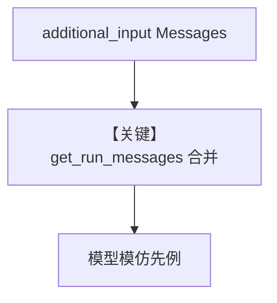

# few_shot_learning.py — 实现原理分析

> 源文件：`cookbook/02_agents/03_context_management/few_shot_learning.py`

## 概述

**`additional_input`**：传入 **`Message` 列表**，作为**额外多轮对话**拼入本次 run（见 **`get_run_messages`** 约 L1214+），实现 **few-shot** 模式；配合 **`instructions`** 与 **`add_name_to_context`**。

**核心配置一览：**

| 配置项 | 值 |
|--------|-----|
| `additional_input` | `support_examples`（多组 user/assistant） |
| `instructions` | list，客服专家行为 |
| `add_name_to_context` | `True` |
| `markdown` | `True` |

## 架构分层

```
few-shot Messages → 与用户当前问题一起进入模型上下文
```

## 核心组件解析

**`additional_input`** 在 `get_run_messages` 中展开（`_messages.py` L1214-L1238），**不**进入 `get_system_message` 的单一字符串。

### 运行机制与因果链

模型看到 **先例对话** 后模仿风格处理新用户句。

## System Prompt 组装

| 部分 | 位置 |
|------|------|
| instructions | system |
| name（若 add_name） | additional_information |
| few-shot | **用户/助手消息序列**（非 system 全文） |

### 还原后的完整 System 文本

instructions 列表合并后可还原为：

```text
You are an expert customer support specialist.
Always be empathetic, professional, and solution-oriented.
Provide clear, actionable steps to resolve customer issues.
Follow the established patterns for consistent, high-quality support.
```

**few-shot 对话**应在「消息列表」还原，不宜塞进单一 system 块；调试可看 `get_run_messages` 输出。

## 完整 API 请求

**OpenAIResponses**，`messages` 含先例 + 当前用户。

## Mermaid 流程图


```mermaid
flowchart TD
    A["additional_input Messages"] --> B["【关键】get_run_messages 合并"]
    B --> C["模型模仿先例"]
```

## 关键源码文件索引

| 文件 | 关键函数/类 | 作用 |
|------|------------|------|
| `agno/agent/_messages.py` | `get_run_messages` L1214+ | additional_input |
