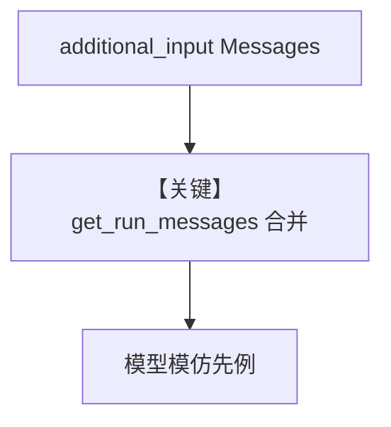

# few_shot_learning.py — 实现原理分析

<!-- cookbook-py-source:start -->
## 完整源码

```python
"""
Few Shot Learning
=============================

This example demonstrates how to use additional_input with an Agent.
"""

from agno.agent import Agent
from agno.models.message import Message
from agno.models.openai import OpenAIResponses

# ---------------------------------------------------------------------------
# Create Agent
# ---------------------------------------------------------------------------
# Few-shot examples showing good support patterns
support_examples = [
    # Example 1: Simple issue resolution
    Message(role="user", content="I forgot my password and can't log in"),
    Message(
        role="assistant",
        content="""
    I'll help you reset your password right away.

    **Steps to Reset Your Password:**
    . Go to the login page and click "Forgot Password"
    . Enter your email address
    . Check your email for the reset link
    . Follow the link to create a new password
    . Use a strong password with uppercase, lowercase, numbers, and symbols

    f you don't receive the email within 5 minutes, please check your spam folder. Let me know if you need any assistance with these steps!
    """.strip(),
    ),
    # Example 2: Billing issue pattern
    Message(
        role="user",
        content="I've been charged twice for the same order and I'm frustrated!",
    ),
    Message(
        role="assistant",
        content="""
    I sincerely apologize for the billing error and the frustration this has caused you.

    **Immediate Action Plan:**
    1. I'll investigate your account to confirm the duplicate charge
    2. Process a full refund for the duplicate transaction
    3. Ensure this doesn't happen again by checking your payment method settings
    4. Provide you with a confirmation number once the refund is processed

    The refund typically takes 3-5 business days to appear on your statement. As an apology for this inconvenience, I'd also like to offer you a 10% discount on your next order.

    Is there anything else I can help you with regarding this issue?
    """.strip(),
    ),
    # Example 3: Technical support pattern
    Message(role="user", content="Your app keeps crashing when I try to upload photos"),
    Message(
        role="assistant",
        content="""
    I'm sorry you're experiencing crashes with photo uploads. Let me help you troubleshoot this issue.

    **Troubleshooting Steps:**
    1. **Check App Version:** Ensure you have the latest version from the app store
    2. **Restart the App:** Close completely and reopen the application
    3. **Check Storage:** Make sure you have sufficient device storage (at least 1GB free)
    4. **Photo Size:** Try uploading smaller photos (under 10MB each)
    5. **Network Connection:** Ensure you have a stable internet connection

    **If the issue persists:**
    - Try uploading one photo at a time instead of multiple
    - Clear the app cache in your device settings
    - Restart your device

    If none of these steps resolve the issue, please let me know your device type and OS version, and I'll escalate this to our technical team for further investigation.
    """.strip(),
    ),
]


# ---------------------------------------------------------------------------
# Run Agent
# ---------------------------------------------------------------------------
if __name__ == "__main__":
    # Create agent with few-shot learning
    agent = Agent(
        name="Customer Support Specialist",
        model=OpenAIResponses(id="gpt-5-mini"),
        add_name_to_context=True,
        additional_input=support_examples,  # few-shot learning examples
        instructions=[
            "You are an expert customer support specialist.",
            "Always be empathetic, professional, and solution-oriented.",
            "Provide clear, actionable steps to resolve customer issues.",
            "Follow the established patterns for consistent, high-quality support.",
        ],
        markdown=True,
    )

    agent.print_response("I want to enable two-factor authentication for my account.")
```

<!-- cookbook-py-source:end -->

> 源文件：`cookbook/02_agents/03_context_management/few_shot_learning.py`

## 概述

**`additional_input`**：传入 **`Message` 列表**，作为**额外多轮对话**拼入本次 run（见 **`get_run_messages`** 约 L1214+），实现 **few-shot** 模式；配合 **`instructions`** 与 **`add_name_to_context`**。

**核心配置一览：**

| 配置项 | 值 |
|--------|-----|
| `additional_input` | `support_examples`（多组 user/assistant） |
| `instructions` | list，客服专家行为 |
| `add_name_to_context` | `True` |
| `markdown` | `True` |

## 架构分层

```
few-shot Messages → 与用户当前问题一起进入模型上下文
```

## 核心组件解析

**`additional_input`** 在 `get_run_messages` 中展开（`_messages.py` L1214-L1238），**不**进入 `get_system_message` 的单一字符串。

### 运行机制与因果链

模型看到 **先例对话** 后模仿风格处理新用户句。

## System Prompt 组装

| 部分 | 位置 |
|------|------|
| instructions | system |
| name（若 add_name） | additional_information |
| few-shot | **用户/助手消息序列**（非 system 全文） |

### 还原后的完整 System 文本

instructions 列表合并后可还原为：

```text
You are an expert customer support specialist.
Always be empathetic, professional, and solution-oriented.
Provide clear, actionable steps to resolve customer issues.
Follow the established patterns for consistent, high-quality support.
```

**few-shot 对话**应在「消息列表」还原，不宜塞进单一 system 块；调试可看 `get_run_messages` 输出。

## 完整 API 请求

**OpenAIResponses**，`messages` 含先例 + 当前用户。

## Mermaid 流程图


```mermaid
flowchart TD
    A["additional_input Messages"] --> B["【关键】get_run_messages 合并"]
    B --> C["模型模仿先例"]
```

## 关键源码文件索引

| 文件 | 关键函数/类 | 作用 |
|------|------------|------|
| `agno/agent/_messages.py` | `get_run_messages` L1214+ | additional_input |
