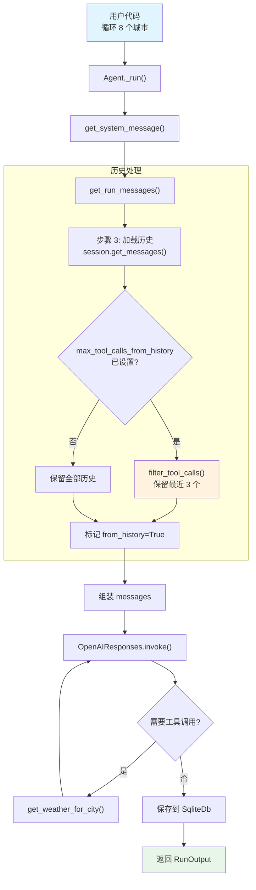

# filter_tool_calls_from_history.py — 实现原理分析

> 源文件：`cookbook/02_agents/03_context_management/filter_tool_calls_from_history.py`

## 概述

本示例展示 Agno 的 **`max_tool_calls_from_history`** 机制：在启用 `add_history_to_context` 的多轮对话中，限制发送给模型的历史工具调用数量，从而**降低 token 消耗**。数据库中仍保存完整历史，仅在构建模型输入时进行过滤。本例还组合使用了 **`db`**（SqliteDb 持久化）、自定义工具函数和 **`add_history_to_context`**。

**核心配置一览：**

| 配置项 | 值 | 说明 |
|--------|------|------|
| `model` | `OpenAIResponses(id="gpt-5-mini")` | Responses API |
| `tools` | `[get_weather_for_city]` | 自定义天气函数 |
| `instructions` | `"You are a weather assistant..."` | 单条指令 |
| `max_tool_calls_from_history` | `3` | 历史中最多保留 3 个工具调用 |
| `db` | `SqliteDb(db_file="tmp/weather_data.db")` | SQLite 持久化 |
| `add_history_to_context` | `True` | 将历史消息加入上下文 |
| `markdown` | `True` | 启用 markdown 格式化 |
| `name` | `None` | 未设置 |
| `description` | `None` | 未设置 |

## 架构分层

```
用户代码层                       agno.agent 层
┌────────────────────────┐    ┌──────────────────────────────────────┐
│ filter_tool_calls_     │    │ Agent._run() (循环 8 次)             │
│   from_history.py      │    │  ├ _messages.py                      │
│                        │    │  │  get_system_message()              │
│ max_tool_calls_from_   │    │  │    → instructions + markdown       │
│   history=3            │───>│  │                                    │
│ add_history_to_context │    │  │  get_run_messages()                │
│   =True                │    │  │    步骤 1: system message          │
│ db=SqliteDb(...)       │    │  │    步骤 3: history                 │
│                        │    │  │      → filter_tool_calls()         │
│ for city in cities:    │    │  │      → 只保留最近 3 个工具调用     │
│   agent.run(           │    │  │    步骤 4: user message             │
│     f"Weather in {c}") │    │  │                                    │
│                        │    │  ├ _tools.py                         │
│                        │    │  │  get_weather_for_city()            │
└────────────────────────┘    └──────────────────────────────────────┘
                                   │              │
                                   ▼              ▼
                          ┌──────────────┐ ┌──────────────┐
                          │ OpenAIResponses│ │ SqliteDb     │
                          │ gpt-5-mini   │ │ 完整历史存储  │
                          └──────────────┘ └──────────────┘
```

## 核心组件解析

### max_tool_calls_from_history

属性定义在 `agent.py:133`：

```python
# 历史中保留的最大工具调用数量（None = 不限制）
max_tool_calls_from_history: Optional[int] = None
```

在 `get_run_messages()`（`_messages.py:1257-1258`）步骤 3 中，加载历史后调用过滤：

```python
# 3. 添加历史到消息列表
if add_history_to_context:
    history = session.get_messages(...)

    if len(history) > 0:
        history_copy = [deepcopy(msg) for msg in history]
        for _msg in history_copy:
            _msg.from_history = True

        # 如果设置了限制，过滤历史中的工具调用
        if agent.max_tool_calls_from_history is not None:
            filter_tool_calls(history_copy, agent.max_tool_calls_from_history)

        run_messages.messages += history_copy
```

### filter_tool_calls 实现

`filter_tool_calls()`（`utils/message.py:10`）就地修改消息列表：

```python
def filter_tool_calls(messages: List[Message], max_tool_calls: int) -> None:
    # 1. 统计总工具调用数
    tool_call_count = sum(1 for m in messages if m.role == "tool")
    if tool_call_count <= max_tool_calls:
        return  # 无需过滤

    # 2. 从后往前收集最近 N 个工具调用的 ID
    tool_call_ids_list = []
    for msg in reversed(messages):
        if msg.role == "tool" and len(tool_call_ids_list) < max_tool_calls:
            if msg.tool_call_id:
                tool_call_ids_list.append(msg.tool_call_id)

    tool_call_ids_to_keep = set(tool_call_ids_list)

    # 3. 过滤：只保留最近 N 个工具调用及其对应的 assistant 消息
    filtered_messages = []
    for msg in messages:
        if msg.role == "tool":
            if msg.tool_call_id in tool_call_ids_to_keep:
                filtered_messages.append(msg)
        elif msg.role == "assistant" and msg.tool_calls:
            # 过滤 assistant 消息中的 tool_calls
            ...
```

### 过滤效果示例

| 运行 | 城市 | 历史工具调用 | 当前工具调用 | 上下文中总计 | 数据库中总计 |
|------|------|------------|------------|------------|------------|
| 1 | Tokyo | 0 | 1 | 1 | 1 |
| 2 | Delhi | 1 | 1 | 2 | 2 |
| 3 | Shanghai | 2 | 1 | 3 | 3 |
| 4 | São Paulo | 3 | 1 | 4 | 4 |
| 5 | Mumbai | **3** | 1 | **4** | 5 |
| 6 | Beijing | **3** | 1 | **4** | 6 |

> 从第 5 次运行开始，历史中的工具调用被截断为 3 个（最近的），但数据库始终保存完整记录。

### add_history_to_context + db

- `add_history_to_context=True`：每次运行时从 session 加载历史消息
- `db=SqliteDb(...)`：将每次运行的消息持久化到 SQLite 数据库

## System Prompt 组装

| 序号 | 组成部分 | 本文件中的值/来源 | 是否生效 |
|------|---------|-----------------|---------|
| 1 | `system_message`（自定义） | `None` | 否 |
| 2 | `build_context=False` | `True`（默认） | 否（不跳过） |
| 3.1 | `instructions` | `"You are a weather assistant..."` | 是 |
| 3.1.1 | 模型指令 | OpenAIResponses 默认 | 视模型而定 |
| 3.2.1 | `markdown` | `True` | 是 |
| 3.2.2 | `add_datetime_to_context` | `False` | 否 |
| 3.2.3 | `add_location_to_context` | `False` | 否 |
| 3.2.4 | `add_name_to_context` | `False` | 否 |
| 3.3.1 | `description` | `None` | 否 |
| 3.3.2 | `role` | `None` | 否 |
| 3.3.3 | instructions 拼接 | 单条指令 | 是 |
| 3.3.4 | additional_information | markdown 指令 | 是 |
| 3.3.5 | `_tool_instructions` | `None`（自定义函数无额外说明） | 否 |
| 3.3.7 | `expected_output` | `None` | 否 |
| 3.3.8 | `additional_context` | `None` | 否 |
| 3.3.9 | `add_memories_to_context` | `None` | 否 |

### 最终 System Prompt

```text
You are a weather assistant. Get the weather using the get_weather_for_city tool.

<additional_information>
- Use markdown to format your answers.
</additional_information>
```

## 完整 API 请求

**第 6 次运行（Beijing）— 历史已过滤：**

```python
client.responses.create(
    model="gpt-5-mini",
    input=[
        # 1. System Message
        {"role": "developer", "content": "You are a weather assistant..."},

        # 3. History（过滤后只保留最近 3 个工具调用）
        # --- 第 3 次运行（Shanghai）的工具调用已被移除 ---
        # --- 第 4 次运行（São Paulo）---
        {"role": "user", "content": "What's the weather in São Paulo?"},
        {"role": "assistant", "tool_calls": [{"function": {"name": "get_weather_for_city", "arguments": "{\"city\": \"São Paulo\"}"}}]},
        {"role": "tool", "content": "São Paulo: 28°C, Sunny"},
        {"role": "assistant", "content": "The weather in São Paulo is..."},
        # --- 第 5 次运行（Mumbai）---
        # ... 同理 ...

        # 4. 当前用户输入
        {"role": "user", "content": "What's the weather in Beijing?"}
    ],
    tools=[
        {"type": "function", "function": {"name": "get_weather_for_city", "parameters": {"type": "object", "properties": {"city": {"type": "string"}}}}}
    ]
)
```

## Mermaid 流程图



## 关键源码文件索引

| 文件 | 关键函数/类 | 作用 |
|------|------------|------|
| `agno/agent/agent.py` | `max_tool_calls_from_history` L133 | 历史工具调用限制 |
| `agno/agent/agent.py` | `add_history_to_context` L127 | 历史消息开关 |
| `agno/agent/agent.py` | `db` L123 | 数据库配置 |
| `agno/agent/_messages.py` | `get_run_messages()` L1146 | 组装消息列表 |
| `agno/agent/_messages.py` | 步骤 3 L1231-1262 | 历史加载与过滤 |
| `agno/agent/_messages.py` | L1257-1258 | 调用 filter_tool_calls |
| `agno/utils/message.py` | `filter_tool_calls()` L10 | 工具调用过滤实现 |
| `agno/db/sqlite.py` | `SqliteDb` | SQLite 持久化适配器 |
