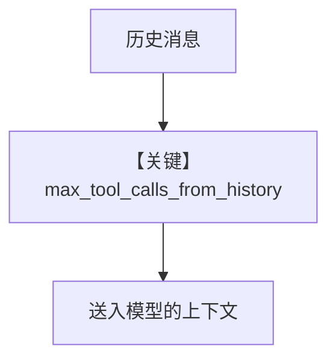

# filter_tool_calls_from_history.py — 实现原理分析

> 源文件：`cookbook/02_agents/03_context_management/filter_tool_calls_from_history.py`

## 概述

**`max_tool_calls_from_history=3`**：从**历史**里**只保留最近 N 条工具调用**再送入模型，降低 token；**DB 仍存完整消息**（示例打印对比 `from_history` 与 DB 总数）。

**核心配置一览：**

| 配置项 | 值 |
|--------|-----|
| `model` | `OpenAIResponses(id="gpt-5-mini")` |
| `tools` | `[get_weather_for_city]` |
| `max_tool_calls_from_history` | `3` |
| `db` | `SqliteDb(tmp/weather_data.db)` |
| `add_history_to_context` | `True` |

## 架构分层

```
get_run_messages → 裁剪历史中的 tool_calls → 当前 run 全量
```

## 核心组件解析

循环多城市查询以累积历史，观察 **In Context** 与 **In DB** 差异（`filter_tool_calls_from_history.py` L66-103）。

### 运行机制与因果链

**关键分支**：`max_tool_calls_from_history` 越小，历史工具上下文越少，可能丢远程依赖信息。

## System Prompt 组装

**instructions**：`"You are a weather assistant..."` 原样。

### 还原后的完整 System 文本

```text
You are a weather assistant. Get the weather using the get_weather_for_city tool.
```

（及 markdown、时间等默认段。）

## 完整 API 请求

**OpenAIResponses** + 工具；历史消息被裁剪后传入。

## Mermaid 流程图


```mermaid
flowchart TD
    A["历史消息"] --> B["【关键】max_tool_calls_from_history"]
    B --> C["送入模型的上下文"]
```

## 关键源码文件索引

| 文件 | 关键函数/类 | 作用 |
|------|------------|------|
| `agno/agent/_messages.py` | `get_run_messages` 内过滤逻辑 | 需结合实现 |
