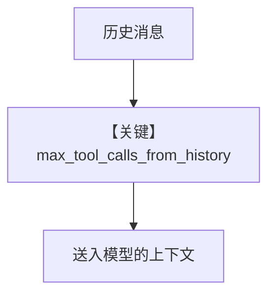

# filter_tool_calls_from_history.py — 实现原理分析

<!-- cookbook-py-source:start -->
## 完整源码

```python
"""
Filter Tool Calls From History
=============================

Demonstrates `max_tool_calls_from_history` by showing that tool-call filtering only
affects model input history while full run history remains in storage.
"""

import random

from agno.agent import Agent
from agno.db.sqlite import SqliteDb
from agno.models.openai import OpenAIResponses


def get_weather_for_city(city: str) -> str:
    conditions = ["Sunny", "Cloudy", "Rainy", "Snowy", "Foggy", "Windy"]
    temperature = random.randint(-10, 35)
    condition = random.choice(conditions)

    return f"{city}: {temperature}°C, {condition}"


# ---------------------------------------------------------------------------
# Setup
# ---------------------------------------------------------------------------
cities = [
    "Tokyo",
    "Delhi",
    "Shanghai",
    "São Paulo",
    "Mumbai",
    "Beijing",
    "Cairo",
    "London",
]


# ---------------------------------------------------------------------------
# Create Agent
# ---------------------------------------------------------------------------
agent = Agent(
    model=OpenAIResponses(id="gpt-5-mini"),
    tools=[get_weather_for_city],
    instructions="You are a weather assistant. Get the weather using the get_weather_for_city tool.",
    # Only keep 3 most recent tool calls from history in context (reduces token costs)
    max_tool_calls_from_history=3,
    db=SqliteDb(db_file="tmp/weather_data.db"),
    add_history_to_context=True,
    markdown=True,
    # debug_mode=True,
)

# ---------------------------------------------------------------------------
# Run Agent
# ---------------------------------------------------------------------------
if __name__ == "__main__":
    print("\n" + "=" * 90)
    print("Tool Call Filtering Demo: max_tool_calls_from_history=3")
    print("=" * 90)
    print(
        f"{'Run':<5} | {'City':<15} | {'History':<8} | {'Current':<8} | {'In Context':<11} | {'In DB':<8}"
    )
    print("-" * 90)

    for i, city in enumerate(cities, 1):
        run_response = agent.run(f"What's the weather in {city}?")

        # Count tool calls from history (sent to model after filtering)
        history_tool_calls = sum(
            len(msg.tool_calls)
            for msg in run_response.messages
            if msg.role == "assistant"
            and msg.tool_calls
            and getattr(msg, "from_history", False)
        )

        # Count tool calls from current run
        current_tool_calls = sum(
            len(msg.tool_calls)
            for msg in run_response.messages
            if msg.role == "assistant"
            and msg.tool_calls
            and not getattr(msg, "from_history", False)
        )

        total_in_context = history_tool_calls + current_tool_calls

        # Total tool calls stored in database (unfiltered)
        saved_messages = agent.get_session_messages()
        total_in_db = (
            sum(
                len(msg.tool_calls)
                for msg in saved_messages
                if msg.role == "assistant" and msg.tool_calls
            )
            if saved_messages
            else 0
        )

        print(
            f"{i:<5} | {city:<15} | {history_tool_calls:<8} | {current_tool_calls:<8} | {total_in_context:<11} | {total_in_db:<8}"
        )
```

<!-- cookbook-py-source:end -->

> 源文件：`cookbook/02_agents/03_context_management/filter_tool_calls_from_history.py`

## 概述

**`max_tool_calls_from_history=3`**：从**历史**里**只保留最近 N 条工具调用**再送入模型，降低 token；**DB 仍存完整消息**（示例打印对比 `from_history` 与 DB 总数）。

**核心配置一览：**

| 配置项 | 值 |
|--------|-----|
| `model` | `OpenAIResponses(id="gpt-5-mini")` |
| `tools` | `[get_weather_for_city]` |
| `max_tool_calls_from_history` | `3` |
| `db` | `SqliteDb(tmp/weather_data.db)` |
| `add_history_to_context` | `True` |

## 架构分层

```
get_run_messages → 裁剪历史中的 tool_calls → 当前 run 全量
```

## 核心组件解析

循环多城市查询以累积历史，观察 **In Context** 与 **In DB** 差异（`filter_tool_calls_from_history.py` L66-103）。

### 运行机制与因果链

**关键分支**：`max_tool_calls_from_history` 越小，历史工具上下文越少，可能丢远程依赖信息。

## System Prompt 组装

**instructions**：`"You are a weather assistant..."` 原样。

### 还原后的完整 System 文本

```text
You are a weather assistant. Get the weather using the get_weather_for_city tool.
```

（及 markdown、时间等默认段。）

## 完整 API 请求

**OpenAIResponses** + 工具；历史消息被裁剪后传入。

## Mermaid 流程图


```mermaid
flowchart TD
    A["历史消息"] --> B["【关键】max_tool_calls_from_history"]
    B --> C["送入模型的上下文"]
```

## 关键源码文件索引

| 文件 | 关键函数/类 | 作用 |
|------|------------|------|
| `agno/agent/_messages.py` | `get_run_messages` 内过滤逻辑 | 需结合实现 |
