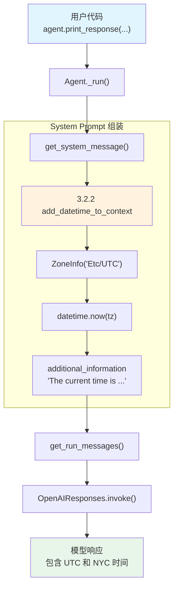

# instructions.py — 实现原理分析

> 源文件：`cookbook/02_agents/03_context_management/instructions.py`

## 概述

本示例展示 Agno 的 **`add_datetime_to_context`** 与 **`timezone_identifier`** 机制：通过设置 `add_datetime_to_context=True`，Agent 在 system prompt 中自动注入当前日期时间信息，使模型具备时间感知能力。`timezone_identifier` 可指定时区。

**核心配置一览：**

| 配置项 | 值 | 说明 |
|--------|------|------|
| `model` | `OpenAIResponses(id="gpt-5.2")` | Responses API |
| `add_datetime_to_context` | `True` | 注入当前时间 |
| `timezone_identifier` | `"Etc/UTC"` | UTC 时区 |
| `name` | `None` | 未设置 |
| `instructions` | `None` | 未设置 |
| `description` | `None` | 未设置 |
| `tools` | `None` | 未设置 |
| `markdown` | `False`（默认） | 未设置 |

## 架构分层

```
用户代码层                       agno.agent 层
┌────────────────────────┐    ┌──────────────────────────────────────┐
│ instructions.py        │    │ Agent._run()                         │
│                        │    │  ├ _messages.py                      │
│ add_datetime_to_context│    │  │  get_system_message()              │
│   =True                │───>│  │    → 3.2.2 注入当前时间           │
│ timezone_identifier=   │    │  │    → timezone: Etc/UTC             │
│   "Etc/UTC"            │    │  │                                    │
│                        │    │  │  get_run_messages()                │
│ print_response(        │    │  │    → system + user                 │
│   "What is the current │    │  │                                    │
│    date and time?")    │    │  │                                    │
└────────────────────────┘    └──────────────────────────────────────┘
                                        │
                                        ▼
                              ┌──────────────────┐
                              │ OpenAIResponses   │
                              │ gpt-5.2           │
                              └──────────────────┘
```

## 核心组件解析

### add_datetime_to_context

`add_datetime_to_context` 在 `get_system_message()`（`_messages.py:187-202`）中处理：

```python
# 3.2.2 添加当前时间到上下文
if agent.add_datetime_to_context:
    from datetime import datetime

    tz = None
    if agent.timezone_identifier:
        try:
            from zoneinfo import ZoneInfo
            tz = ZoneInfo(agent.timezone_identifier)  # "Etc/UTC"
        except Exception:
            log_warning("Invalid timezone identifier")

    time = datetime.now(tz) if tz else datetime.now()
    additional_information.append(f"The current time is {time}.")
```

### timezone_identifier

属性定义在 `agent.py:247`：

```python
# 自定义时区，遵循 TZ Database 格式（如 "Etc/UTC"、"Asia/Shanghai"）
timezone_identifier: Optional[str] = None
```

使用 Python 标准库 `zoneinfo.ZoneInfo` 解析时区标识符。

## System Prompt 组装

| 序号 | 组成部分 | 本文件中的值/来源 | 是否生效 |
|------|---------|-----------------|---------|
| 1 | `system_message`（自定义） | `None` | 否 |
| 2 | `build_context=False` | `True`（默认） | 否（不跳过） |
| 3.1 | `instructions` | `None` | 否 |
| 3.1.1 | 模型指令 | OpenAIResponses 默认 | 视模型而定 |
| 3.2.1 | `markdown` | `False` | 否 |
| 3.2.2 | `add_datetime_to_context` | `True`，tz=`Etc/UTC` | 是 |
| 3.2.3 | `add_location_to_context` | `False` | 否 |
| 3.2.4 | `add_name_to_context` | `False` | 否 |
| 3.3.1 | `description` | `None` | 否 |
| 3.3.2 | `role` | `None` | 否 |
| 3.3.3 | instructions 拼接 | 无 | 否 |
| 3.3.4 | additional_information | 当前时间 | 是 |
| 3.3.5 | `_tool_instructions` | `None` | 否 |
| 3.3.7 | `expected_output` | `None` | 否 |
| 3.3.8 | `additional_context` | `None` | 否 |
| 3.3.9 | `add_memories_to_context` | `None` | 否 |

### 最终 System Prompt

```text
<additional_information>
- The current time is 2026-02-28 12:34:56.789012+00:00.
</additional_information>
```

> 时间为运行时动态生成，每次调用都不同。

## 完整 API 请求

```python
client.responses.create(
    model="gpt-5.2",
    input=[
        {"role": "developer", "content": "<additional_information>\n- The current time is 2026-02-28 12:34:56.789012+00:00.\n</additional_information>\n\n"},
        {"role": "user", "content": "What is the current date and time? What is the current time in NYC?"}
    ]
)
```

> 模型收到 UTC 时间后，可以推算 NYC（UTC-5）的当前时间。

## Mermaid 流程图



## 关键源码文件索引

| 文件 | 关键函数/类 | 作用 |
|------|------------|------|
| `agno/agent/agent.py` | `add_datetime_to_context` L242 | 时间注入开关 |
| `agno/agent/agent.py` | `timezone_identifier` L247 | 时区标识符 |
| `agno/agent/_messages.py` | `get_system_message()` L106 | 构建 system prompt |
| `agno/agent/_messages.py` | 步骤 3.2.2 L187-202 | 时间注入逻辑 |
