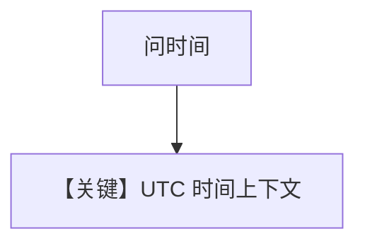

# instructions.py — 实现原理分析

> 源文件：`cookbook/02_agents/03_context_management/instructions.py`

## 概述

文件名易误解：本文件**未设置 `instructions` 参数**，仅演示 **`add_datetime_to_context=True`** 与 **`timezone_identifier="Etc/UTC"`**，用于回答「当前日期时间」类问题。

**核心配置一览：**

| 配置项 | 值 |
|--------|-----|
| `model` | `OpenAIResponses(id="gpt-5.2")` |
| `add_datetime_to_context` | `True` |
| `timezone_identifier` | `"Etc/UTC"` |

## 架构分层

```
#3.2.2 UTC 时间 → 用户问时间 → 模型结合 system 中的当前时间回答
```

## 核心组件解析

无自定义业务 instructions，**#3.1** 可能为空。

### 运行机制与因果链

适用于验证 **时区** 与 **时间句** 是否正确注入。

## System Prompt 组装

### 还原后的完整 System 文本

无用户 instructions；仅有 **#3.2.2** 类似：

```text
The current time is <UTC 格式化时间>.
```

及可能的 **#3.2.1 markdown**（若 `markdown` 默认 true——本文件未设 `markdown`，以 Agent 默认为准）。

## 完整 API 请求

**OpenAIResponses**。

## Mermaid 流程图


```mermaid
flowchart TD
    A["问时间"] --> B["【关键】UTC 时间上下文"]
```

## 关键源码文件索引

| 文件 | 关键函数/类 | 作用 |
|------|------------|------|
| `agno/agent/_messages.py` | `#3.2.2` | 时间 |
