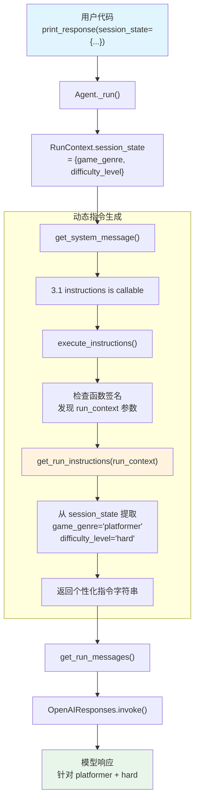

# instructions_with_state.py — 实现原理分析

> 源文件：`cookbook/02_agents/03_context_management/instructions_with_state.py`

## 概述

本示例展示 Agno 的 **动态指令（Callable Instructions）** 机制：将 `instructions` 参数设置为一个接收 `RunContext` 的函数，在每次运行时根据 `session_state` 动态生成指令内容。这使得同一个 Agent 实例可以根据不同的运行上下文产生不同的 system prompt。

**核心配置一览：**

| 配置项 | 值 | 说明 |
|--------|------|------|
| `model` | `OpenAIResponses(id="gpt-5.2")` | Responses API |
| `instructions` | `get_run_instructions`（Callable） | 动态指令函数 |
| `name` | `None` | 未设置 |
| `description` | `None` | 未设置 |
| `tools` | `None` | 未设置 |
| `markdown` | `False`（默认） | 未设置 |

**运行时参数：**

| 参数 | 值 | 说明 |
|------|------|------|
| `session_state` | `{"game_genre": "platformer", "difficulty_level": "hard"}` | 会话状态 |

## 架构分层

```
用户代码层                       agno.agent 层
┌────────────────────────┐    ┌──────────────────────────────────────┐
│ instructions_with_     │    │ Agent._run()                         │
│   state.py             │    │  ├ _messages.py                      │
│                        │    │  │  get_system_message()              │
│ instructions=          │    │  │    → 3.1 callable → execute_       │
│   get_run_instructions │───>│  │      instructions()                │
│                        │    │  │    → 检查函数签名                   │
│ session_state=         │    │  │    → 注入 run_context              │
│   {"game_genre":       │    │  │    → 返回动态指令字符串            │
│    "platformer",...}   │    │  │                                    │
│                        │    │  │  get_run_messages()                │
│ print_response(        │    │  │    → system + user                 │
│   "What genre...",     │    │  │                                    │
│   session_state=...)   │    │  │                                    │
└────────────────────────┘    └──────────────────────────────────────┘
                                        │
                                        ▼
                              ┌──────────────────┐
                              │ OpenAIResponses   │
                              │ gpt-5.2           │
                              └──────────────────┘
```

## 核心组件解析

### Callable Instructions

当 `instructions` 为 callable 时，`get_system_message()`（`_messages.py:163-174`）中的步骤 3.1 处理：

```python
# 3.1 解析 instructions
instructions: List[str] = []
if agent.instructions is not None:
    _instructions = agent.instructions
    if callable(agent.instructions):
        # 调用 execute_instructions() 执行函数
        _instructions = execute_instructions(
            agent=agent, instructions=agent.instructions,
            session_state=session_state, run_context=run_context
        )

    if isinstance(_instructions, str):
        instructions.append(_instructions)
    elif isinstance(_instructions, list):
        instructions.extend(_instructions)
```

### execute_instructions

`execute_instructions()`（`utils/agent.py:949`）通过检查函数签名自动注入参数：

```python
def execute_instructions(instructions, agent=None, team=None, session_state=None, run_context=None):
    import inspect
    signature = inspect.signature(instructions)
    instruction_args = {}

    # 根据函数签名自动注入参数
    if "agent" in signature.parameters:
        instruction_args["agent"] = agent
    if "team" in signature.parameters:
        instruction_args["team"] = team
    if "session_state" in signature.parameters:
        instruction_args["session_state"] = session_state
    if "run_context" in signature.parameters:
        instruction_args["run_context"] = run_context

    return instructions(**instruction_args)
```

### 本例的指令函数

```python
def get_run_instructions(run_context: RunContext) -> str:
    # 无 session_state 时返回通用指令
    if not run_context.session_state:
        return "You are a helpful game development assistant..."

    # 有 session_state 时，从中提取参数构建个性化指令
    game_genre = run_context.session_state.get("game_genre", "")
    difficulty_level = run_context.session_state.get("difficulty_level", "")

    return f"""
    You are a specialized game development assistant.
    The team is currently working on a {game_genre} game.
    The current project difficulty level is set to {difficulty_level}.
    ..."""
```

函数签名中有 `run_context` 参数，`execute_instructions` 会自动注入 `RunContext` 对象，其中包含 `session_state`。

### session_state 传递链

```
print_response(session_state={...})
  → _run(session_state=...)
    → RunContext.session_state = {...}
      → get_system_message(run_context=...)
        → execute_instructions(run_context=...)
          → get_run_instructions(run_context)
            → run_context.session_state.get("game_genre")
```

## System Prompt 组装

| 序号 | 组成部分 | 本文件中的值/来源 | 是否生效 |
|------|---------|-----------------|---------|
| 1 | `system_message`（自定义） | `None` | 否 |
| 2 | `build_context=False` | `True`（默认） | 否（不跳过） |
| 3.1 | `instructions` | `get_run_instructions()`（动态） | 是 |
| 3.1.1 | 模型指令 | OpenAIResponses 默认 | 视模型而定 |
| 3.2.1 | `markdown` | `False` | 否 |
| 3.2.2 | `add_datetime_to_context` | `False` | 否 |
| 3.2.3 | `add_location_to_context` | `False` | 否 |
| 3.2.4 | `add_name_to_context` | `False` | 否 |
| 3.3.1 | `description` | `None` | 否 |
| 3.3.2 | `role` | `None` | 否 |
| 3.3.3 | instructions 拼接 | 动态生成的指令 | 是 |
| 3.3.4 | additional_information | 无 | 否 |
| 3.3.5 | `_tool_instructions` | `None` | 否 |
| 3.3.7 | `expected_output` | `None` | 否 |
| 3.3.8 | `additional_context` | `None` | 否 |
| 3.3.9 | `add_memories_to_context` | `None` | 否 |

### 最终 System Prompt

```text
You are a specialized game development assistant.
The team is currently working on a platformer game.
The current project difficulty level is set to hard.
Please tailor your responses to match this genre and complexity level when providing
coding advice, design suggestions, or technical guidance.
```

## 完整 API 请求

```python
client.responses.create(
    model="gpt-5.2",
    input=[
        {"role": "developer", "content": "\n        You are a specialized game development assistant.\n        The team is currently working on a platformer game.\n        The current project difficulty level is set to hard.\n        Please tailor your responses to match this genre and complexity level when providing\n        coding advice, design suggestions, or technical guidance.\n\n"},
        {"role": "user", "content": "What genre are we working on and what should I focus on for the core mechanics?"}
    ]
)
```

## Mermaid 流程图



## 关键源码文件索引

| 文件 | 关键函数/类 | 作用 |
|------|------------|------|
| `agno/agent/agent.py` | `instructions` L229 | 指令参数（支持 Callable） |
| `agno/agent/_messages.py` | `get_system_message()` L106 | 构建 system prompt |
| `agno/agent/_messages.py` | 步骤 3.1 L163-174 | callable instructions 处理 |
| `agno/utils/agent.py` | `execute_instructions()` L949 | 执行指令函数 |
| `agno/run.py` | `RunContext` | 运行上下文（含 session_state） |
