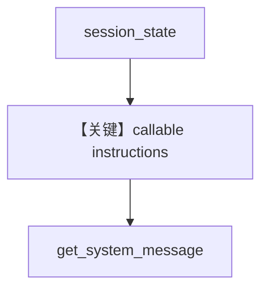

# instructions_with_state.py — 实现原理分析

> 源文件：`cookbook/02_agents/03_context_management/instructions_with_state.py`

## 概述

**`instructions` 为可调用**：**`get_run_instructions(run_context)`** 按 **`session_state`**（`game_genre`、`difficulty_level`）动态生成字符串；无 state 时返回通用游戏助手句。**`execute_instructions`** 在 `get_system_message` **#3.1** 分支调用（`_messages.py` L165-168）。

**核心配置一览：**

| 配置项 | 值 |
|--------|-----|
| `model` | `OpenAIResponses(id="gpt-5.2")` |
| `instructions` | `get_run_instructions` 可调用 |

## 架构分层

```
run_context.session_state → execute_instructions → instructions 文本 → system
```

## 核心组件解析

`print_response` 传入 **`session_state={...}`**（`instructions_with_state.py` L46-48）。

### 运行机制与因果链

同一会话可切换 state，instructions 随之变，无需改 Agent 类。

## System Prompt 组装

### 还原后的完整 System 文本（有 state 时）

```text
You are a specialized game development assistant.
The team is currently working on a platformer game.
The current project difficulty level is set to hard.
Please tailor your responses to match this genre and complexity level when providing
coding advice, design suggestions, or technical guidance.
```

无 state 时用 `get_run_instructions` 首分支返回的通用句。

## 完整 API 请求

**OpenAIResponses**。

## Mermaid 流程图


```mermaid
flowchart TD
    A["session_state"] --> B["【关键】callable instructions"]
    B --> C["get_system_message"]
```

## 关键源码文件索引

| 文件 | 关键函数/类 | 作用 |
|------|------------|------|
| `agno/agent/_messages.py` | `execute_instructions` | 调用可调用 instructions |
