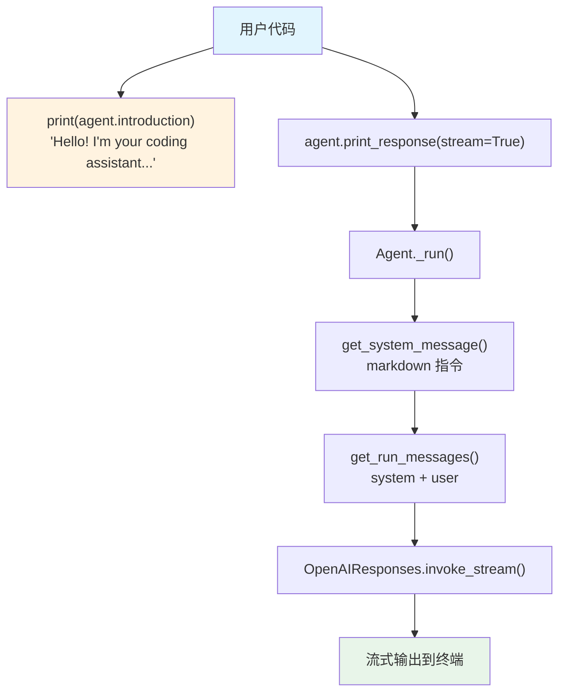

# introduction_message.py — 实现原理分析

> 源文件：`cookbook/02_agents/03_context_management/introduction_message.py`

## 概述

本示例展示 Agno 的 **`introduction`** 机制：通过设置 `introduction` 参数，为 Agent 定义一条初始问候消息。该消息作为 Agent 的「自我介绍」，可通过 `agent.introduction` 属性直接访问。注意：`introduction` **不会自动注入到对话消息中**，它是一个供应用层使用的元数据属性。

**核心配置一览：**

| 配置项 | 值 | 说明 |
|--------|------|------|
| `model` | `OpenAIResponses(id="gpt-5.2")` | Responses API |
| `introduction` | `"Hello! I'm your coding assistant..."` | 初始问候消息 |
| `markdown` | `True` | 启用 markdown 格式化 |
| `name` | `None` | 未设置 |
| `instructions` | `None` | 未设置 |
| `description` | `None` | 未设置 |
| `tools` | `None` | 未设置 |
| `expected_output` | `None` | 未设置 |

## 架构分层

```
用户代码层                       agno.agent 层
┌────────────────────────┐    ┌──────────────────────────────────────┐
│ introduction_message.py│    │ Agent                                │
│                        │    │  ├ introduction 属性                 │
│ introduction=          │    │  │  → 仅作为元数据存储               │
│   "Hello! I'm your    │───>│  │  → 不注入到消息列表               │
│    coding assistant."  │    │  │                                    │
│                        │    │  ├ _messages.py                      │
│ print(agent.           │    │  │  get_system_message()              │
│   introduction)        │    │  │    → markdown 指令                 │
│                        │    │  │                                    │
│ print_response(        │    │  │  get_run_messages()                │
│   "Help me write...",  │    │  │    → system + user（无 intro）     │
│   stream=True)         │    │  │                                    │
└────────────────────────┘    └──────────────────────────────────────┘
                                        │
                                        ▼
                              ┌──────────────────┐
                              │ OpenAIResponses   │
                              │ gpt-5.2           │
                              └──────────────────┘
```

## 核心组件解析

### introduction

属性定义在 `agent.py:220-221`：

```python
# 提供 Agent 的首条消息作为介绍
introduction: Optional[str] = None
```

`introduction` 是一个纯属性，不参与 `get_system_message()` 或 `get_run_messages()` 的构建。它的主要用途：

1. **应用层展示**：在聊天 UI 中显示 Agent 的初始问候
2. **元数据访问**：`agent.introduction` 可在代码中直接读取
3. **AgentOS/Playground**：Agno 的 Web UI 会自动展示此消息

### 本例的使用方式

```python
# 直接访问属性打印
print("Introduction:", agent.introduction)

# 然后正常调用 Agent
agent.print_response("Help me write a Python function...", stream=True)
```

## System Prompt 组装

| 序号 | 组成部分 | 本文件中的值/来源 | 是否生效 |
|------|---------|-----------------|---------|
| 1 | `system_message`（自定义） | `None` | 否 |
| 2 | `build_context=False` | `True`（默认） | 否（不跳过） |
| 3.1 | `instructions` | `None` | 否 |
| 3.1.1 | 模型指令 | OpenAIResponses 默认 | 视模型而定 |
| 3.2.1 | `markdown` | `True` | 是 |
| 3.2.2 | `add_datetime_to_context` | `False` | 否 |
| 3.2.3 | `add_location_to_context` | `False` | 否 |
| 3.2.4 | `add_name_to_context` | `False` | 否 |
| 3.3.1 | `description` | `None` | 否 |
| 3.3.2 | `role` | `None` | 否 |
| 3.3.3 | instructions 拼接 | 无 | 否 |
| 3.3.4 | additional_information | markdown 指令 | 是 |
| 3.3.5 | `_tool_instructions` | `None` | 否 |
| 3.3.7 | `expected_output` | `None` | 否 |
| 3.3.8 | `additional_context` | `None` | 否 |
| 3.3.9 | `add_memories_to_context` | `None` | 否 |

### 最终 System Prompt

```text
<additional_information>
- Use markdown to format your answers.
</additional_information>
```

> `introduction` 不出现在 system prompt 中。

## 完整 API 请求

```python
client.responses.create(
    model="gpt-5.2",
    input=[
        {"role": "developer", "content": "<additional_information>\n- Use markdown to format your answers.\n</additional_information>\n\n"},
        {"role": "user", "content": "Help me write a Python function to check if a string is a palindrome."}
    ],
    stream=True,
    stream_options={"include_usage": True}
)
```

> `introduction` 消息由应用层单独打印，不进入 API 请求。

## Mermaid 流程图



## 关键源码文件索引

| 文件 | 关键函数/类 | 作用 |
|------|------------|------|
| `agno/agent/agent.py` | `introduction` L221 | 介绍消息属性 |
| `agno/agent/agent.py` | `markdown` L237 | markdown 格式化开关 |
| `agno/agent/_messages.py` | `get_system_message()` L106 | 构建 system prompt |
| `agno/agent/_messages.py` | 步骤 3.2.1 L184-185 | markdown 指令注入 |
