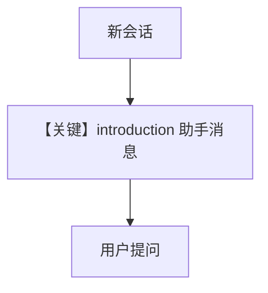

# introduction_message.py — 实现原理分析

> 源文件：`cookbook/02_agents/03_context_management/introduction_message.py`

## 概述

**`introduction`**：会话开始时作为 **Agent 首条助手消息** 写入会话存储（见 **`_storage.py`** 约 L320+），模拟「开场白」。**非 system**，而是 **assistant 消息**。

**核心配置一览：**

| 配置项 | 值 |
|--------|-----|
| `model` | `OpenAIResponses(id="gpt-5.2")` |
| `introduction` | 英文问候与能力说明 |
| `markdown` | `True` |

## 架构分层

```
新 session → 存储层插入 introduction 作为 assistant → 后续用户消息
```

## 核心组件解析

打印 **`agent.introduction`** 仅展示属性（`introduction_message.py` L25-26）。

### 运行机制与因果链

首次对话用户可见历史中先有助手问候（依 UI/存储策略）。

## System Prompt 组装

**introduction 不进 `get_system_message` 的默认拼装**；属 **消息历史**。

### 还原后的完整 System 文本

无额外业务 instructions；默认 system 可能较短。

**introduction 原文**（作为 assistant 内容）：

```text
Hello! I'm your coding assistant. I can help you write, debug, and explain code. What would you like to work on?
```

## 完整 API 请求

首条 assistant 与后续 **OpenAIResponses** 请求一并进入上下文。

## Mermaid 流程图


```mermaid
flowchart TD
    A["新会话"] --> B["【关键】introduction 助手消息"]
    B --> C["用户提问"]
```

## 关键源码文件索引

| 文件 | 关键函数/类 | 作用 |
|------|------------|------|
| `agno/agent/_storage.py` | L320+ | 写入 introduction |
