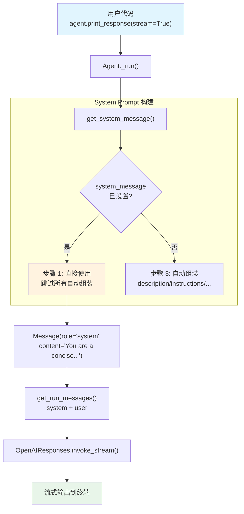

# system_message.py — 实现原理分析

> 源文件：`cookbook/02_agents/03_context_management/system_message.py`

## 概述

本示例展示 Agno 的 **`system_message` 自定义** 机制：通过直接设置 `system_message` 参数，完全覆盖 Agno 自动生成的 system prompt。当设置了 `system_message` 时，所有自动组装步骤（description、instructions、markdown、expected_output 等）都会被跳过，直接使用用户提供的内容。本例还展示了 `system_message_role` 的自定义。

**核心配置一览：**

| 配置项 | 值 | 说明 |
|--------|------|------|
| `model` | `OpenAIResponses(id="gpt-5.2")` | Responses API |
| `system_message` | `"You are a concise technical writer..."` | 自定义 system prompt |
| `system_message_role` | `"system"` | system 消息角色（显式设置为默认值） |
| `markdown` | `True` | 已设置但**不生效**（被 system_message 覆盖） |
| `name` | `None` | 未设置 |
| `instructions` | `None` | 未设置 |
| `description` | `None` | 未设置 |
| `tools` | `None` | 未设置 |

## 架构分层

```
用户代码层                       agno.agent 层
┌────────────────────────┐    ┌──────────────────────────────────────┐
│ system_message.py      │    │ Agent._run()                         │
│                        │    │  ├ _messages.py                      │
│ system_message=        │    │  │  get_system_message()              │
│   "You are a concise   │───>│  │    → 步骤 1: system_message 已设置│
│    technical writer."  │    │  │    → 直接返回，跳过所有自动组装   │
│ system_message_role=   │    │  │    → role = "system"              │
│   "system"             │    │  │                                    │
│ markdown=True          │    │  │  get_run_messages()                │
│   (不生效)             │    │  │    → system + user                 │
│                        │    │  │                                    │
│ print_response(        │    │  │                                    │
│   "Explain how...",    │    │  │                                    │
│   stream=True)         │    │  │                                    │
└────────────────────────┘    └──────────────────────────────────────┘
                                        │
                                        ▼
                              ┌──────────────────┐
                              │ OpenAIResponses   │
                              │ gpt-5.2           │
                              └──────────────────┘
```

## 核心组件解析

### system_message 覆盖机制

`get_system_message()`（`_messages.py:130-152`）步骤 1 中，检测到 `system_message` 后直接返回：

```python
# 1. 如果设置了 system_message，直接使用
if agent.system_message is not None:
    if isinstance(agent.system_message, Message):
        return agent.system_message

    sys_message_content: str = ""
    if isinstance(agent.system_message, str):
        sys_message_content = agent.system_message  # 本例走这个分支
    elif callable(agent.system_message):
        sys_message_content = execute_system_message(...)

    # 解析模板变量（如 {session_state.xxx}）
    if agent.resolve_in_context:
        sys_message_content = format_message_with_state_variables(...)

    return Message(role=agent.system_message_role, content=sys_message_content)
```

**关键点**：`system_message` 设置后，步骤 2（`build_context` 检查）和步骤 3（自动组装）全部被跳过。因此 `markdown=True` 虽然已设置，但其对应的指令不会被注入到 system prompt 中。

### system_message_role

属性定义在 `agent.py:219`：

```python
# system 消息的角色，默认 "system"
system_message_role: str = "system"
```

默认值为 `"system"`，在 OpenAIResponses 的 `role_map` 中会被映射为 `"developer"`。本例显式设置为 `"system"` 与默认行为一致。

### markdown 不生效的原因

| 场景 | system_message | markdown 效果 |
|------|---------------|---------------|
| 本例 | 已设置 | **不生效** — 步骤 3.2.1 被跳过 |
| 典型用法 | 未设置 | 生效 — 在步骤 3.2.1 中注入 |

> `markdown=True` 仍会影响 `_cli` 层的终端渲染（Rich markdown），但不会在 system prompt 中添加格式化指令。

## System Prompt 组装

| 序号 | 组成部分 | 本文件中的值/来源 | 是否生效 |
|------|---------|-----------------|---------|
| 1 | `system_message`（自定义） | `"You are a concise technical writer..."` | **是（直接返回）** |
| 2 | `build_context=False` | — | **跳过** |
| 3.1 | `instructions` | — | **跳过** |
| 3.2.1 | `markdown` | `True`（但被跳过） | **跳过** |
| 3.2.2~3.3.9 | 所有自动组装步骤 | — | **全部跳过** |

### 最终 System Prompt

```text
You are a concise technical writer. Always respond in bullet points. Never use more than 3 sentences per bullet point.
```

## 完整 API 请求

```python
client.responses.create(
    model="gpt-5.2",
    input=[
        # system_message_role="system" → role_map 映射为 "developer"
        {"role": "developer", "content": "You are a concise technical writer. Always respond in bullet points. Never use more than 3 sentences per bullet point."},
        {"role": "user", "content": "Explain how HTTP cookies work."}
    ],
    stream=True,
    stream_options={"include_usage": True}
)
```

> 模型收到简洁的自定义 system prompt，无任何 Agno 自动添加的内容。

## Mermaid 流程图



## 关键源码文件索引

| 文件 | 关键函数/类 | 作用 |
|------|------------|------|
| `agno/agent/agent.py` | `system_message` L217 | 自定义 system prompt |
| `agno/agent/agent.py` | `system_message_role` L219 | system 消息角色 |
| `agno/agent/agent.py` | `markdown` L237 | markdown 开关（本例中不影响 prompt） |
| `agno/agent/_messages.py` | `get_system_message()` L106 | 构建 system prompt |
| `agno/agent/_messages.py` | 步骤 1 L130-152 | system_message 直接返回逻辑 |
| `agno/models/openai/responses.py` | `role_map` L84 | system → developer 映射 |
