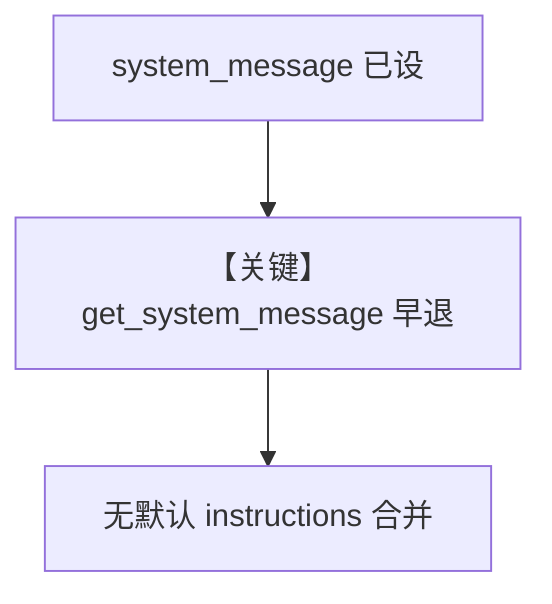

# system_message.py — 实现原理分析

<!-- cookbook-py-source:start -->
## 完整源码

```python
"""
System Message
=============================

Customize the agent's system message and role.
"""

from agno.agent import Agent
from agno.models.openai import OpenAIResponses

# ---------------------------------------------------------------------------
# Create Agent
# ---------------------------------------------------------------------------
agent = Agent(
    model=OpenAIResponses(id="gpt-5.2"),
    # Override the auto-generated system message with a custom one
    system_message="You are a concise technical writer. Always respond in bullet points. Never use more than 3 sentences per bullet point.",
    # Change the role of the system message (default is "system")
    system_message_role="system",
    markdown=True,
)

# ---------------------------------------------------------------------------
# Run Agent
# ---------------------------------------------------------------------------
if __name__ == "__main__":
    agent.print_response(
        "Explain how HTTP cookies work.",
        stream=True,
    )
```

<!-- cookbook-py-source:end -->

> 源文件：`cookbook/02_agents/03_context_management/system_message.py`

## 概述

**`system_message`** 字符串 **直接覆盖** 默认拼装路径：**`get_system_message` 早退**（`_messages.py` L129-L152），不再合并 `instructions`/`description` 等默认段（除非 `system_message` 为 callable 等分支）。**`system_message_role`** 控制消息角色名（默认 `system`）。

**核心配置一览：**

| 配置项 | 值 |
|--------|-----|
| `model` | `OpenAIResponses(id="gpt-5.2")` |
| `system_message` | 技术写作、条列、每点不超过 3 句 |
| `system_message_role` | `"system"` |
| `markdown` | `True` |

## 架构分层

```
system_message 原样 → Message(role, content) → 跳过默认 #3.x 拼装
```

## 核心组件解析

与仅设 `instructions` 不同：**完全手工 system**。

### 运行机制与因果链

**分支**：若 `system_message is not None` 则不走 **#3.1-3.3.13** 默认构建（同一早退分支）。

## System Prompt 组装

### 还原后的完整 System 文本

```text
You are a concise technical writer. Always respond in bullet points. Never use more than 3 sentences per bullet point.
```

（`markdown=True` 是否仍追加额外段取决于早退后是否还有后续处理——以当前版本为准，通常 **仅该字符串**。）

## 完整 API 请求

**OpenAIResponses**。

## Mermaid 流程图


```mermaid
flowchart TD
    A["system_message 已设"] --> B["【关键】get_system_message 早退"]
    B --> C["无默认 instructions 合并"]
```

## 关键源码文件索引

| 文件 | 关键函数/类 | 作用 |
|------|------------|------|
| `agno/agent/_messages.py` | L129-152 | 早退分支 |
