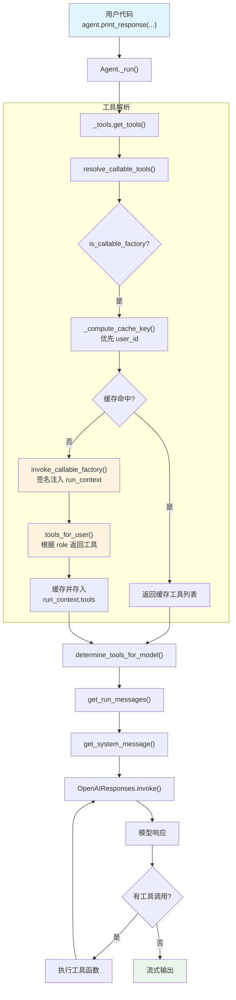

# 01_callable_tools.py — 实现原理分析

> 源文件：`cookbook/02_agents/04_tools/01_callable_tools.py`

## 概述

本示例展示 Agno 的 **Callable Tools Factory（可调用工具工厂）** 机制：将 `tools` 参数设置为一个函数而非列表，该函数在每次运行时被调用，根据 `RunContext`（如用户角色）动态决定提供哪些工具。工厂结果按 `user_id` 自动缓存，不同用户获得不同的工具集。

**核心配置一览：**

| 配置项 | 值 | 说明 |
|--------|------|------|
| `model` | `OpenAIResponses(id="gpt-5-mini")` | Responses API |
| `tools` | `tools_for_user`（callable） | 可调用工具工厂函数 |
| `instructions` | `["You are a helpful assistant.", "Use the tools available to you to answer the user's question."]` | 指令列表 |
| `cache_callables` | `True`（默认） | 按 user_id 缓存工厂结果 |
| `name` | `None` | 未设置 |
| `description` | `None` | 未设置 |
| `markdown` | `False`（默认） | 未设置 |

## 架构分层

```
用户代码层                          agno 内部层
┌──────────────────────────┐      ┌────────────────────────────────────────┐
│ 01_callable_tools.py     │      │ Agent._run()                           │
│                          │      │  ├─ _tools.get_tools()                 │
│ tools=tools_for_user     │─────>│  │  ├─ resolve_callable_tools()        │
│   (callable factory)     │      │  │  │  ├─ is_callable_factory()        │
│                          │      │  │  │  ├─ _compute_cache_key(user_id)  │
│ session_state=           │      │  │  │  ├─ invoke_callable_factory()    │
│   {"role": "admin"}      │      │  │  │  │  └─ 签名检查 → 注入参数      │
│                          │      │  │  │  └─ 缓存结果                     │
│ user_id="admin_user"     │      │  │  └─ determine_tools_for_model()     │
│                          │      │  │                                      │
│                          │      │  ├─ _messages.get_run_messages()       │
│                          │      │  │  └─ get_system_message()            │
│                          │      │  │                                      │
└──────────────────────────┘      └────────────────────────────────────────┘
                                           │
                                           ▼
                                   ┌───────────────────┐
                                   │ OpenAIResponses    │
                                   │ gpt-5-mini         │
                                   └───────────────────┘
```

## 核心组件解析

### Callable Tools Factory

`tools` 参数接受一个 callable，在 `resolve_callable_tools()`（`utils/callables.py:L213`）中处理：

```python
# utils/callables.py:L213-248
def resolve_callable_tools(entity: Any, run_context: "RunContext") -> None:
    # 1. 检查 tools 是否为可调用工厂（排除 Toolkit/Function 实例）
    if not is_callable_factory(entity.tools, excluded_types=(Toolkit, Function)):
        return

    # 2. 获取缓存配置
    cache_enabled = getattr(entity, "cache_callables", True)
    cache = _get_or_create_cache(entity, "_callable_tools_cache")

    # 3. 计算缓存 key（优先 user_id → session_id → None）
    cache_key = _compute_cache_key(entity, run_context, custom_key_fn)

    # 4. 命中缓存则直接返回
    if cache_enabled and cache_key is not None and cache_key in cache:
        run_context.tools = cache[cache_key]
        return

    # 5. 调用工厂函数
    result = invoke_callable_factory(entity.tools, entity, run_context)

    # 6. 缓存结果
    if cache_enabled and cache_key is not None:
        cache[cache_key] = result
    run_context.tools = result
```

### 签名注入机制

`invoke_callable_factory()`（`utils/callables.py:L60`）通过 `inspect.signature()` 检查工厂函数的参数名，按名称注入：

```python
# utils/callables.py:L60-101
def invoke_callable_factory(factory, entity, run_context):
    sig = inspect.signature(factory)
    kwargs = {}

    # 按参数名注入对应对象
    if "agent" in sig.parameters:
        kwargs["agent"] = entity
    if "run_context" in sig.parameters:
        kwargs["run_context"] = run_context        # 本文件使用此参数
    if "session_state" in sig.parameters:
        kwargs["session_state"] = run_context.session_state or {}

    return factory(**kwargs)
```

本文件的工厂函数 `tools_for_user(run_context: RunContext)` 声明了 `run_context` 参数，因此框架会注入当前的 `RunContext` 对象。

### 缓存 Key 计算

`_compute_cache_key()`（`utils/callables.py:L133`）的优先级：

| 优先级 | Key 来源 | 说明 |
|--------|----------|------|
| 1 | `custom_key_fn` | 自定义缓存 key 函数（本文件未使用） |
| 2 | `run_context.user_id` | 本文件 Run 1 为 `"viewer_user"`，Run 2 为 `"admin_user"` |
| 3 | `run_context.session_id` | 备选 |
| 4 | `None` | 跳过缓存 |

由于两次运行使用不同 `user_id`，工厂会被调用两次，各自缓存独立的工具集。

### 动态工具选择逻辑

```python
# 01_callable_tools.py:L44-55
def tools_for_user(run_context: RunContext):
    role = (run_context.session_state or {}).get("role", "viewer")

    base_tools = [search_web]                    # viewer: 仅 search_web
    if role == "admin":
        base_tools.append(search_internal_docs)  # admin: 追加内部文档搜索
    if role in ("admin", "finance"):
        base_tools.append(get_account_balance)   # admin/finance: 追加余额查询

    return base_tools
```

| 角色 | 可用工具 |
|------|---------|
| `viewer` | `search_web` |
| `finance` | `search_web`, `get_account_balance` |
| `admin` | `search_web`, `search_internal_docs`, `get_account_balance` |

## System Prompt 组装

| 序号 | 组成部分 | 本文件中的值/来源 | 是否生效 |
|------|---------|-----------------|---------|
| 1 | `system_message`（自定义） | `None` | 否 |
| 3.1 | `instructions` | `["You are a helpful assistant.", "Use the tools available to you to answer the user's question."]` | 是 |
| 3.1.1 | 模型指令（`get_instructions_for_model`） | 取决于模型 | 是 |
| 3.2.1 | `markdown` | `False` | 否 |
| 3.2.2 | `add_datetime_to_context` | `False` | 否 |
| 3.2.3 | `add_location_to_context` | `False` | 否 |
| 3.2.4 | `add_name_to_context` | `False` | 否 |
| 3.3.1 | `description` | `None` | 否 |
| 3.3.2 | `role` | `None` | 否 |
| 3.3.3 | instructions 拼接 | 两条指令拼接为列表格式 | 是 |
| 3.3.4 | additional_information | 无 | 否 |
| 3.3.5 | `_tool_instructions` | 无 | 否 |
| 3.3.7 | `expected_output` | `None` | 否 |
| 3.3.8 | `additional_context` | `None` | 否 |
| 3.3.9 | `add_memories_to_context` | `None` | 否 |

### 最终 System Prompt

```text
- You are a helpful assistant.
- Use the tools available to you to answer the user's question.
```

## 完整 API 请求

**Run 1（viewer 角色）：**

```python
client.responses.create(
    model="gpt-5-mini",
    input=[
        # 1. System Message（role_map: system → developer）
        {"role": "developer", "content": "- You are a helpful assistant.\n- Use the tools available to you to answer the user's question.\n"},
        # 2. 用户输入
        {"role": "user", "content": "Search for recent news about AI agents"}
    ],
    tools=[
        # 仅 search_web（viewer 角色）
        {
            "type": "function",
            "name": "search_web",
            "description": "Search the web for information.",
            "parameters": {
                "type": "object",
                "properties": {
                    "query": {"type": "string", "description": "No description provided"}
                },
                "required": ["query"]
            }
        }
    ],
    stream=True,
    stream_options={"include_usage": True}
)
```

**Run 2（admin 角色）：**

```python
client.responses.create(
    model="gpt-5-mini",
    input=[
        {"role": "developer", "content": "- You are a helpful assistant.\n- Use the tools available to you to answer the user's question.\n"},
        {"role": "user", "content": "Search internal docs for the deployment guide and check account balance for ACC-001"}
    ],
    tools=[
        # admin 角色：三个工具全部可用
        {
            "type": "function",
            "name": "search_web",
            "description": "Search the web for information.",
            "parameters": {
                "type": "object",
                "properties": {
                    "query": {"type": "string"}
                },
                "required": ["query"]
            }
        },
        {
            "type": "function",
            "name": "search_internal_docs",
            "description": "Search internal documentation (admin only).",
            "parameters": {
                "type": "object",
                "properties": {
                    "query": {"type": "string"}
                },
                "required": ["query"]
            }
        },
        {
            "type": "function",
            "name": "get_account_balance",
            "description": "Get account balance (finance only).",
            "parameters": {
                "type": "object",
                "properties": {
                    "account_id": {"type": "string"}
                },
                "required": ["account_id"]
            }
        }
    ],
    stream=True,
    stream_options={"include_usage": True}
)
```

> **说明**：admin 运行中模型可能触发多次工具调用（先搜内部文档，再查余额），每次工具返回后进入下一轮 agentic loop。

## Mermaid 流程图



## 关键源码文件索引

| 文件 | 关键函数/类 | 作用 |
|------|------------|------|
| `agno/agent/agent.py` | `tools` L159 | 工具参数定义，支持 `List` 或 `Callable` |
| `agno/agent/agent.py` | `cache_callables` L352 | 控制是否缓存工厂结果 |
| `agno/utils/callables.py` | `resolve_callable_tools()` L213 | 检测并解析 callable 工具工厂 |
| `agno/utils/callables.py` | `invoke_callable_factory()` L60 | 签名检查 + 参数注入 + 调用工厂 |
| `agno/utils/callables.py` | `_compute_cache_key()` L133 | 计算缓存 key（user_id 优先） |
| `agno/utils/callables.py` | `is_callable_factory()` L40 | 判断值是否为工厂函数 |
| `agno/agent/_tools.py` | `get_tools()` L105 | 工具收集入口 |
| `agno/agent/_tools.py` | `determine_tools_for_model()` L434 | 将工具转换为模型可用的 Function 列表 |
| `agno/agent/_messages.py` | `get_system_message()` L106 | 构造 system prompt |
| `agno/agent/_run.py` | `_run()` L490-510 | 主运行循环，传递 tool_choice/tool_call_limit |
