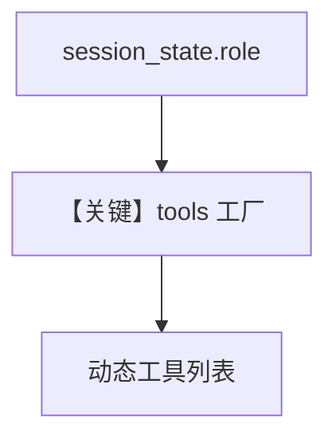

# 01_callable_tools.py — 实现原理分析

<!-- cookbook-py-source:start -->
## 完整源码

```python
"""
Callable Tools Factory
======================
Pass a function as `tools` instead of a list. The function is called
at the start of each run, so the toolset can vary per user or session.

The factory receives parameters by name via signature inspection:
- agent: the Agent instance
- run_context: the current RunContext (has user_id, session_id, etc.)
- session_state: the current session state dict

Results are cached per user_id (or session_id) by default.
"""

from agno.agent import Agent
from agno.models.openai import OpenAIResponses
from agno.run import RunContext

# ---------------------------------------------------------------------------
# Tools
# ---------------------------------------------------------------------------


def search_web(query: str) -> str:
    """Search the web for information."""
    return f"Search results for: {query}"


def search_internal_docs(query: str) -> str:
    """Search internal documentation (admin only)."""
    return f"Internal doc results for: {query}"


def get_account_balance(account_id: str) -> str:
    """Get account balance (finance only)."""
    return f"Balance for {account_id}: $42,000"


# ---------------------------------------------------------------------------
# Callable Factory
# ---------------------------------------------------------------------------


def tools_for_user(run_context: RunContext):
    """Return different tools based on the user's role stored in session_state."""
    role = (run_context.session_state or {}).get("role", "viewer")
    print(f"--> Resolving tools for role: {role}")

    base_tools = [search_web]
    if role == "admin":
        base_tools.append(search_internal_docs)
    if role in ("admin", "finance"):
        base_tools.append(get_account_balance)

    return base_tools


# ---------------------------------------------------------------------------
# Create Agent
# ---------------------------------------------------------------------------
agent = Agent(
    model=OpenAIResponses(id="gpt-5-mini"),
    tools=tools_for_user,
    instructions=[
        "You are a helpful assistant.",
        "Use the tools available to you to answer the user's question.",
    ],
)


# ---------------------------------------------------------------------------
# Run Agent
# ---------------------------------------------------------------------------
if __name__ == "__main__":
    # Run 1: viewer role - only search_web available
    # Each user_id gets its own cached toolset
    print("=== Run as viewer ===")
    agent.print_response(
        "Search for recent news about AI agents",
        user_id="viewer_user",
        session_state={"role": "viewer"},
        stream=True,
    )

    # Run 2: admin role - all tools available
    # Different user_id means the factory is called again with new context
    print("\n=== Run as admin ===")
    agent.print_response(
        "Search internal docs for the deployment guide and check account balance for ACC-001",
        user_id="admin_user",
        session_state={"role": "admin"},
        stream=True,
    )
```

<!-- cookbook-py-source:end -->

> 源文件：`cookbook/02_agents/04_tools/01_callable_tools.py`

## 概述

**`tools` 传入可调用工厂 `tools_for_user(run_context)`**：每轮 run 按 **`session_state["role"]`** 返回不同工具列表（viewer/admin/finance）。框架按签名注入 **`RunContext`**；默认 **按 user_id 缓存** 工具集。

**核心配置一览：**

| 配置项 | 值 |
|--------|-----|
| `model` | `OpenAIResponses(id="gpt-5-mini")` |
| `tools` | `tools_for_user` 可调用 |
| `instructions` | list |

## 架构分层

```
get_tools → 调用工厂 → 动态 Function 列表 → determine_tools_for_model
```

## 核心组件解析

**`invoke_callable_factory`**（`agno/utils/callables.py`）解析参数：agent、run_context、session_state 等。

### 运行机制与因果链

**分支**：`role` 决定能否用 internal docs / balance。

## System Prompt 组装

instructions 列表合并为默认 system；工具定义随工厂变化。

### 还原后的完整 System 文本

```text
You are a helpful assistant.
Use the tools available to you to answer the user's question.
```

## 完整 API 请求

**OpenAIResponses**；每轮工具表可能不同。

## Mermaid 流程图


```mermaid
flowchart TD
    A["session_state.role"] --> B["【关键】tools 工厂"]
    B --> C["动态工具列表"]
```

## 关键源码文件索引

| 文件 | 关键函数/类 | 作用 |
|------|------------|------|
| `agno/utils/callables.py` | `invoke_callable_factory` | 工厂调用 |
