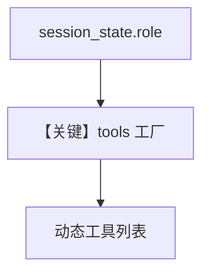

# 01_callable_tools.py — 实现原理分析

> 源文件：`cookbook/02_agents/04_tools/01_callable_tools.py`

## 概述

**`tools` 传入可调用工厂 `tools_for_user(run_context)`**：每轮 run 按 **`session_state["role"]`** 返回不同工具列表（viewer/admin/finance）。框架按签名注入 **`RunContext`**；默认 **按 user_id 缓存** 工具集。

**核心配置一览：**

| 配置项 | 值 |
|--------|-----|
| `model` | `OpenAIResponses(id="gpt-5-mini")` |
| `tools` | `tools_for_user` 可调用 |
| `instructions` | list |

## 架构分层

```
get_tools → 调用工厂 → 动态 Function 列表 → determine_tools_for_model
```

## 核心组件解析

**`invoke_callable_factory`**（`agno/utils/callables.py`）解析参数：agent、run_context、session_state 等。

### 运行机制与因果链

**分支**：`role` 决定能否用 internal docs / balance。

## System Prompt 组装

instructions 列表合并为默认 system；工具定义随工厂变化。

### 还原后的完整 System 文本

```text
You are a helpful assistant.
Use the tools available to you to answer the user's question.
```

## 完整 API 请求

**OpenAIResponses**；每轮工具表可能不同。

## Mermaid 流程图


```mermaid
flowchart TD
    A["session_state.role"] --> B["【关键】tools 工厂"]
    B --> C["动态工具列表"]
```

## 关键源码文件索引

| 文件 | 关键函数/类 | 作用 |
|------|------------|------|
| `agno/utils/callables.py` | `invoke_callable_factory` | 工厂调用 |
