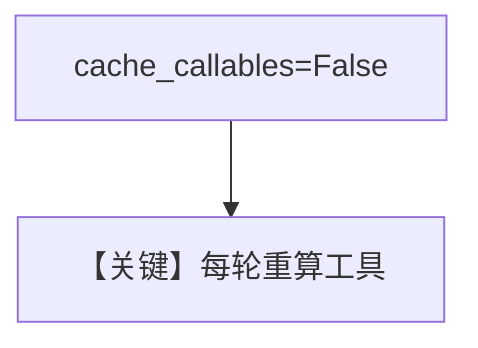

# 02_session_state_tools.py — 实现原理分析

> 源文件：`cookbook/02_agents/04_tools/02_session_state_tools.py`

## 概述

**工厂 `get_tools(session_state)`** 仅用 **`session_state` 参数**（无需 `RunContext`）；**`cache_callables=False`** 使**每轮**重新解析工具，适应 **`mode` 在两次 run 间从 greet 变 farewell**。

**核心配置一览：**

| 配置项 | 值 |
|--------|-----|
| `tools` | `get_tools` |
| `cache_callables` | `False` |
| `model` | `OpenAIResponses(id="gpt-5-mini")` |

## 架构分层

```
session_state.mode → get_greeting 或 get_farewell → 单工具
```

## 核心组件解析

与 `01_callable_tools` 对比：签名只收 **dict**，且 **禁用缓存**。

### 运行机制与因果链

若 `cache_callables=True`，可能仍用首次缓存工具集——本例显式关闭。

## System Prompt 组装

```text
Use the available tool to respond.
```

## 完整 API 请求

**OpenAIResponses**。

## Mermaid 流程图



## 关键源码文件索引

| 文件 | 关键函数/类 | 作用 |
|------|------------|------|
| `agno/agent/agent.py` | `cache_callables` | 工具缓存 |
