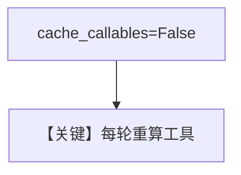

# 02_session_state_tools.py — 实现原理分析

<!-- cookbook-py-source:start -->
## 完整源码

```python
"""
Session State Tools
===================
Use `session_state` as a parameter name in your factory to receive
the session state dict directly (no need for run_context).

Set `cache_callables=False` so the factory runs fresh every time,
picking up any session_state changes between runs.
"""

from agno.agent import Agent
from agno.models.openai import OpenAIResponses

# ---------------------------------------------------------------------------
# Tools
# ---------------------------------------------------------------------------


def get_greeting(name: str) -> str:
    """Greet someone by name."""
    return f"Hello, {name}!"


def get_farewell(name: str) -> str:
    """Say goodbye to someone."""
    return f"Goodbye, {name}!"


def get_tools(session_state: dict):
    """Pick tools based on the 'mode' key in session_state."""
    mode = session_state.get("mode", "greet")
    print(f"--> Factory resolved mode: {mode}")

    if mode == "greet":
        return [get_greeting]
    else:
        return [get_farewell]


# ---------------------------------------------------------------------------
# Create the Agent
# ---------------------------------------------------------------------------

agent = Agent(
    model=OpenAIResponses(id="gpt-5-mini"),
    tools=get_tools,
    cache_callables=False,
    instructions=["Use the available tool to respond."],
)


# ---------------------------------------------------------------------------
# Run the Agent
# ---------------------------------------------------------------------------

if __name__ == "__main__":
    print("=== Greet mode ===")
    agent.print_response(
        "Say hi to Alice",
        session_state={"mode": "greet"},
        stream=True,
    )

    print("\n=== Farewell mode ===")
    agent.print_response(
        "Say bye to Alice",
        session_state={"mode": "farewell"},
        stream=True,
    )
```

<!-- cookbook-py-source:end -->

> 源文件：`cookbook/02_agents/04_tools/02_session_state_tools.py`

## 概述

**工厂 `get_tools(session_state)`** 仅用 **`session_state` 参数**（无需 `RunContext`）；**`cache_callables=False`** 使**每轮**重新解析工具，适应 **`mode` 在两次 run 间从 greet 变 farewell**。

**核心配置一览：**

| 配置项 | 值 |
|--------|-----|
| `tools` | `get_tools` |
| `cache_callables` | `False` |
| `model` | `OpenAIResponses(id="gpt-5-mini")` |

## 架构分层

```
session_state.mode → get_greeting 或 get_farewell → 单工具
```

## 核心组件解析

与 `01_callable_tools` 对比：签名只收 **dict**，且 **禁用缓存**。

### 运行机制与因果链

若 `cache_callables=True`，可能仍用首次缓存工具集——本例显式关闭。

## System Prompt 组装

```text
Use the available tool to respond.
```

## 完整 API 请求

**OpenAIResponses**。

## Mermaid 流程图



## 关键源码文件索引

| 文件 | 关键函数/类 | 作用 |
|------|------------|------|
| `agno/agent/agent.py` | `cache_callables` | 工具缓存 |
