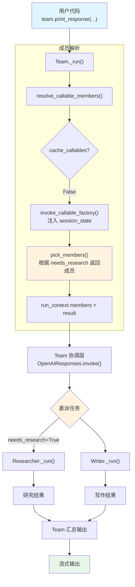

# 03_team_callable_members.py — 实现原理分析

> 源文件：`cookbook/02_agents/04_tools/03_team_callable_members.py`

## 概述

本示例展示 Agno 的 **Callable Members Factory（可调用成员工厂）** 机制：将 `Team.members` 参数设置为一个函数，在运行时根据 `session_state` 动态决定团队成员组成。与工具工厂共享同一套 `callables.py` 解析逻辑，同样支持 `cache_callables` 控制。

**核心配置一览：**

| 配置项 | 值 | 说明 |
|--------|------|------|
| **Team** | | |
| `name` | `"Content Team"` | 团队名称 |
| `model` | `OpenAIResponses(id="gpt-5-mini")` | 团队协调用模型 |
| `members` | `pick_members`（callable） | 可调用成员工厂函数 |
| `cache_callables` | `False` | 禁用缓存，每次运行重新决定成员 |
| `instructions` | `["Coordinate the team to complete the task."]` | 团队指令 |
| **Writer Agent** | | |
| `name` | `"Writer"` | |
| `role` | `"Content writer"` | |
| `model` | `OpenAIResponses(id="gpt-5-mini")` | |
| `instructions` | `["Write clear, concise content."]` | |
| **Researcher Agent** | | |
| `name` | `"Researcher"` | |
| `role` | `"Research analyst"` | |
| `model` | `OpenAIResponses(id="gpt-5-mini")` | |
| `instructions` | `["Research topics and summarize findings."]` | |

## 架构分层

```
用户代码层                          agno 内部层
┌──────────────────────────┐      ┌────────────────────────────────────────┐
│ 03_team_callable_members │      │ Team._run()                            │
│                          │      │  ├─ resolve_callable_members()         │
│ members=pick_members     │─────>│  │  ├─ is_callable_factory()           │
│   (callable factory)     │      │  │  ├─ cache_callables=False           │
│                          │      │  │  ├─ invoke_callable_factory()       │
│ cache_callables=False    │      │  │  │  └─ 注入 session_state dict      │
│                          │      │  │  └─ run_context.members = result    │
│ session_state=           │      │  │                                      │
│   {"needs_research":True}│      │  ├─ 将任务委派给成员 Agent              │
│                          │      │  │  ├─ Writer._run()                   │
│                          │      │  │  └─ Researcher._run()（可选）        │
└──────────────────────────┘      └────────────────────────────────────────┘
                                           │
                                           ▼
                                   ┌───────────────────┐
                                   │ OpenAIResponses    │
                                   │ gpt-5-mini         │
                                   │ (每个 Agent 各自)   │
                                   └───────────────────┘
```

## 核心组件解析

### Callable Members Factory

`resolve_callable_members()`（`utils/callables.py:L374`）与 `resolve_callable_tools()` 共享同一套逻辑：

```python
# utils/callables.py:L374-408
def resolve_callable_members(entity: Any, run_context: "RunContext") -> None:
    members = getattr(entity, "members", None)
    if not is_callable_factory(members):
        return

    cache_enabled = getattr(entity, "cache_callables", True)
    cache = _get_or_create_cache(entity, "_callable_members_cache")
    cache_key = _compute_cache_key(entity, run_context, custom_key_fn)

    # 缓存检查（cache_callables=False 时跳过）
    if cache_enabled and cache_key is not None and cache_key in cache:
        run_context.members = cache[cache_key]
        return

    # 调用工厂
    result = invoke_callable_factory(members, entity, run_context)
    run_context.members = list(result)
```

三种 callable 工厂的统一架构：

| 工厂类型 | 解析函数 | 缓存属性 | 结果存储 |
|---------|---------|---------|---------|
| `tools` | `resolve_callable_tools()` L213 | `_callable_tools_cache` | `run_context.tools` |
| `knowledge` | `resolve_callable_knowledge()` L294 | `_callable_knowledge_cache` | `run_context.knowledge` |
| `members` | `resolve_callable_members()` L374 | `_callable_members_cache` | `run_context.members` |

### 动态成员选择

```python
# 03_team_callable_members.py:L31-38
def pick_members(session_state: dict):
    needs_research = session_state.get("needs_research", False)

    if needs_research:
        return [researcher, writer]  # 需要研究时：两个成员
    return [writer]                  # 不需要时：仅 writer
```

| session_state | 团队成员 |
|--------------|---------|
| `{"needs_research": False}` | Writer |
| `{"needs_research": True}` | Researcher + Writer |

### Team 与 Agent 的关系

Team 作为协调者，将任务委派给成员 Agent。每个成员 Agent 独立与模型交互：

- **Team**（`model=gpt-5-mini`）：分析任务，决定委派策略
- **Writer**（`role="Content writer"`）：执行写作任务
- **Researcher**（`role="Research analyst"`）：执行研究任务（仅当 `needs_research=True`）

## System Prompt 组装

> 以下为 Team 协调层的 system prompt。各成员 Agent 有各自的 system prompt。

| 序号 | 组成部分 | 本文件中的值/来源 | 是否生效 |
|------|---------|-----------------|---------|
| 1 | `system_message`（自定义） | `None` | 否 |
| 3.1 | `instructions` | `["Coordinate the team to complete the task."]` | 是 |
| 3.3.1 | `description` | `None` | 否 |
| 3.3.3 | instructions 拼接 | 单条指令 | 是 |

### 最终 System Prompt（Team 协调层）

```text
Coordinate the team to complete the task.
```

## 完整 API 请求

**Run 1（仅 Writer）：**

Team 协调层的请求（简化示意）：

```python
client.responses.create(
    model="gpt-5-mini",
    input=[
        {"role": "developer", "content": "Coordinate the team to complete the task.\n\n..."},
        {"role": "user", "content": "Write a haiku about Python"}
    ],
    # Team 将任务委派给 Writer
    tools=[
        {
            "type": "function",
            "name": "transfer_to_Writer",
            "description": "...",
            "parameters": {...}
        }
    ],
    stream=True,
    stream_options={"include_usage": True}
)
```

Writer Agent 的请求：

```python
client.responses.create(
    model="gpt-5-mini",
    input=[
        {"role": "developer", "content": "Write clear, concise content.\n\n"},
        {"role": "user", "content": "Write a haiku about Python"}
    ],
    stream=True,
    stream_options={"include_usage": True}
)
```

**Run 2（Researcher + Writer）：**

Team 协调层的请求中 `tools` 包含两个成员的转交函数：

```python
tools=[
    {
        "type": "function",
        "name": "transfer_to_Researcher",
        "description": "...",
        "parameters": {...}
    },
    {
        "type": "function",
        "name": "transfer_to_Writer",
        "description": "...",
        "parameters": {...}
    }
]
```

> **说明**：Team 协调层通过工具调用将任务委派给成员 Agent，每个成员 Agent 独立运行并返回结果。

## Mermaid 流程图



## 关键源码文件索引

| 文件 | 关键函数/类 | 作用 |
|------|------------|------|
| `agno/team/team.py` | `Team` | 团队类定义，`members` 支持 callable |
| `agno/utils/callables.py` | `resolve_callable_members()` L374 | 解析 callable 成员工厂 |
| `agno/utils/callables.py` | `invoke_callable_factory()` L60 | 签名检查 + 参数注入 |
| `agno/utils/callables.py` | `is_callable_factory()` L40 | 判断是否为工厂函数 |
| `agno/utils/callables.py` | `_compute_cache_key()` L133 | 缓存 key 计算 |
| `agno/agent/agent.py` | `Agent` L67 | 成员 Agent 定义 |
| `agno/agent/agent.py` | `role` L312 | Agent 在团队中的角色 |
