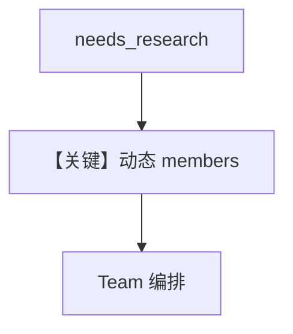

# 03_team_callable_members.py — 实现原理分析

<!-- cookbook-py-source:start -->
## 完整源码

```python
"""
Team Callable Members
=====================
Pass a function as `members` to a Team. The team composition
is decided at run time based on session_state.
"""

from agno.agent import Agent
from agno.models.openai import OpenAIResponses
from agno.team import Team

# ---------------------------------------------------------------------------
# Create the Team Members
# ---------------------------------------------------------------------------

writer = Agent(
    name="Writer",
    role="Content writer",
    model=OpenAIResponses(id="gpt-5-mini"),
    instructions=["Write clear, concise content."],
)

researcher = Agent(
    name="Researcher",
    role="Research analyst",
    model=OpenAIResponses(id="gpt-5-mini"),
    instructions=["Research topics and summarize findings."],
)


def pick_members(session_state: dict):
    """Include the researcher only when needed."""
    needs_research = session_state.get("needs_research", False)
    print(f"--> needs_research={needs_research}")

    if needs_research:
        return [researcher, writer]
    return [writer]


# ---------------------------------------------------------------------------
# Create the Team
# ---------------------------------------------------------------------------

team = Team(
    name="Content Team",
    model=OpenAIResponses(id="gpt-5-mini"),
    members=pick_members,
    cache_callables=False,
    instructions=["Coordinate the team to complete the task."],
)


# ---------------------------------------------------------------------------
# Run the Team
# ---------------------------------------------------------------------------

if __name__ == "__main__":
    print("=== Writer only ===")
    team.print_response(
        "Write a haiku about Python",
        session_state={"needs_research": False},
        stream=True,
    )

    print("\n=== Researcher + Writer ===")
    team.print_response(
        "Research the history of Python and write a short summary",
        session_state={"needs_research": True},
        stream=True,
    )
```

<!-- cookbook-py-source:end -->

> 源文件：`cookbook/02_agents/04_tools/03_team_callable_members.py`

## 概述

**`Team(members=pick_members)`**：**`pick_members(session_state)`** 按 **`needs_research`** 动态选择 **仅 Writer** 或 **Researcher+Writer**。**`cache_callables=False`**。**非单一 Agent**，system 由 Team 与各成员分别拼装。

**核心配置一览：**

| 配置项 | 值 |
|--------|-----|
| `members` | `pick_members` 可调用 |
| `cache_callables` | `False` |
| `model` | `OpenAIResponses(gpt-5-mini)` Leader |

## 架构分层

```
session_state → 成员列表 → Team.run 调度
```

## 核心组件解析

`writer` / `researcher` 为预定义 **Agent** 实例（`03_team_callable_members.py` L16-27）。

### 运行机制与因果链

同一 `Team` 对象，不同 run 成员数可变。

## System Prompt 组装

不适用单一 Agent；见 **Team** 与各 **member Agent** 的 instructions。

## 完整 API 请求

多次 **OpenAIResponses**（成员 + Leader）。

## Mermaid 流程图


```mermaid
flowchart TD
    A["needs_research"] --> B["【关键】动态 members"]
    B --> C["Team 编排"]
```

## 关键源码文件索引

| 文件 | 关键函数/类 | 作用 |
|------|------------|------|
| `agno/team/team.py` | `Team` | 可调用 members |
