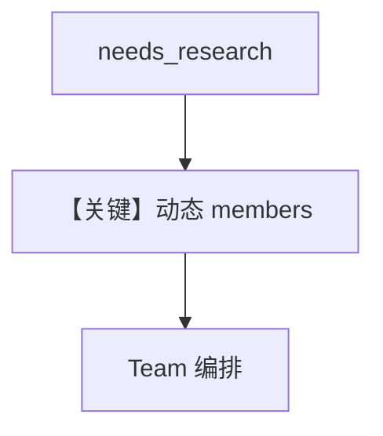

# 03_team_callable_members.py — 实现原理分析

> 源文件：`cookbook/02_agents/04_tools/03_team_callable_members.py`

## 概述

**`Team(members=pick_members)`**：**`pick_members(session_state)`** 按 **`needs_research`** 动态选择 **仅 Writer** 或 **Researcher+Writer**。**`cache_callables=False`**。**非单一 Agent**，system 由 Team 与各成员分别拼装。

**核心配置一览：**

| 配置项 | 值 |
|--------|-----|
| `members` | `pick_members` 可调用 |
| `cache_callables` | `False` |
| `model` | `OpenAIResponses(gpt-5-mini)` Leader |

## 架构分层

```
session_state → 成员列表 → Team.run 调度
```

## 核心组件解析

`writer` / `researcher` 为预定义 **Agent** 实例（`03_team_callable_members.py` L16-27）。

### 运行机制与因果链

同一 `Team` 对象，不同 run 成员数可变。

## System Prompt 组装

不适用单一 Agent；见 **Team** 与各 **member Agent** 的 instructions。

## 完整 API 请求

多次 **OpenAIResponses**（成员 + Leader）。

## Mermaid 流程图


```mermaid
flowchart TD
    A["needs_research"] --> B["【关键】动态 members"]
    B --> C["Team 编排"]
```

## 关键源码文件索引

| 文件 | 关键函数/类 | 作用 |
|------|------------|------|
| `agno/team/team.py` | `Team` | 可调用 members |
