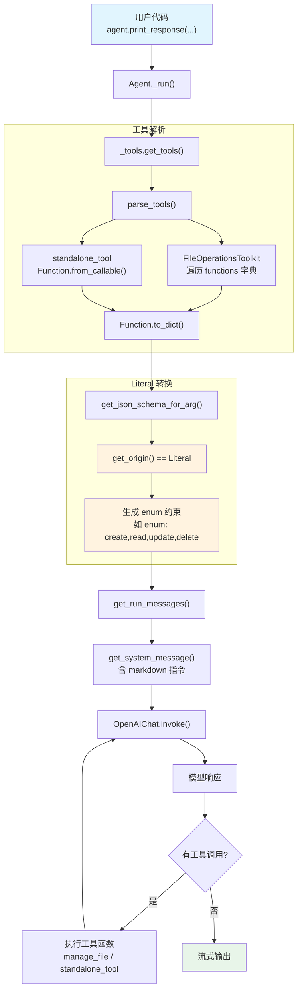

# 04_tools_with_literal_type_param.py — 实现原理分析

> 源文件：`cookbook/02_agents/04_tools/04_tools_with_literal_type_param.py`

## 概述

本示例展示 Agno 的 **`Literal` 类型参数支持** 机制：在工具函数和 Toolkit 方法中使用 `typing.Literal` 约束参数取值范围，Agno 会自动将其转换为 JSON Schema 的 `enum` 约束，让模型只能从预定义值中选择。同时展示了 **Toolkit 类** 和 **独立函数** 两种工具注册方式的混合使用。

**核心配置一览：**

| 配置项 | 值 | 说明 |
|--------|------|------|
| `model` | `OpenAIChat(id="gpt-4o-mini")` | Chat Completions API |
| `tools` | `[FileOperationsToolkit(), standalone_tool]` | Toolkit 实例 + 独立函数混合 |
| `instructions` | `"You are a helpful assistant that can manage files and services."` | 单条字符串指令 |
| `markdown` | `True` | 启用 markdown 格式化 |
| `name` | `None` | 未设置 |
| `description` | `None` | 未设置 |
| `cache_callables` | `True`（默认） | 默认（本文件 tools 为列表，不涉及工厂） |

## 架构分层

```
用户代码层                          agno 内部层
┌──────────────────────────┐      ┌────────────────────────────────────────┐
│ 04_tools_with_literal_   │      │ Agent._run()                           │
│   type_param.py          │      │  ├─ _tools.get_tools()                 │
│                          │      │  │  └─ determine_tools_for_model()     │
│ tools=[                  │─────>│  │     ├─ parse_tools()                │
│   FileOperationsToolkit()│      │  │     │  ├─ Toolkit → 遍历 functions  │
│   standalone_tool        │      │  │     │  └─ Callable → from_callable()│
│ ]                        │      │  │     └─ Function.to_dict()           │
│                          │      │  │        └─ get_json_schema_for_arg() │
│ Literal["create",...]   │      │  │           └─ Literal → enum 转换     │
│                          │      │  │                                      │
│                          │      │  ├─ _messages.get_run_messages()       │
└──────────────────────────┘      └────────────────────────────────────────┘
                                           │
                                           ▼
                                   ┌───────────────────┐
                                   │ OpenAIChat         │
                                   │ gpt-4o-mini        │
                                   └───────────────────┘
```

## 核心组件解析

### Literal 类型到 JSON Schema 的转换

`get_json_schema_for_arg()`（`utils/json_schema.py:L127`）处理 `Literal` 类型：

```python
# utils/json_schema.py:L124-143
type_origin = get_origin(type_hint)
if type_origin is Literal:
    # 检查所有值的类型，生成对应的 JSON Schema
    if type_args:
        if all(isinstance(arg, str) for arg in type_args):
            return {"type": "string", "enum": list(type_args)}
        elif all(isinstance(arg, bool) for arg in type_args):
            return {"type": "boolean", "enum": list(type_args)}
        elif all(isinstance(arg, int) and not isinstance(arg, bool) for arg in type_args):
            return {"type": "integer", "enum": list(type_args)}
        elif all(isinstance(arg, (int, float)) and not isinstance(arg, bool) for arg in type_args):
            return {"type": "number", "enum": list(type_args)}
        else:
            # 混合类型：仅提供 enum
            return {"enum": list(type_args)}
```

本文件中的 Literal 参数转换结果：

| 参数 | Literal 定义 | JSON Schema |
|------|-------------|-------------|
| `operation` | `Literal["create", "read", "update", "delete"]` | `{"type": "string", "enum": ["create", "read", "update", "delete"]}` |
| `priority` | `Literal["low", "medium", "high"]` | `{"type": "string", "enum": ["low", "medium", "high"]}` |
| `action` | `Literal["start", "stop", "restart"]` | `{"type": "string", "enum": ["start", "stop", "restart"]}` |

### Toolkit 类注册

`FileOperationsToolkit` 继承自 `Toolkit`（`tools/toolkit.py:L10`），在构造时注册方法：

```python
# 04_tools_with_literal_type_param.py:L16-20
class FileOperationsToolkit(Toolkit):
    def __init__(self):
        super().__init__(name="file_operations", tools=[self.manage_file])
```

Toolkit 初始化流程（`toolkit.py:L15-80`）：
1. 接收 `tools` 列表（本例为 `[self.manage_file]`）
2. 遍历列表，为每个 callable 创建 `Function` 对象
3. 存入 `self.functions` 字典

### 混合工具列表

`tools=[FileOperationsToolkit(), standalone_tool]` 在 `parse_tools()`（`_tools.py:L350-431`）中被处理：

```python
# _tools.py 中的处理逻辑
for tool in tools:
    if isinstance(tool, Toolkit):
        # Toolkit → 遍历其 functions 字典，逐个添加
        for func_name, func in tool.functions.items():
            _functions.append(func)
    elif callable(tool):
        # 独立函数 → Function.from_callable(tool)
        _func = Function.from_callable(tool)
        _functions.append(_func)
```

### 默认值处理

`operation` 和 `priority` 有默认值（`"read"` 和 `"medium"`），在 JSON Schema 中体现为不在 `required` 列表中：

| 参数 | 默认值 | 是否 required |
|------|--------|-------------|
| `filename` | 无 | 是 |
| `operation` | `"read"` | 否 |
| `priority` | `"medium"` | 否 |
| `action` | 无 | 是 |
| `service_name` | 无 | 是 |

## System Prompt 组装

| 序号 | 组成部分 | 本文件中的值/来源 | 是否生效 |
|------|---------|-----------------|---------|
| 1 | `system_message`（自定义） | `None` | 否 |
| 3.1 | `instructions` | `"You are a helpful assistant that can manage files and services."` | 是 |
| 3.1.1 | 模型指令（`get_instructions_for_model`） | 取决于模型 | 是 |
| 3.2.1 | `markdown` | `True`（但无 output_schema，生效） | 是 |
| 3.2.2 | `add_datetime_to_context` | `False` | 否 |
| 3.2.3 | `add_location_to_context` | `False` | 否 |
| 3.2.4 | `add_name_to_context` | `False` | 否 |
| 3.3.1 | `description` | `None` | 否 |
| 3.3.2 | `role` | `None` | 否 |
| 3.3.3 | instructions 拼接 | 单条指令 | 是 |
| 3.3.4 | additional_information | `["Use markdown to format your answers."]` | 是 |
| 3.3.5 | `_tool_instructions` | 无 | 否 |
| 3.3.7 | `expected_output` | `None` | 否 |
| 3.3.8 | `additional_context` | `None` | 否 |
| 3.3.9 | `add_memories_to_context` | `None` | 否 |

### 最终 System Prompt

```text
You are a helpful assistant that can manage files and services.

<additional_information>
- Use markdown to format your answers.
</additional_information>
```

## 完整 API 请求

**请求 1（文件操作）：**

```python
client.chat.completions.create(
    model="gpt-4o-mini",
    messages=[
        {"role": "system", "content": "You are a helpful assistant that can manage files and services.\n\n<additional_information>\n- Use markdown to format your answers.\n</additional_information>\n\n"},
        {"role": "user", "content": "Create a new file called 'report.txt' with high priority"}
    ],
    tools=[
        {
            "type": "function",
            "function": {
                "name": "manage_file",
                "description": "Manage a file with the specified operation.",
                "parameters": {
                    "type": "object",
                    "properties": {
                        "filename": {"type": "string", "description": "The name of the file to operate on."},
                        "operation": {
                            "type": "string",
                            "enum": ["create", "read", "update", "delete"],
                            "description": "The operation to perform on the file."
                        },
                        "priority": {
                            "type": "string",
                            "enum": ["low", "medium", "high"],
                            "description": "The priority level for this operation."
                        }
                    },
                    "required": ["filename"]
                }
            }
        },
        {
            "type": "function",
            "function": {
                "name": "standalone_tool",
                "description": "Control a service with the specified action.",
                "parameters": {
                    "type": "object",
                    "properties": {
                        "action": {
                            "type": "string",
                            "enum": ["start", "stop", "restart"],
                            "description": "The action to perform on the service."
                        },
                        "service_name": {"type": "string", "description": "The name of the service to control."}
                    },
                    "required": ["action", "service_name"]
                }
            }
        }
    ],
    stream=True,
    stream_options={"include_usage": True}
)
```

> **关键**：`enum` 字段由 `Literal` 类型自动生成，模型被约束只能从预定义值中选择参数。Chat Completions API 使用 `messages`（非 `input`），role 保持 `system`（非 `developer`）。

## Mermaid 流程图



## 关键源码文件索引

| 文件 | 关键函数/类 | 作用 |
|------|------------|------|
| `agno/utils/json_schema.py` | `get_json_schema_for_arg()` L124-143 | Literal → JSON Schema enum 转换 |
| `agno/tools/toolkit.py` | `Toolkit` L10 | Toolkit 基类定义 |
| `agno/tools/toolkit.py` | `__init__()` L15-80 | Toolkit 初始化，注册方法为 Function |
| `agno/tools/function.py` | `Function.from_callable()` | 从 callable 创建 Function 对象 |
| `agno/agent/_tools.py` | `parse_tools()` L350-431 | 解析 Toolkit/Callable/Function 混合列表 |
| `agno/agent/_tools.py` | `determine_tools_for_model()` L434 | 转换为模型可用的 Function 列表 |
| `agno/agent/_messages.py` | `get_system_message()` L106 | 构造 system prompt |
| `agno/agent/_messages.py` | L184-185 | markdown 指令生效逻辑 |
