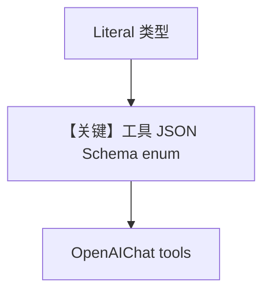

# 04_tools_with_literal_type_param.py — 实现原理分析

<!-- cookbook-py-source:start -->
## 完整源码

```python
"""
Example demonstrating Literal type support in Agno tools.

This example shows how to use typing.Literal for function parameters
in Agno toolkits and standalone tools. Literal types are useful when
a parameter should only accept specific predefined values.
"""

from typing import Literal

from agno.agent import Agent
from agno.models.openai import OpenAIChat
from agno.tools import Toolkit


class FileOperationsToolkit(Toolkit):
    """A toolkit demonstrating Literal type parameters."""

    def __init__(self):
        super().__init__(name="file_operations", tools=[self.manage_file])

    def manage_file(
        self,
        filename: str,
        operation: Literal["create", "read", "update", "delete"] = "read",
        priority: Literal["low", "medium", "high"] = "medium",
    ) -> str:
        """
        Manage a file with the specified operation.

        Args:
            filename: The name of the file to operate on.
            operation: The operation to perform on the file.
            priority: The priority level for this operation.

        Returns:
            A message describing what was done.
        """
        return f"Performed '{operation}' on '{filename}' with {priority} priority"


def standalone_tool(
    action: Literal["start", "stop", "restart"],
    service_name: str,
) -> str:
    """
    Control a service with the specified action.

    Args:
        action: The action to perform on the service.
        service_name: The name of the service to control.

    Returns:
        A message describing the action taken.
    """
    return f"Service '{service_name}' has been {action}ed"


def main():
    # Create an agent with both toolkit and standalone tool
    agent = Agent(
        model=OpenAIChat(id="gpt-4o-mini"),
        tools=[FileOperationsToolkit(), standalone_tool],
        instructions="You are a helpful assistant that can manage files and services.",
        markdown=True,
    )

    # Test with file operations
    print("Testing file operations with Literal types:")
    agent.print_response(
        "Create a new file called 'report.txt' with high priority", stream=True
    )

    print("\n" + "=" * 50 + "\n")

    # Test with service control
    print("Testing service control with Literal types:")
    agent.print_response("Restart the web server service", stream=True)


if __name__ == "__main__":
    main()
```

<!-- cookbook-py-source:end -->

> 源文件：`cookbook/02_agents/04_tools/04_tools_with_literal_type_param.py`

## 概述

演示 **`typing.Literal`** 出现在 **Toolkit 方法**与**独立函数**参数上时，框架生成的 **JSON Schema enum** 限制模型只能传 **预定值**（create/read/…、low/medium/high、start/stop/restart）。模型为 **`OpenAIChat(id="gpt-4o-mini")`**（**Chat Completions** 系）。

**核心配置一览：**

| 配置项 | 值 |
|--------|-----|
| `model` | `OpenAIChat(id="gpt-4o-mini")` |
| `tools` | `FileOperationsToolkit()`, `standalone_tool` |

## 架构分层

```
Literal 注解 → Function schema → 模型 function call 参数受约束
```

## 核心组件解析

**Toolkit** 将方法注册为工具；**standalone_tool** 为模块级函数。

### 运行机制与因果链

模型若传非法枚举值，提供商可能校验失败或触发重试。

## System Prompt 组装

```text
You are a helpful assistant that can manage files and services.
```

## 完整 API 请求

**`OpenAIChat` → `chat.completions.create`**，含 `tools` JSON Schema。

## Mermaid 流程图


```mermaid
flowchart TD
    A["Literal 类型"] --> B["【关键】工具 JSON Schema enum"]
    B --> C["OpenAIChat tools"]
```

## 关键源码文件索引

| 文件 | 关键函数/类 | 作用 |
|------|------------|------|
| `agno/tools/function.py` | schema 生成 | Literal→enum |
| `agno/models/openai/chat.py` | `OpenAIChat` | Completions API |
