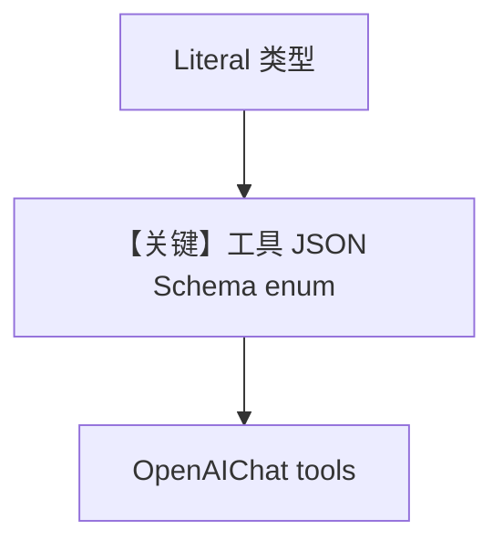

# 04_tools_with_literal_type_param.py — 实现原理分析

> 源文件：`cookbook/02_agents/04_tools/04_tools_with_literal_type_param.py`

## 概述

演示 **`typing.Literal`** 出现在 **Toolkit 方法**与**独立函数**参数上时，框架生成的 **JSON Schema enum** 限制模型只能传 **预定值**（create/read/…、low/medium/high、start/stop/restart）。模型为 **`OpenAIChat(id="gpt-4o-mini")`**（**Chat Completions** 系）。

**核心配置一览：**

| 配置项 | 值 |
|--------|-----|
| `model` | `OpenAIChat(id="gpt-4o-mini")` |
| `tools` | `FileOperationsToolkit()`, `standalone_tool` |

## 架构分层

```
Literal 注解 → Function schema → 模型 function call 参数受约束
```

## 核心组件解析

**Toolkit** 将方法注册为工具；**standalone_tool** 为模块级函数。

### 运行机制与因果链

模型若传非法枚举值，提供商可能校验失败或触发重试。

## System Prompt 组装

```text
You are a helpful assistant that can manage files and services.
```

## 完整 API 请求

**`OpenAIChat` → `chat.completions.create`**，含 `tools` JSON Schema。

## Mermaid 流程图


```mermaid
flowchart TD
    A["Literal 类型"] --> B["【关键】工具 JSON Schema enum"]
    B --> C["OpenAIChat tools"]
```

## 关键源码文件索引

| 文件 | 关键函数/类 | 作用 |
|------|------------|------|
| `agno/tools/function.py` | schema 生成 | Literal→enum |
| `agno/models/openai/chat.py` | `OpenAIChat` | Completions API |
