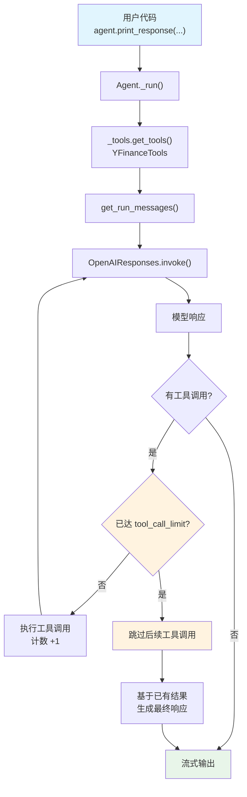

# tool_call_limit.py — 实现原理分析

> 源文件：`cookbook/02_agents/04_tools/tool_call_limit.py`

## 概述

本示例展示 Agno 的 **`tool_call_limit`（工具调用次数限制）** 机制：通过设置 `tool_call_limit=1`，限制 Agent 在单次运行中最多执行 1 次工具调用。即使模型请求多次工具调用，超出限制后 Agent 会停止执行后续工具并直接返回已有结果。

**核心配置一览：**

| 配置项 | 值 | 说明 |
|--------|------|------|
| `model` | `OpenAIResponses(id="gpt-5-mini")` | Responses API |
| `tools` | `[YFinanceTools()]` | YFinance 工具集 |
| `tool_call_limit` | `1` | 最多执行 1 次工具调用 |
| `name` | `None` | 未设置 |
| `instructions` | `None` | 未设置 |
| `description` | `None` | 未设置 |
| `markdown` | `False`（默认） | 未设置 |
| `tool_choice` | `None`（默认 auto） | 未设置 |

## 架构分层

```
用户代码层                          agno 内部层
┌──────────────────────────┐      ┌────────────────────────────────────────┐
│ tool_call_limit.py       │      │ Agent._run()                           │
│                          │      │  ├─ _tools.get_tools()                 │
│ tools=[YFinanceTools()]  │─────>│  │  └─ YFinanceTools → Function 列表   │
│ tool_call_limit=1        │      │  │                                      │
│                          │      │  ├─ _messages.get_run_messages()       │
│                          │      │  │                                      │
│                          │      │  └─ Model.response(                    │
│                          │      │       tool_call_limit=1                 │
│                          │      │     )                                   │
│                          │      │     └─ agentic loop                    │
│                          │      │        ├─ 第 1 次工具调用 → 执行        │
│                          │      │        └─ 第 2 次工具调用 → 跳过        │
└──────────────────────────┘      └────────────────────────────────────────┘
                                           │
                                           ▼
                                   ┌───────────────────┐
                                   │ OpenAIResponses    │
                                   │ gpt-5-mini         │
                                   └───────────────────┘
```

## 核心组件解析

### tool_call_limit 传递路径

`tool_call_limit` 在 Agent 属性中定义（`agent.py:L162`），通过 `_run.py` 传递给模型：

```python
# agent.py:L162
tool_call_limit: Optional[int] = None

# _run.py:L501-505
model_response: ModelResponse = agent.model.response(
    messages=run_messages.messages,
    tools=_tools,
    tool_choice=agent.tool_choice,
    tool_call_limit=agent.tool_call_limit,  # 传递限制值
    ...
)
```

### 限制执行机制

`tool_call_limit` 被传递给模型的 `response()` 方法，在 agentic loop（工具调用循环）中生效：

1. 模型返回响应，可能包含多个工具调用请求
2. 框架逐个执行工具调用，同时计数
3. 当已执行次数达到 `tool_call_limit` 时，停止执行后续工具调用
4. 将已有结果返回给模型，模型基于部分结果生成最终响应

### 实际运行效果

用户 prompt 要求两个操作：
1. 查询 TSLA 当前价格（第 1 次工具调用 → **执行**）
2. 查询 Tesla 最新新闻（第 2 次工具调用 → **跳过**）

```
用户: "Find me the current price of TSLA, then after that find me the latest news about Tesla."
      ↓
模型: 请求调用 get_stock_price(symbol="TSLA")
      ↓
框架: 执行（计数 1/1）→ 返回价格数据
      ↓
模型: 请求调用 get_company_news(symbol="TSLA")
      ↓
框架: 已达 tool_call_limit=1 → 跳过
      ↓
模型: 基于已有数据生成响应（仅包含价格信息）
```

### tool_call_limit 与 tool_choice 对比

| 配置 | 作用 | 控制层面 |
|------|------|---------|
| `tool_call_limit` | 限制执行次数 | 框架层（执行时截断） |
| `tool_choice` | 控制是否调用工具 | 模型层（API 参数） |

## System Prompt 组装

| 序号 | 组成部分 | 本文件中的值/来源 | 是否生效 |
|------|---------|-----------------|---------|
| 1 | `system_message`（自定义） | `None` | 否 |
| 3.1 | `instructions` | `None` | 否 |
| 3.1.1 | 模型指令（`get_instructions_for_model`） | 取决于模型 | 是 |
| 3.2.1 | `markdown` | `False` | 否 |
| 3.2.2 | `add_datetime_to_context` | `False` | 否 |
| 3.2.3 | `add_location_to_context` | `False` | 否 |
| 3.2.4 | `add_name_to_context` | `False` | 否 |
| 3.3.1 | `description` | `None` | 否 |
| 3.3.2 | `role` | `None` | 否 |
| 3.3.3 | instructions 拼接 | 无用户指令 | 否 |
| 3.3.4 | additional_information | 无 | 否 |
| 3.3.5 | `_tool_instructions` | 无 | 否 |
| 3.3.7 | `expected_output` | `None` | 否 |
| 3.3.8 | `additional_context` | `None` | 否 |
| 3.3.9 | `add_memories_to_context` | `None` | 否 |

### 最终 System Prompt

```text
（仅包含模型自身的指令，无用户自定义内容）
```

> 由于未设置 `instructions`、`description` 等，system prompt 仅包含模型 `get_instructions_for_model()` 返回的内容（如有）。

## 完整 API 请求

```python
client.responses.create(
    model="gpt-5-mini",
    input=[
        # System message（如有模型指令）
        # {"role": "developer", "content": "..."},
        {"role": "user", "content": "Find me the current price of TSLA, then after that find me the latest news about Tesla."}
    ],
    tools=[
        # YFinanceTools 提供的工具（如 get_stock_price, get_company_news 等）
        {
            "type": "function",
            "name": "get_stock_price",
            "description": "...",
            "parameters": {
                "type": "object",
                "properties": {
                    "symbol": {"type": "string"}
                },
                "required": ["symbol"]
            }
        },
        {
            "type": "function",
            "name": "get_company_news",
            "description": "...",
            "parameters": {
                "type": "object",
                "properties": {
                    "symbol": {"type": "string"}
                },
                "required": ["symbol"]
            }
        }
        # ... 其他 YFinance 工具
    ],
    stream=True,
    stream_options={"include_usage": True}
)
```

> **说明**：`tool_call_limit` 不作为 API 参数传递给模型，而是由 Agno 框架在 agentic loop 中控制执行次数。模型仍然会请求多次工具调用，但框架只执行前 N 次。

## Mermaid 流程图



## 关键源码文件索引

| 文件 | 关键函数/类 | 作用 |
|------|------------|------|
| `agno/agent/agent.py` | `tool_call_limit` L162 | 工具调用次数限制属性 |
| `agno/agent/_run.py` | L505 | 将 tool_call_limit 传递给模型 |
| `agno/models/openai/responses.py` | `response()` | 模型响应方法，处理 agentic loop |
| `agno/tools/yfinance.py` | `YFinanceTools` | YFinance 工具集 |
| `agno/agent/_tools.py` | `get_tools()` L105 | 工具收集入口 |
| `agno/agent/_tools.py` | `determine_tools_for_model()` L434 | 转换为模型可用的 Function 列表 |
