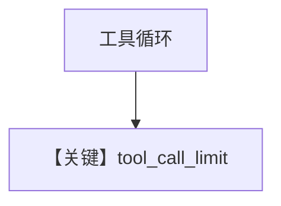

# tool_call_limit.py — 实现原理分析

> 源文件：`cookbook/02_agents/04_tools/tool_call_limit.py`

## 概述

**`tool_call_limit=1`**：单轮 run 内**最多一次**工具调用，用于控费/防循环；用户要求「先查价再查新闻」时第二次工具应被阻止或报错（依框架行为）。

**核心配置一览：**

| 配置项 | 值 |
|--------|-----|
| `model` | `OpenAIResponses(id="gpt-5-mini")` |
| `tools` | `[YFinanceTools()]` |
| `tool_call_limit` | `1` |

## 架构分层

```
agentic loop → 计数 tool 调用 → 达上限则停止扩展
```

## 核心组件解析

与 **`max_tool_calls_from_history`**（历史裁剪）不同：本参数约束**当前轮**工具次数。

### 运行机制与因果链

超限后模型可能仅用文本解释无法完成第二步。

## System Prompt 组装

无显式 instructions；默认 system。

## 完整 API 请求

**OpenAIResponses** + YFinance。

## Mermaid 流程图


```mermaid
flowchart TD
    A["工具循环"] --> B["【关键】tool_call_limit"]
```

## 关键源码文件索引

| 文件 | 关键函数/类 | 作用 |
|------|------------|------|
| `agno/agent/_run.py` | tool 循环与限制 | 实现位置需结合版本 |
