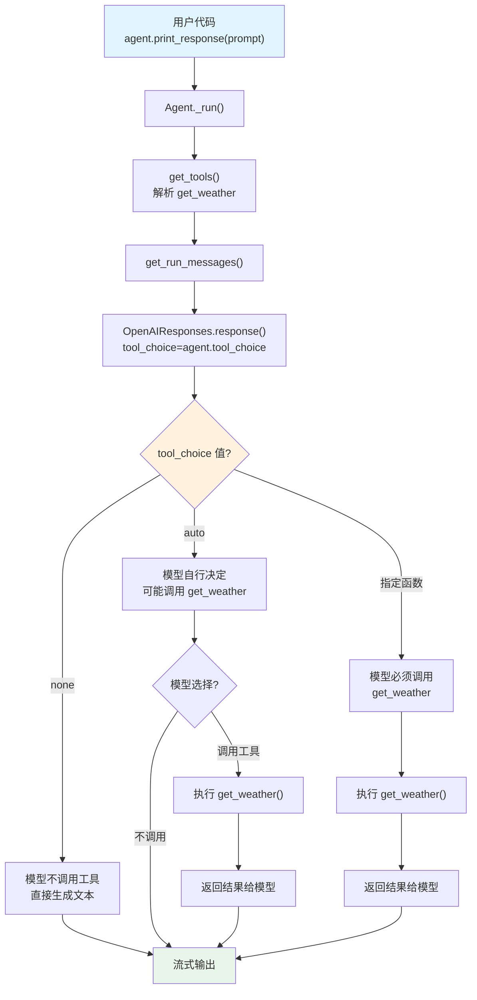

# tool_choice.py — 实现原理分析

> 源文件：`cookbook/02_agents/04_tools/tool_choice.py`

## 概述

本示例展示 Agno 的 **`tool_choice`（工具选择策略）** 机制：通过设置不同的 `tool_choice` 值，控制模型在响应时是否以及如何使用工具。本文件创建三个 Agent 对比三种策略：`"none"`（禁用工具）、`"auto"`（模型自动决定）和指定特定函数（强制调用）。

**核心配置一览：**

| Agent | `tool_choice` | 说明 |
|-------|-------------|------|
| `no_tools_agent` | `"none"` | 禁止调用工具，直接生成文本回复 |
| `auto_tools_agent` | `"auto"` | 模型自行决定是否调用工具 |
| `forced_tool_agent` | `{"type": "function", "name": "get_weather"}` | 强制调用 `get_weather` 函数 |

**三个 Agent 的共同配置：**

| 配置项 | 值 | 说明 |
|--------|------|------|
| `model` | `OpenAIResponses(id="gpt-5.2")` | Responses API |
| `tools` | `[get_weather]` | 单个天气查询工具 |
| `instructions` | `None` | 未设置 |
| `markdown` | `False`（默认） | 未设置 |

## 架构分层

```
用户代码层                          agno 内部层
┌──────────────────────────┐      ┌────────────────────────────────────────┐
│ tool_choice.py           │      │ Agent._run()                           │
│                          │      │  ├─ _tools.get_tools()                 │
│ 三个 Agent:              │      │  │  └─ [get_weather] → Function       │
│ ┌─ tool_choice="none"   │      │  │                                      │
│ ├─ tool_choice="auto"   │─────>│  └─ Model.response(                    │
│ └─ tool_choice={...}    │      │       tool_choice=agent.tool_choice     │
│                          │      │     )                                   │
│ 同一 prompt:             │      │     → 作为 API 参数直传给模型           │
│ "What is the weather     │      │                                        │
│  in San Francisco today?"│      │                                        │
└──────────────────────────┘      └────────────────────────────────────────┘
                                           │
                                           ▼
                                   ┌───────────────────┐
                                   │ OpenAIResponses    │
                                   │ gpt-5.2            │
                                   └───────────────────┘
```

## 核心组件解析

### tool_choice 属性定义

```python
# agent.py:L163-169
# Controls which (if any) tool is called by the model.
# "none" means the model will not call a tool and instead generates a message.
# "auto" means the model can pick between generating a message or calling a tool.
# Specifying a particular function via {"type: "function", "function": {"name": "my_function"}}
#   forces the model to call that tool.
# "none" is the default when no tools are present. "auto" is the default if tools are present.
tool_choice: Optional[Union[str, Dict[str, Any]]] = None
```

### tool_choice 传递路径

`tool_choice` 直接作为 API 参数传递给模型，不做任何框架层处理：

```python
# _run.py:L501-505
model_response = agent.model.response(
    messages=run_messages.messages,
    tools=_tools,
    tool_choice=agent.tool_choice,  # 直传给模型 API
    tool_call_limit=agent.tool_call_limit,
    ...
)
```

### 三种策略对比

| 策略 | `tool_choice` 值 | 模型行为 | 预期结果 |
|------|-----------------|---------|---------|
| 禁用 | `"none"` | 不调用任何工具，直接生成文本 | 模型凭自身知识回答天气问题 |
| 自动 | `"auto"` | 模型决定是否调用工具 | 模型可能调用 `get_weather` 获取数据 |
| 强制 | `{"type": "function", "name": "get_weather"}` | 必须调用指定函数 | 模型一定会调用 `get_weather` |

### tool_choice 与 tool_call_limit 对比

| 维度 | `tool_choice` | `tool_call_limit` |
|------|-------------|-------------------|
| 控制层面 | 模型层（API 参数） | 框架层（执行截断） |
| 作用时机 | 模型决策时 | 工具执行时 |
| 影响范围 | 是否生成工具调用请求 | 已生成的请求是否执行 |
| 值类型 | `"none"` / `"auto"` / `{specific}` | `int`（正整数） |

## System Prompt 组装

| 序号 | 组成部分 | 本文件中的值/来源 | 是否生效 |
|------|---------|-----------------|---------|
| 1 | `system_message`（自定义） | `None` | 否 |
| 3.1 | `instructions` | `None` | 否 |
| 3.1.1 | 模型指令（`get_instructions_for_model`） | 取决于模型 | 是 |
| 3.2.1 | `markdown` | `False` | 否 |
| 3.2.2 | `add_datetime_to_context` | `False` | 否 |
| 3.2.3 | `add_location_to_context` | `False` | 否 |
| 3.2.4 | `add_name_to_context` | 各 Agent 有 name 但未启用 | 否 |
| 3.3.1 | `description` | `None` | 否 |
| 3.3.2 | `role` | `None` | 否 |
| 3.3.3 | instructions 拼接 | 无 | 否 |
| 3.3.5 | `_tool_instructions` | 无 | 否 |
| 3.3.7 | `expected_output` | `None` | 否 |
| 3.3.8 | `additional_context` | `None` | 否 |
| 3.3.9 | `add_memories_to_context` | `None` | 否 |

### 最终 System Prompt

```text
（仅包含模型自身的指令，无用户自定义内容）
```

## 完整 API 请求

**Agent 1（tool_choice="none"）：**

```python
client.responses.create(
    model="gpt-5.2",
    input=[
        {"role": "user", "content": "What is the weather in San Francisco today?"}
    ],
    tools=[
        {
            "type": "function",
            "name": "get_weather",
            "description": "No description provided",
            "parameters": {
                "type": "object",
                "properties": {
                    "city": {"type": "string"}
                },
                "required": ["city"]
            }
        }
    ],
    tool_choice="none",  # 禁止调用工具
    stream=True,
    stream_options={"include_usage": True}
)
```

**Agent 2（tool_choice="auto"）：**

```python
client.responses.create(
    model="gpt-5.2",
    input=[
        {"role": "user", "content": "What is the weather in San Francisco today?"}
    ],
    tools=[
        {
            "type": "function",
            "name": "get_weather",
            "description": "No description provided",
            "parameters": {
                "type": "object",
                "properties": {
                    "city": {"type": "string"}
                },
                "required": ["city"]
            }
        }
    ],
    tool_choice="auto",  # 模型自行决定
    stream=True,
    stream_options={"include_usage": True}
)
```

**Agent 3（强制调用 get_weather）：**

```python
client.responses.create(
    model="gpt-5.2",
    input=[
        {"role": "user", "content": "What is the weather in San Francisco today?"}
    ],
    tools=[
        {
            "type": "function",
            "name": "get_weather",
            "description": "No description provided",
            "parameters": {
                "type": "object",
                "properties": {
                    "city": {"type": "string"}
                },
                "required": ["city"]
            }
        }
    ],
    tool_choice={"type": "function", "name": "get_weather"},  # 强制调用
    stream=True,
    stream_options={"include_usage": True}
)
```

> **说明**：三次请求的 `tools` 相同，唯一区别在 `tool_choice` 参数。Responses API 使用 `input`（非 `messages`），role 映射 `system→developer`。

## Mermaid 流程图



## 关键源码文件索引

| 文件 | 关键函数/类 | 作用 |
|------|------------|------|
| `agno/agent/agent.py` | `tool_choice` L169 | 工具选择策略属性定义 |
| `agno/agent/_run.py` | L504 | 将 tool_choice 传递给模型 |
| `agno/models/openai/responses.py` | `response()` L574 | 模型响应方法，将 tool_choice 传入 API |
| `agno/models/openai/responses.py` | `role_map` L84 | system→developer 角色映射 |
| `agno/agent/_tools.py` | `get_tools()` L105 | 工具收集入口 |
| `agno/agent/_tools.py` | `determine_tools_for_model()` L434 | 转换为模型可用的 Function 列表 |
