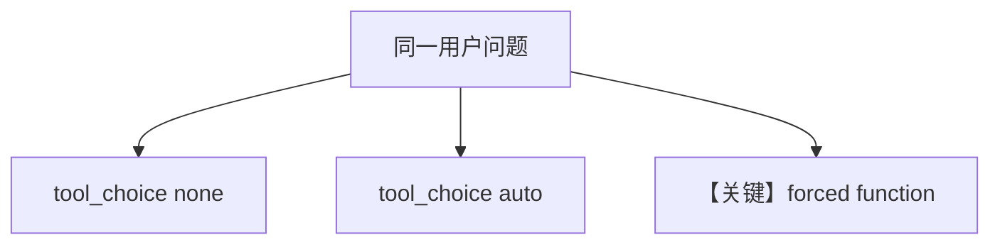

# tool_choice.py — 实现原理分析

> 源文件：`cookbook/02_agents/04_tools/tool_choice.py`

## 概述

对比 **`tool_choice`**：**`none`** 禁止工具（虽有 `get_weather`）；**`auto`** 由模型决定；**`{"type":"function","name":"get_weather"}`** 强制调用。映射至 OpenAI **Responses/Chat** 的 `tool_choice` 参数（`Gemini` 则为 `tool_config`，依适配器）。

**核心配置一览：**

| Agent | tool_choice |
|-------|-------------|
| `no_tools_agent` | `"none"` |
| `auto_tools_agent` | `"auto"` |
| `forced_tool_agent` | `dict` 指定函数名 |

## 架构分层

```
tool_choice → Model.get_request_params → 提供商 API 行为差异
```

## 核心组件解析

同 prompt 三次 `print_response` 对比输出（`tool_choice.py` L43-47）。

### 运行机制与因果链

- **none**：模型不得发起 function call，只能纯文本。
- **forced**：应至少产生一次指定工具调用（若提供商支持）。

## System Prompt 组装

无 instructions；三 Agent 仅 `tool_choice` 不同。

## 完整 API 请求

**OpenAIResponses**，`tool_choice` 字段随示例变化。

## Mermaid 流程图


```mermaid
flowchart TD
    Q["同一用户问题"] --> N["tool_choice none"]
    Q --> A["tool_choice auto"]
    Q --> F["【关键】forced function"]
```

## 关键源码文件索引

| 文件 | 关键函数/类 | 作用 |
|------|------------|------|
| `agno/models/openai/responses.py` | `get_request_params` | 传 tool_choice |
