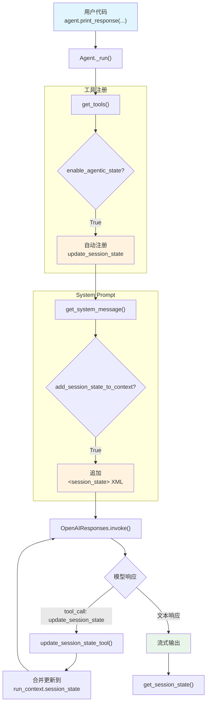

# agentic_session_state.py — 实现原理分析

> 源文件：`cookbook/02_agents/05_state_and_session/agentic_session_state.py`

## 概述

本示例展示 Agno 的 **`enable_agentic_state`** 机制：启用后 Agent 自动获得一个 `update_session_state` 内置工具，模型可以直接通过工具调用修改 `session_state`，无需用户定义任何工具函数。配合 `add_session_state_to_context=True`，当前状态以 XML 标签注入 system prompt，模型可感知并自主管理状态。

**核心配置一览：**

| 配置项 | 值 | 说明 |
|--------|------|------|
| `model` | `OpenAIResponses(id="gpt-5-mini")` | Responses API |
| `db` | `SqliteDb(db_file="tmp/agents.db")` | SQLite 持久化 |
| `session_state` | `{"shopping_list": []}` | 初始会话状态 |
| `add_session_state_to_context` | `True` | 将状态注入 system prompt |
| `enable_agentic_state` | `True` | 启用内置状态更新工具 |

## 架构分层

```
用户代码层                          agno.agent 层
┌─────────────────────────┐       ┌──────────────────────────────────────┐
│ agentic_session_state   │       │ Agent._run()                         │
│                         │       │  ├ _tools.py                         │
│ enable_agentic_state    │       │  │  get_tools()                       │
│   = True                │──────>│  │    → 自动注册                      │
│                         │       │  │      update_session_state 工具     │
│ add_session_state_to_   │       │  │                                    │
│   context = True        │       │  ├ _messages.py                      │
│                         │       │  │  get_system_message()              │
│ session_state=          │       │  │    → <session_state> XML 块        │
│   {"shopping_list": []} │       │  │                                    │
│                         │       │  └ 模型调用 update_session_state 工具 │
└─────────────────────────┘       └──────────────────────────────────────┘
                                          │
                                          ▼
                                  ┌──────────────────┐
                                  │ OpenAIResponses   │
                                  │ gpt-5-mini        │
                                  └──────────────────┘
```

## 核心组件解析

### enable_agentic_state 自动注册工具

当 `enable_agentic_state=True`（`agent.py:88`），`get_tools()`（`_tools.py:165`）自动注册一个 `update_session_state` 工具：

```python
# _tools.py:165-171
if agent.enable_agentic_state:
    agent_tools.append(
        Function(
            name="update_session_state",
            entrypoint=_default_tools.make_update_session_state_entrypoint(agent),
        )
    )
```

### update_session_state 内置工具

工具实现在 `_default_tools.py:347-363`：

```python
def update_session_state_tool(agent, run_context, session_state_updates: dict) -> str:
    """模型可直接调用此工具更新 session_state"""
    if run_context.session_state is None:
        run_context.session_state = {}
    session_state = run_context.session_state
    for key, value in session_state_updates.items():
        session_state[key] = value  # 逐 key 合并更新
    return f"Updated session state: {session_state}"
```

模型通过工具调用传入 `{"session_state_updates": {"shopping_list": ["milk", "eggs", "bread"]}}`，工具函数直接修改 `run_context.session_state`。

### add_session_state_to_context

当 `add_session_state_to_context=True`（`agent.py:86`），`get_system_message()` 在步骤 3.3.17（`_messages.py:437`）将完整状态以 XML 标签追加到 system prompt 末尾：

```python
# _messages.py:437-438
if add_session_state_to_context and session_state is not None:
    system_message_content += f"\n<session_state>\n{session_state}\n</session_state>\n\n"
```

### 与自定义工具方式的对比

| 特性 | enable_agentic_state | 自定义工具函数 |
|------|---------------------|--------------|
| 工具定义 | 自动注册 | 用户手动定义 |
| 状态操作 | 整体 key-value 合并 | 自定义逻辑（可精细控制） |
| 模型感知 | `<session_state>` XML 块 | `{var}` 模板变量 |
| 适用场景 | 简单 KV 状态管理 | 复杂业务逻辑 |

## System Prompt 组装

| 序号 | 组成部分 | 本文件中的值/来源 | 是否生效 |
|------|---------|-----------------|---------|
| 1 | `system_message` | `None` | 否 |
| 3.1 | `instructions` | `None` | 否 |
| 3.2.1 | `markdown` | `False`（默认） | 否 |
| 3.3.1 | `description` | `None` | 否 |
| 3.3.17 | `add_session_state_to_context` | `True` | 是 |

### 最终 System Prompt

```text
<session_state>
{'shopping_list': []}
</session_state>
```

> 注意：没有 `instructions` 和 `markdown`，system prompt 仅包含 `<session_state>` XML 块。模型根据工具描述理解如何操作状态。

## 完整 API 请求

```python
client.responses.create(
    model="gpt-5-mini",
    input=[
        # 1. System Message
        {
            "role": "developer",
            "content": "\n<session_state>\n{'shopping_list': []}\n</session_state>\n"
        },
        # 2. 用户输入
        {
            "role": "user",
            "content": "Add milk, eggs, and bread to the shopping list"
        }
    ],
    tools=[
        {
            "type": "function",
            "function": {
                "name": "update_session_state",
                "description": "Update the shared session state. Provide any updates as a dictionary of key-value pairs.\nExample:\n    \"session_state_updates\": {\"shopping_list\": [\"milk\", \"eggs\", \"bread\"]}",
                "parameters": {
                    "type": "object",
                    "properties": {
                        "session_state_updates": {
                            "type": "object",
                            "description": "The updates to apply to the shared session state."
                        }
                    },
                    "required": ["session_state_updates"]
                }
            }
        }
    ],
    stream=True,
    stream_options={"include_usage": True}
)
```

**第二轮请求（Agent 已更新状态后）：**

```python
client.responses.create(
    model="gpt-5-mini",
    input=[
        # System Message — 状态已更新
        {
            "role": "developer",
            "content": "\n<session_state>\n{'shopping_list': ['milk', 'eggs', 'bread']}\n</session_state>\n"
        },
        {"role": "user", "content": "I picked up the eggs, now what's on my list?"}
    ],
    tools=[...],  # 同上
    stream=True,
    stream_options={"include_usage": True}
)
```

## Mermaid 流程图



## 关键源码文件索引

| 文件 | 关键函数/类 | 作用 |
|------|------------|------|
| `agno/agent/agent.py` | `enable_agentic_state` L88 | 启用内置状态工具 |
| `agno/agent/agent.py` | `add_session_state_to_context` L86 | 状态注入 system prompt |
| `agno/agent/_tools.py` | `get_tools()` L165-171 | 自动注册 update_session_state |
| `agno/agent/_default_tools.py` | `update_session_state_tool()` L347 | 内置工具实现 |
| `agno/agent/_default_tools.py` | `make_update_session_state_entrypoint()` L366 | 工具入口闭包 |
| `agno/agent/_messages.py` | `get_system_message()` L437 | 追加 `<session_state>` XML |
| `agno/run/base.py` | `RunContext` L16 | 运行上下文 |
