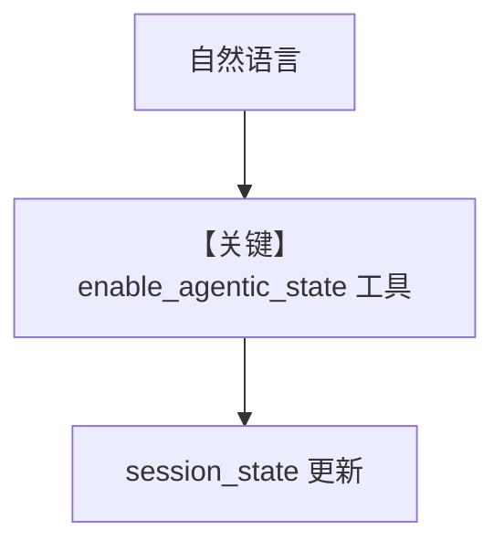

# agentic_session_state.py — 实现原理分析

> 源文件：`cookbook/02_agents/05_state_and_session/agentic_session_state.py`

## 概述

**`enable_agentic_state=True`**：由模型通过**框架提供的会话状态工具**（非手写 `add_item`）更新 **`session_state`**（如购物清单）；需 **`add_session_state_to_context=True`** 让模型看到当前状态。

**核心配置一览：**

| 配置项 | 值 |
|--------|-----|
| `session_state` | `{"shopping_list": []}` |
| `add_session_state_to_context` | `True` |
| `enable_agentic_state` | `True` |
| `db` | `SqliteDb` |

## 架构分层

```
模型 → agentic 状态工具 → session_state 持久 → 下一轮 system 可见
```

## 核心组件解析

与手写工具改 `run_context.session_state` 不同：**由框架生成/注册**状态变更工具（具体见 `agno/agent` 内 agentic state 实现）。

### 运行机制与因果链

用户自然语言「加牛奶」→ 模型调用状态工具 → 列表更新。

## System Prompt 组装

无长 instructions；状态通过 **占位与附加机制** 可见（以框架为准）。

## 完整 API 请求

**OpenAIResponses** + 状态工具。

## Mermaid 流程图


```mermaid
flowchart TD
    A["自然语言"] --> B["【关键】enable_agentic_state 工具"]
    B --> C["session_state 更新"]
```

## 关键源码文件索引

| 文件 | 关键函数/类 | 作用 |
|------|------------|------|
| `agno/agent/agent.py` | `enable_agentic_state` | 配置 |
