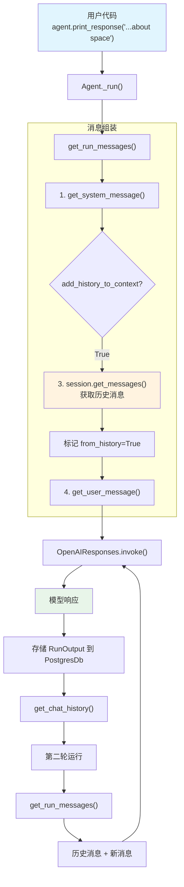

# chat_history.py — 实现原理分析

> 源文件：`cookbook/02_agents/05_state_and_session/chat_history.py`

## 概述

本示例展示 Agno 的 **`add_history_to_context`** 机制：启用后 Agent 自动将同一会话的历史消息添加到发送给模型的消息列表中，使模型能记住之前的对话内容。配合 `PostgresDb` 持久化和固定 `session_id`，实现跨运行的对话记忆。

**核心配置一览：**

| 配置项 | 值 | 说明 |
|--------|------|------|
| `model` | `OpenAIResponses(id="gpt-5-mini")` | Responses API |
| `db` | `PostgresDb(db_url=..., session_table="sessions")` | PostgreSQL 持久化 |
| `session_id` | `"chat_history"` | 固定会话 ID |
| `instructions` | `"You are a helpful assistant..."` | 限定话题 |
| `add_history_to_context` | `True` | 启用历史消息注入 |

## 架构分层

```
用户代码层                          agno.agent 层
┌─────────────────────────┐       ┌──────────────────────────────────────┐
│ chat_history.py         │       │ Agent._run()                         │
│                         │       │  ├ _messages.py                      │
│ session_id=             │       │  │  get_run_messages()                │
│   "chat_history"        │──────>│  │    ├ get_system_message()          │
│                         │       │  │    ├ 步骤 3: 添加 history          │
│ add_history_to_context  │       │  │    │  session.get_messages(        │
│   = True                │       │  │    │    last_n_runs=None)          │
│                         │       │  │    └ get_user_message()            │
│ get_chat_history()      │       │  │                                    │
│   → 查看消息列表        │       │  └ PostgresDb 存储 RunOutput         │
└─────────────────────────┘       └──────────────────────────────────────┘
                                          │
                                          ▼
                                  ┌──────────────────┐
                                  │ OpenAIResponses   │
                                  │ gpt-5-mini        │
                                  └──────────────────┘
```

## 核心组件解析

### add_history_to_context 的工作原理

当 `add_history_to_context=True`（`agent.py:127`），`get_run_messages()` 在步骤 3（`_messages.py:1231-1262`）从 session 中获取历史消息并注入：

```python
# _messages.py:1231-1262
if add_history_to_context:
    # 从 session 获取历史消息
    history: List[Message] = session.get_messages(
        last_n_runs=agent.num_history_runs,    # 限制运行次数（None=不限）
        limit=agent.num_history_messages,       # 限制消息数量（None=不限）
        skip_roles=[skip_role] if skip_role else None,
    )

    if len(history) > 0:
        # 深拷贝避免修改原始消息
        history_copy = [deepcopy(msg) for msg in history]
        # 标记为历史消息
        for _msg in history_copy:
            _msg.from_history = True
        # 过滤历史中的工具调用
        if agent.max_tool_calls_from_history is not None:
            filter_tool_calls(history_copy, agent.max_tool_calls_from_history)
        # 添加到消息列表
        run_messages.messages += history_copy
```

### 固定 session_id

`session_id="chat_history"` 确保每次运行都属于同一个会话。每次 `_run()` 结束后，新的消息被存入 PostgresDb，下次运行时作为历史消息取出。

### get_chat_history()

`agent.get_chat_history()`（`agent.py:1005`）返回当前会话的所有消息，用于调试和验证：

```python
def get_chat_history(self, session_id=None, last_n_runs=None) -> List[Message]:
    return _session.get_chat_history(self, session_id=session_id, last_n_runs=last_n_runs)
```

### PostgresDb

使用 PostgreSQL 作为持久化后端，`session_table="sessions"` 指定存储表名。需要预先启动 PostgreSQL（`cookbook/scripts/run_pgvector.sh`）。

## System Prompt 组装

| 序号 | 组成部分 | 本文件中的值/来源 | 是否生效 |
|------|---------|-----------------|---------|
| 1 | `system_message` | `None` | 否 |
| 3.1 | `instructions` | `"You are a helpful assistant that can answer questions about space and oceans."` | 是 |
| 3.2.1 | `markdown` | `False`（默认） | 否 |
| 3.3.3 | instructions 拼接 | 单条指令 | 是 |

### 最终 System Prompt

```text
You are a helpful assistant that can answer questions about space and oceans.
```

## 完整 API 请求

**第一轮：**

```python
client.responses.create(
    model="gpt-5-mini",
    input=[
        # 1. System Message
        {"role": "developer", "content": "You are a helpful assistant that can answer questions about space and oceans.\n"},
        # 2. 用户输入（无历史）
        {"role": "user", "content": "Tell me a new interesting fact about space"}
    ],
    stream=True,
    stream_options={"include_usage": True}
)
```

**第二轮（含历史）：**

```python
client.responses.create(
    model="gpt-5-mini",
    input=[
        # 1. System Message
        {"role": "developer", "content": "You are a helpful assistant that can answer questions about space and oceans.\n"},
        # 2. 历史消息（from_history=True）
        {"role": "user", "content": "Tell me a new interesting fact about space"},
        {"role": "assistant", "content": "Did you know that..."},
        # 3. 当前用户输入
        {"role": "user", "content": "Tell me a new interesting fact about oceans"}
    ],
    stream=True,
    stream_options={"include_usage": True}
)
```

> 第二轮请求包含第一轮的对话作为历史，模型可以参考之前的对话避免重复。

## Mermaid 流程图



## 关键源码文件索引

| 文件 | 关键函数/类 | 作用 |
|------|------------|------|
| `agno/agent/agent.py` | `add_history_to_context` L127 | 启用历史消息注入 |
| `agno/agent/agent.py` | `num_history_runs` L129 | 限制历史运行次数 |
| `agno/agent/agent.py` | `num_history_messages` L131 | 限制历史消息数量 |
| `agno/agent/agent.py` | `get_chat_history()` L1005 | 获取聊天历史 |
| `agno/agent/_messages.py` | `get_run_messages()` L1231-1262 | 步骤 3：注入历史消息 |
| `agno/db/postgres` | `PostgresDb` | PostgreSQL 持久化后端 |
