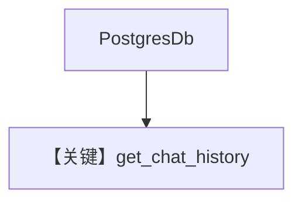

# chat_history.py — 实现原理分析

> 源文件：`cookbook/02_agents/05_state_and_session/chat_history.py`

## 概述

**`PostgresDb`** + 固定 **`session_id="chat_history"`** + **`add_history_to_context=True`**：演示 **`get_chat_history()`** 读取会话消息；适合与 **SQLite** 对照学习 **生产库** 用法。

**核心配置一览：**

| 配置项 | 值 |
|--------|-----|
| `db` | `PostgresDb(..., session_table="sessions")` |
| `session_id` | `"chat_history"` |
| `instructions` | 太空与海洋助手 |

## 架构分层

```
print_response → 写会话 → get_chat_history() 打印
```

## 核心组件解析

需本地 **Postgres** 可连（`chat_history.py` L12-L14）。

### 运行机制与因果链

两轮 `print_response` 后历史增长；`get_chat_history()` 展示存储视图。

## System Prompt 组装

```text
You are a helpful assistant that can answer questions about space and oceans.
```

## 完整 API 请求

**OpenAIResponses**。

## Mermaid 流程图


```mermaid
flowchart TD
    A["PostgresDb"] --> B["【关键】get_chat_history"]
```

## 关键源码文件索引

| 文件 | 关键函数/类 | 作用 |
|------|------------|------|
| `agno/db/postgres.py` | `PostgresDb` | 持久化 |
