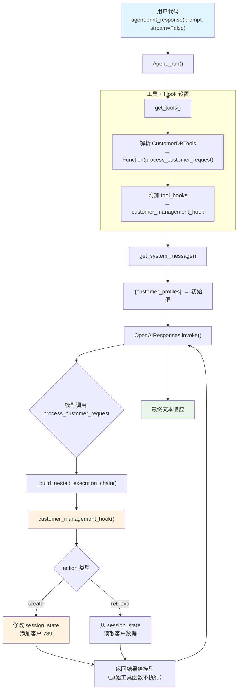

# dynamic_session_state.py — 实现原理分析

> 源文件：`cookbook/02_agents/05_state_and_session/dynamic_session_state.py`

## 概述

本示例展示 Agno 的 **`tool_hooks`（工具钩子）** 机制：通过注册中间件函数拦截工具调用，在工具函数实际执行**之前**修改 `session_state` 并返回结果，从而实现动态状态管理。配合 `resolve_in_context=True` 的 instructions 模板变量注入，展示了 hook 如何在单轮多次工具调用中动态更新状态。

**核心配置一览：**

| 配置项 | 值 | 说明 |
|--------|------|------|
| `model` | `OpenAIResponses(id="gpt-5.2")` | Responses API |
| `tools` | `[CustomerDBTools()]` | Toolkit 子类 |
| `tool_hooks` | `[customer_management_hook]` | 工具调用中间件 |
| `session_state` | `{"customer_profiles": {"123": {"name": "Jane Doe"}}}` | 初始客户数据 |
| `instructions` | `"Your profiles: {customer_profiles}. Use process_customer_request..."` | 含模板变量 |
| `resolve_in_context` | `True`（默认） | 启用模板变量替换 |
| `db` | `InMemoryDb()` | 内存数据库 |

## 架构分层

```
用户代码层                          agno.agent 层
┌─────────────────────────┐       ┌──────────────────────────────────────┐
│ dynamic_session_state   │       │ Agent._run()                         │
│                         │       │  ├ _tools.py                         │
│ tools=[CustomerDBTools] │       │  │  parse_tools() → Function 对象    │
│   process_customer_     │       │  │  func.tool_hooks =                │
│   request()             │──────>│  │    [customer_management_hook]     │
│                         │       │  │                                    │
│ tool_hooks=             │       │  ├ function.py: _build_nested_       │
│   [customer_management  │       │  │  execution_chain()                │
│    _hook]               │       │  │    → hook 拦截 → 返回结果         │
│                         │       │  │    → 原始工具函数不执行            │
│ session_state=          │       │  │                                    │
│   {"customer_profiles": │       │  ├ _messages.py                      │
│    {"123": {...}}}      │       │  │  {customer_profiles} → 实际值     │
└─────────────────────────┘       └──────────────────────────────────────┘
                                          │
                                          ▼
                                  ┌──────────────────┐
                                  │ OpenAIResponses   │
                                  │ gpt-5.2           │
                                  └──────────────────┘
```

## 核心组件解析

### CustomerDBTools Toolkit

`CustomerDBTools` 继承 `Toolkit`，注册了 `process_customer_request` 方法：

```python
class CustomerDBTools(Toolkit):
    def __init__(self, *args, **kwargs):
        super().__init__(*args, **kwargs)
        self.register(self.process_customer_request)

    def process_customer_request(self, agent, customer_id, action="retrieve", name="John Doe"):
        log_warning("Tool called, this shouldn't happen.")
        return "This should not be seen."
```

关键点：这个工具函数**不应被实际调用**，因为 `tool_hooks` 会拦截并处理所有请求。

### tool_hooks 中间件机制

`tool_hooks` 在工具解析时被附加到每个 `Function` 对象上（`_tools.py:364-365`）：

```python
# _tools.py:364-365
if agent.tool_hooks is not None:
    _func.tool_hooks = agent.tool_hooks
```

执行时，`FunctionCall._build_nested_execution_chain()`（`function.py:928-974`）将 hooks 构建为嵌套调用链：

```python
# function.py:944-974
if not self.function.tool_hooks:
    return execute_entrypoint  # 无 hook，直接执行

# 从内到外构建嵌套链
hooks = list(reversed(final_hooks))
chain = reduce(create_hook_wrapper, hooks, execute_entrypoint)
```

### hook 参数注入

`_build_hook_args()`（`function.py:898-926`）通过检查 hook 函数签名自动注入参数：

```python
def _build_hook_args(self, hook, name, func, args):
    hook_args = {}
    if "run_context" in signature(hook).parameters:
        hook_args["run_context"] = self.function._run_context  # 注入 RunContext
    if "arguments" in signature(hook).parameters:
        hook_args["arguments"] = args  # 注入工具调用参数
    # ...还支持 agent, team, name, function 等
    return hook_args
```

### customer_management_hook 实现

hook 函数接收 `run_context` 和 `arguments`，直接操作 `session_state` 并返回结果（**不调用原始工具函数**）：

```python
def customer_management_hook(run_context: RunContext, arguments: Dict[str, Any]):
    action = arguments.get("action", "retrieve")
    cust_id = arguments.get("customer_id")

    if action == "create":
        # 直接修改 session_state
        run_context.session_state["customer_profiles"][cust_id] = {"name": name}
        return f"Success! Customer {cust_id} has been created."

    if action == "retrieve":
        profile = run_context.session_state.get("customer_profiles", {}).get(cust_id)
        if profile:
            return f"Profile for {cust_id}: {json.dumps(profile)}"
        else:
            raise ValueError(f"Customer '{cust_id}' not found.")
```

关键行为：hook 返回字符串结果时，该结果直接作为工具调用的输出返回给模型，**原始 `process_customer_request` 方法不会被执行**。

### InMemoryDb

`InMemoryDb` 是内存数据库，数据不持久化到磁盘，适合测试场景。

## System Prompt 组装

| 序号 | 组成部分 | 本文件中的值/来源 | 是否生效 |
|------|---------|-----------------|---------|
| 1 | `system_message` | `None` | 否 |
| 3.1 | `instructions` | `"Your profiles: {customer_profiles}..."` | 是 |
| 3.2.1 | `markdown` | `False`（默认） | 否 |
| 3.3.3 | instructions 拼接 | 含替换后的 `{customer_profiles}` | 是 |

### 最终 System Prompt

```text
Your profiles: {'123': {'name': 'Jane Doe'}}. Use `process_customer_request`. Use either create or retrieve as action for the tool.
```

> 注意：`{customer_profiles}` 被替换为初始值。即使 hook 在第一次工具调用中创建了新客户（789），system prompt **不会在同一轮中更新**——它只在下一次 `_run()` 调用时刷新。

## 完整 API 请求

```python
client.responses.create(
    model="gpt-5.2",
    input=[
        # 1. System Message
        {
            "role": "developer",
            "content": "Your profiles: {'123': {'name': 'Jane Doe'}}. Use `process_customer_request`. Use either create or retrieve as action for the tool."
        },
        # 2. 用户输入
        {
            "role": "user",
            "content": "First, create customer 789 named 'Tom'. Then, retrieve Tom's profile. Step by step."
        }
    ],
    tools=[
        {
            "type": "function",
            "function": {
                "name": "process_customer_request",
                "description": null,
                "parameters": {
                    "type": "object",
                    "properties": {
                        "customer_id": {"type": "string"},
                        "action": {"type": "string", "default": "retrieve"},
                        "name": {"type": "string", "default": "John Doe"}
                    },
                    "required": ["customer_id"]
                }
            }
        }
    ],
    stream=False
)
```

**第二轮（创建客户后 retrieve）：**

```python
# 模型第一次调用: process_customer_request(customer_id="789", action="create", name="Tom")
# → hook 拦截 → session_state["customer_profiles"]["789"] = {"name": "Tom"}
# → 返回: "Success! Customer 789 has been created."

# 模型第二次调用: process_customer_request(customer_id="789", action="retrieve")
# → hook 拦截 → 从 session_state 中找到 789
# → 返回: "Profile for 789: {\"name\": \"Tom\"}"
```

> 关键洞察：system prompt 中的 `{customer_profiles}` 只包含初始客户 123，但 hook 在运行时已经修改了 `session_state`，所以第二次工具调用能成功检索到客户 789。

## Mermaid 流程图



## 关键源码文件索引

| 文件 | 关键函数/类 | 作用 |
|------|------------|------|
| `agno/agent/agent.py` | `tool_hooks` L172 | 工具钩子列表 |
| `agno/agent/_tools.py` | L364-365 | 将 tool_hooks 附加到每个 Function |
| `agno/tools/function.py` | `_build_hook_args()` L898 | hook 参数注入（检查签名） |
| `agno/tools/function.py` | `_build_nested_execution_chain()` L928 | 构建嵌套调用链 |
| `agno/tools/function.py` | L1007-1009 | 有 hook 时执行链式调用 |
| `agno/tools/toolkit.py` | `Toolkit` L10 | Toolkit 基类 |
| `agno/agent/_messages.py` | `format_message_with_state_variables()` L56 | 模板变量替换 |
| `agno/run/base.py` | `RunContext` L16 | 运行上下文 |
| `agno/db/in_memory/in_memory_db.py` | `InMemoryDb` L27 | 内存数据库 |
